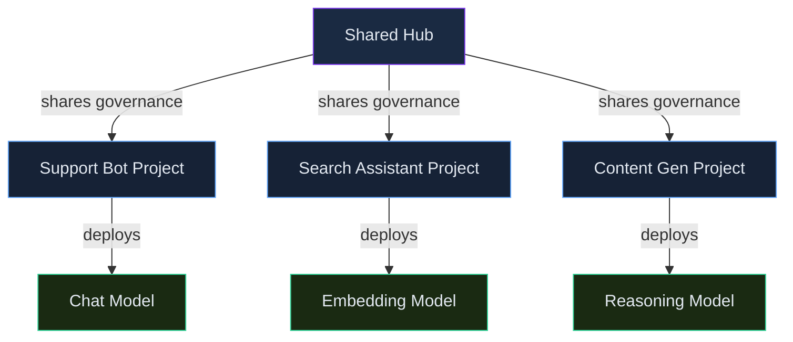

# Projects, Hubs & the Model Catalog

> **Skill track**: Azure AI Foundry Practitioner — Module 1, Lesson 1

## Prerequisites

- An Azure subscription you can create resources in (no prior AI/ML service experience needed)
- Comfortable with the general idea of a cloud "project" or "workspace" grouping related resources together

## Overview

Azure AI Foundry is Microsoft's unified platform for discovering, deploying, customizing, and orchestrating generative AI models and agents. Before any of that, you need somewhere to build (a project, optionally under a hub) and something to build with (a model from the catalog) — get either of those wrong on day one and every deployment you make afterward inherits the mistake.

> 💡 **Human Angle**: *Think of the model catalog as a car showroom and the deployment type as how you pay for the car — lease it by the mile (serverless/pay-per-token), buy it outright and park it in your garage (managed compute), or reserve a dedicated lane on the highway (provisioned throughput).*

## Foundry Projects vs. Hubs

### Key Concept

**Choosing hub vs. project is a governance decision, not a feature decision.**

A Foundry project (backed by an Azure AI Foundry resource) is a single, self-contained unit with simplified default networking and identity — everything a single team needs, bundled together. A hub-based project instead inherits shared connections, compute, and security boundaries from a parent hub, which matters the moment more than one team needs to work under the *same* governance rules without each reconfiguring them from scratch.

Neither option is more "modern" than the other — they solve different organizational shapes. **A hub is infrastructure for consistency across teams; a standalone project is infrastructure for one team moving fast.**

| Concept | What it is | When to use |
|---|---|---|
| Foundry project (Azure AI Foundry resource) | A single, unified project with simplified default networking/identity | Recommended default for new, single-team projects |
| Hub-based project | A project that inherits shared connections, compute, and security boundaries from a parent hub | Multiple teams/projects need consistent shared governance |

*One hub, three teams, three independently chosen models.*

### In Practice

**What breaks without this**: a platform team spins up a separate standalone Foundry project per new initiative "to move fast," and six months later has a dozen projects each with their own duplicated Azure AI Search and Key Vault connections — the same governance rules re-implemented, slightly differently, a dozen times.

**Decision trigger**: ask *"will more than one team or project need the exact same shared connections, compute, and security boundary?"* If yes, put them under a hub from the start — retrofitting shared governance onto already-independent projects is far more painful than starting with it.

**When you'd choose differently**: even a genuinely single-team effort might still start under an existing hub if the organization already runs one for governance reasons — the deciding factor is organizational policy, not just this one project's immediate needs.

### Common Pitfall ⚠️

Don't assume hub-based projects are "legacy" or being phased out — they're still the right choice whenever several product teams must share the same connections, compute, and network/security posture. Pick the structure that fits the *scenario*, not whichever one feels newer.

## Model Catalog

### Key Concept

**The model catalog isn't a passive list — its benchmarks and licensing data are meant to directly drive your deployment decision, not just help you recognize a model's name.**

The catalog is the central hub for browsing models across providers — Azure OpenAI, Microsoft's Phi family, Meta's Llama, Mistral, Cohere, DeepSeek, xAI, and more — each with benchmarks, licensing terms, and supported deployment options listed on its model card. That last part matters as much as the benchmarks: a model you can't deploy the way you need it isn't actually a candidate, no matter how good its numbers look.

| Feature | Purpose |
|---|---|
| Benchmarks | Compare quality, cost, and latency/throughput across models before choosing one |
| License info | Understand usage rights per model family (varies — some commercial, some open-weight) |
| Deployment options per model | Not every model supports every deployment type — check the model card |

### In Practice

**What breaks without this**: a team picks the largest, most familiar-name model in the catalog for a simple classification task, without checking whether a smaller, cheaper model clears the same accuracy bar for their specific workload shape — the benchmark page exists precisely to catch this before it becomes a recurring cost problem.

**Decision trigger**: ask *"have I compared benchmark numbers for a workload shaped like MINE, not just the headline scores everyone quotes?"* A model that benchmarks well on general reasoning may be unnecessary overkill (and overspend) for a narrow, repetitive task.

**When you'd choose differently**: sometimes a non-benchmark factor legitimately dominates — an existing vendor relationship, a support SLA, or a licensing term that rules out an otherwise-superior model. That's a valid reason to override the benchmark-driven default, as long as it's a deliberate trade-off and not just familiarity.

## Deep Dive: Making Projects, Hubs & the Model Catalog Click

### 1. The connective narrative

Every decision in this lesson happens before you write a single line of application code, which is exactly why it's easy to underinvest in. The project/hub structure decides *who else this workspace's governance affects* — get it wrong and you're either duplicating security configuration across a dozen isolated projects, or forcing unrelated teams into one shared blast radius. The model catalog decides *what you're actually building with* — and its benchmarks and licensing data exist so that decision is made on evidence, not on which model name a team recognizes from the news. Neither choice is glamorous, but both are expensive to unwind once real usage and real teams are depending on them.

### 2. Worked scenario

> **Scenario.** Northwind Traders is standing up its first three generative AI initiatives at once: a customer support chatbot, an internal document-search assistant, and a marketing content generator — each owned by a different team.
>
> Walking the structural decision first:
>
> 1. **All three teams need the same connections** — the same Azure AI Search index (for the support bot's policy docs and the internal search assistant), the same Key Vault, and the same network/security posture mandated by IT. That shared-governance need is exactly the signal for a **hub**, with each team's work living in its own project underneath it — not three independent standalone projects each re-declaring the same connections.
> 2. **Each team then picks a model independently, from the catalog, based on their own workload shape:**
>    - The support bot needs fast, cheap, high-volume responses to short questions — the team checks benchmarks for latency and cost on short-context tasks, not raw reasoning depth, and picks a smaller, cheaper model that clears their quality bar.
>    - The internal search assistant needs an *embedding* model, not a chat model at all — a different section of the catalog entirely, chosen for retrieval quality benchmarks specific to embeddings.
>    - The marketing content generator produces longer, more nuanced copy where quality matters more than per-token cost — the team checks benchmarks weighted toward reasoning/creativity and accepts a larger, pricier model.
>
> **The lesson**: the hub/project decision is made once, org-wide; the model decision is made per-workload, every time — conflating the two (e.g., assuming "one hub" means "one model for everyone") produces a worse outcome for at least two of the three teams.

### 3. Memory aid

Before finalizing structure and model choice, check:

1. **Shared governance** — do multiple teams need the exact same connections/compute/security posture? → hub.
2. **Model card first** — does the model even support the deployment type and region you need?
3. **Benchmark for YOUR shape** — not the headline number, the number for a workload like yours.
4. **License fit** — does the usage-rights term actually permit what you're building?

### 4. Applying this in real projects

- Hub-vs-project is a decision that gets harder to change the more teams onboard under the wrong structure — decide deliberately at the start rather than defaulting to "everyone gets their own project" out of convenience.
- The single most common real-world mistake in model selection is picking based on name recognition rather than the catalog's own benchmark data for a comparable workload — five minutes on the benchmark page routinely changes the decision.

## Cheat Sheet 📋

| Concept | Key Rule |
|---|---|
| Recommended new-project default | Foundry project (Azure AI Foundry resource) |
| Hub's job | Shared connections/compute/security across multiple projects |
| Model catalog benchmarks | Compare quality/cost/latency for YOUR workload shape, not headline scores |
| Model card | Confirms region and deployment-type support before you commit |
