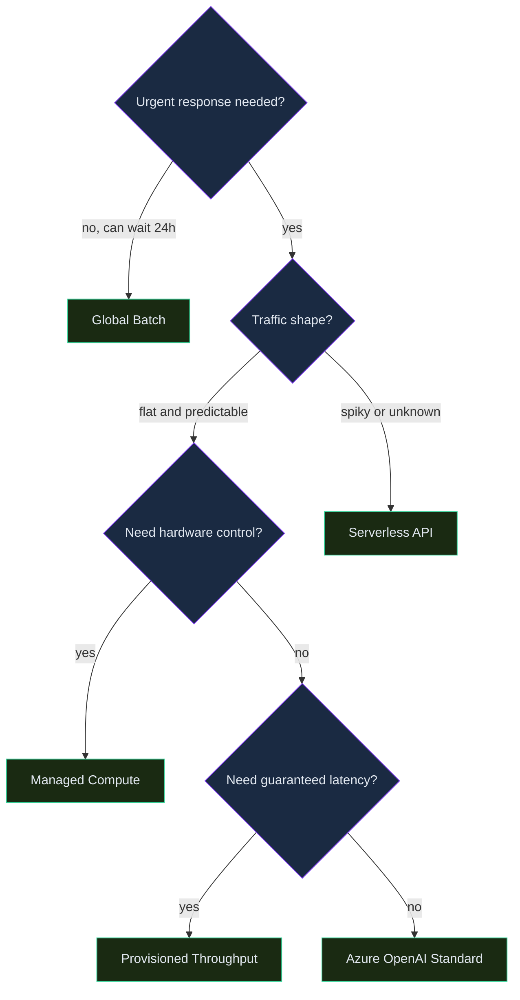

# Deployment Options, SDKs & Prompt Flow

> **Skill track**: Azure AI Foundry Practitioner — Module 1, Lesson 2
> **Try it**: pairs with the hands-on mission "Deploy Your First Prompt Flow in Azure AI Foundry"

## Prerequisites

- Comfortable reading a Python HTTP client call (you don't need to write one from scratch, just follow along)
- Lesson 1 (Projects, Hubs & the Model Catalog) — this lesson assumes you already know what a Foundry project and the model catalog are
- Basic idea of what "requests per minute" and "tokens" mean for an API — no math beyond arithmetic

## Overview

Picking a model is only half the job — you also have to decide *how it's hosted*, *how your code talks to it*, and *how you iterate on the prompt in front of it* before anything reaches production. This lesson covers all three, because in practice they're one decision, not three: the deployment option you pick constrains which SDK calls make sense, and Prompt Flow only pays off once you've settled on a deployment stable enough to bulk-test against.

> 💡 **Human Angle**: *Think of the model catalog as a car showroom and the deployment type as how you pay for the car — lease it by the mile (serverless/pay-per-token), buy it outright and park it in your garage (managed compute), or reserve a dedicated lane on the highway (provisioned throughput).*

## Deployment Options

### Key Concept

**The deployment option you pick is a bet on your traffic shape, not a technology preference.**

Azure AI Foundry gives you five ways to put a model behind an endpoint, and they differ on exactly one axis that matters day-to-day: who pays for idle capacity. Serverless API and Azure OpenAI Standard both let Microsoft absorb the cost of idle compute — you pay per token, so a quiet Tuesday costs you nothing. Managed compute and Provisioned Throughput (PTU) do the opposite: you reserve capacity up front, so a quiet Tuesday still costs the same as a busy Friday, but in exchange you get either hardware control or *guaranteed* latency that shared capacity can't promise.

Global Batch is the odd one out — it isn't really competing on latency at all. **It trades an immediate answer for a steep discount**, processing a large job asynchronously within a 24-hour window instead of responding in real time.

| Option | Compute model | Billing | Best for |
|---|---|---|---|
| Serverless API (MaaS) | Microsoft-managed, no customer infra | Pay-per-token | Fast start, variable/low volume, many catalog models (Meta, Mistral, Cohere, etc.) |
| Managed compute | Dedicated VM-backed online endpoint | Pay for VM regardless of usage | Need more control over hardware; broader open-model support |
| Azure OpenAI — Standard / Global Standard | Shared, pay-as-you-go capacity | Per-token, variable latency under load | General-purpose Azure OpenAI usage |
| Azure OpenAI — Provisioned (PTU) | Reserved, dedicated capacity | Reserved-unit commitment | Latency-sensitive production workloads needing predictable throughput |
| Azure OpenAI — Global Batch | Asynchronous, 24-hour window | Discounted per-token | Large, non-latency-sensitive batch jobs |


*Which of the five deployment options fits your traffic.*

### In Practice

**What breaks without this**: a team that defaults to managed compute "because that's what we did before Foundry" ends up paying for a VM that sits at 8% utilization overnight — real money for capacity nobody's using, when a serverless deployment would have cost near-zero during those same idle hours.

**Decision trigger**: ask *"if I plotted my requests-per-minute over a week, would the line be flat or spiky?"* Flat and predictable → PTU is worth the commitment. Spiky or unknown → start serverless, because you can always move to PTU later once you have real traffic data, but you can't easily walk back an over-provisioned reserved-capacity contract.

**When you'd choose differently**: a spiky-traffic team would normally reach for serverless, but if that spike happens to be a hard latency-SLA workload (a trading desk, a live support handoff) where *variable* latency under load is itself unacceptable — not just average latency — PTU's predictability can be worth paying for headroom you don't always use.

### Common Pitfall ⚠️

<div class="note-trap">
Serverless API availability is *region- and model-specific* — a newly released catalog model may only support managed compute at first, or only be available in a subset of regions. "It's in the catalog" doesn't mean "it's deployable everywhere, every way, immediately." Always check the model card before committing to an architecture around a specific deployment type.
</div>

## Connections & SDKs

### Key Concept

**Two SDKs exist because managing a project and calling a model are different jobs done by different people at different times.**

`azure-ai-projects` is the *management-plane* SDK — it lists connections, deployments, agents, and datasets, the kind of thing a platform engineer runs from a setup script or an internal admin tool. `azure-ai-inference` (or the OpenAI SDK pointed at a Foundry endpoint) is the *data-plane* SDK — the one your application actually calls on every user request to get a completion back.

**Connections** are what tie a project to the outside resources it needs — most commonly an Azure AI Search index for RAG, plus Storage, Key Vault, and Application Insights. Get the connection wrong and neither SDK will save you: the inference call will succeed, but retrieval will come back empty because the project was never pointed at the search index in the first place.

### In Practice

**What breaks without this**: pulling in `azure-ai-projects` just to make a chat completion call — the management SDK doesn't expose a completions method the way you'd expect, so a developer who reaches for the wrong SDK burns time discovering that before finding the right one.

**Decision trigger**: ask *"is this code running once, from my machine or a CI job, to set something up — or is it running per user-request, in the hot path of my app?"* Setup-time and infrequent → management plane. Every request → data plane.

**When you'd choose differently**: a background job that periodically audits which deployments exist across a project (a cost-governance script, say) legitimately uses the management-plane SDK even though it runs on a schedule "like" a hot-path job — the distinguishing factor is *what it's asking for* (deployment metadata vs. a model's output), not how often it runs.

## Fine-Tuning

### Key Concept

**Fine-tuning data must already look exactly like the conversation you'll have in production.**

The training file is JSONL — one JSON object per line — and each line's `messages` array uses the same role/content shape (`system`/`user`/`assistant`) the chat-completion API expects at inference time. This isn't an arbitrary format choice: the model is learning to continue conversations shaped like your training examples, so if your training data doesn't match your production prompt structure, the fine-tune won't transfer.

### In Practice

**What breaks without this**: a team trains on flat prompt/completion pairs (no `messages` structure, no system role) and then wonders why the fine-tuned model behaves inconsistently once it's called through a normal chat-completion request — the mismatch between training shape and inference shape is the cause.

**Decision trigger**: ask *"could I take one line of my training file and use it, unmodified, as an actual API call?"* If not, the data isn't ready to submit.

**When you'd choose differently**: if you're trying to fix formatting/tone rather than add new knowledge, a well-crafted system prompt often gets you 80% of the way there for a fraction of the cost and turnaround time — reach for fine-tuning once prompt engineering has genuinely plateaued, not as the first lever you pull.

```jsonc
// One line of a valid fine-tuning training file
{"messages": [
  {"role": "system", "content": "You are a support agent for Contoso Retail. Keep replies under 3 sentences."},
  {"role": "user", "content": "Where is my order #4821?"},
  {"role": "assistant", "content": "Order #4821 shipped yesterday and is expected by Thursday. I've sent the tracking link to your email."}
]}
```

## Quota

### Key Concept

**Quota is enforced on two independent dimensions, and hitting either one throttles you.**

Azure OpenAI tracks tokens-per-minute (TPM) and requests-per-minute (RPM) separately per deployment. A workload sending few requests with huge payloads can exhaust TPM while nowhere near its RPM limit; a chatty workload sending many tiny requests can hit RPM while barely touching TPM. Quota can be split across multiple deployments within the subscription's overall ceiling, which is how teams isolate a noisy-neighbor workload from a latency-critical one.

### In Practice

**What breaks without this**: a team load-tests with a handful of large-payload requests, sees TPM headroom to spare, and ships — then gets throttled in production once real traffic sends ten times as many small requests, because they never checked RPM.

**Decision trigger**: ask *"which dimension will my real traffic pattern hit first — big payloads or high request counts?"* — and load-test against *that* dimension specifically, not just whichever one is easier to simulate.

**When you'd choose differently**: if two workloads share a deployment and one starts starving the other of quota, splitting them into separate deployments (each with its own TPM/RPM allocation) is the fix — not requesting a blanket quota increase, which just delays the same conflict at a higher ceiling.

## Playground & Prompt Flow

### Key Concept

**The playground is for exploring a prompt; Prompt Flow is for proving it works before you ship it.**

The chat playground gives fast, code-free iteration on a system message, parameters, and a couple of few-shot examples — ideal for the first hour of figuring out what you even want the model to do. Prompt Flow is a different tool for a different stage: a visual, DAG-based canvas for chaining retrieval, prompt, and code/LLM nodes together, then bulk-testing the whole chain against a real dataset before deploying it as its own managed endpoint.

### In Practice

**What breaks without this**: a team ships a prompt that looked great for the five examples they tried by hand in the playground, then discovers in production that it fails on a whole category of inputs nobody happened to try — bulk-testing against a real dataset (Prompt Flow's job, not the playground's) is exactly what would have caught that before launch.

**Decision trigger**: ask *"have I tried this prompt against more than a handful of hand-picked inputs?"* If no, you're still in playground territory. If you need a repeatable, scored answer across dozens or hundreds of inputs, move to Prompt Flow.

**When you'd choose differently**: for a genuinely one-off exploration — a prompt you'll run once, by hand, and never productionize — building a full Prompt Flow is overkill; the playground alone is the right-sized tool.

### Common Pitfall ⚠️

<div class="note-trap">
Content filters on Azure OpenAI deployments are **on by default** and are *not* a self-service toggle to disable — modifying or disabling them (e.g., for an approved red-teaming exercise) requires applying through Microsoft's **Limited Access** review process.
</div>

## Deep Dive: Making Deployment, SDKs & Prompt Flow Click

### 1. The connective narrative

These three topics look separate but resolve into one pipeline. You start by choosing a deployment option — a bet on your traffic shape — because that decision determines what "calling the model" even looks like: a serverless endpoint you hit with the data-plane SDK, or a PTU endpoint your finance team signed off on for guaranteed latency. Once you have a stable endpoint, the SDK split (`azure-ai-projects` vs. `azure-ai-inference`) reflects the two different jobs people do against it: a platform engineer sets it up and manages it, while your application calls it constantly. And once you're iterating on *what you send* to that endpoint — the actual prompt — Prompt Flow is where you stop trusting your own five hand-picked test inputs and start proving the prompt holds up across a real dataset before it goes anywhere near production traffic.

Fine-tuning and quota sit slightly to the side of that main pipeline, but they answer the two questions that come up the moment the pipeline is live: "what if prompting alone isn't enough?" (fine-tune, but only after prompting has genuinely plateaued) and "what happens when real traffic arrives?" (quota, on two independent axes that traffic can hit separately).

### 2. Worked scenario

> **Scenario.** Contoso Retail wants to add an AI support chatbot backed by Llama-3.1-70B from the catalog. Traffic is spiky — quiet most of the day, then a burst up to ~50 requests/minute during evening promos — and the team has no infrastructure headcount to manage VMs.
>
> Walking the decision end to end:
>
> 1. **Check the model card first.** Not every catalog model supports every deployment type, and support is region-specific — Llama-3.1-70B's card confirms Serverless API availability in Contoso's region. Skipping this step is the single most common way teams pick an option that turns out to be unavailable.
> 2. **Match the traffic pattern to a billing model.** Spiky, unpredictable volume with no infrastructure team is the textbook case for **Serverless API (MaaS)** — pay-per-token, Microsoft-managed compute, scales with demand automatically. Managed compute would mean paying for a dedicated VM around the clock even during the quiet hours; PTU's reserved-capacity commitment doesn't fit unpredictable spiky load either.
> 3. **Wire up the right SDK for the job.** The actual chat-completion calls at runtime go through the **data-plane** SDK:
>
> ```python
> from azure.ai.inference import ChatCompletionsClient
> from azure.core.credentials import AzureKeyCredential
>
> client = ChatCompletionsClient(
>     endpoint="https://contoso-foundry.services.ai.azure.com/models",
>     credential=AzureKeyCredential("<key>"),
> )
> response = client.complete(
>     model="Llama-3.1-70B-Instruct",
>     messages=[{"role": "user", "content": "Where is my order #4821?"}],
> )
> ```
>
> If Contoso later needs an internal admin dashboard to list or manage deployments and connections, that's the **management-plane** SDK (`azure-ai-projects`) instead — a different job entirely, not a fallback for the same job.
> 4. **Before launch, bulk-test the actual support prompt in Prompt Flow** against a few hundred real historical support questions, not the handful the team tried by hand — this is what catches a category of question the prompt silently mishandles before a customer finds it in production.
> 5. **Load-test against both quota dimensions**, not just one: a 50 requests/minute promo burst with moderately long support responses could plausibly hit either the RPM or the TPM ceiling first, and only measuring one gives a false sense of headroom.
>
> **Contrast case**: if Contoso instead ran a trading-desk assistant needing guaranteed, consistent sub-second latency regardless of load, the right call flips to **Provisioned throughput (PTU)** — the deciding factor is a *predictability* requirement, not raw volume.

### 3. Memory aid

Before picking a deployment option, run through this checklist in order:

1. **Shape** — flat or spiky traffic?
2. **Control** — do I need to touch the hardware, or is "just give me an endpoint" fine?
3. **Latency guarantee** — does *variability* under load break something, not just average speed?
4. **Urgency** — does this need to answer right now, or can it run overnight for a discount?

Answering these four, in order, resolves to one of the five deployment options almost every time.

### 4. Applying this in real projects

- The most common real-world mistake isn't picking the wrong deployment option — it's picking a *reasonable* one and never revisiting it once real traffic data exists. A serverless deployment chosen for an unknown launch-day traffic shape should be reassessed against PTU once you have a month of real RPM/TPM data.
- Teams reach for fine-tuning far earlier than they should. If you haven't tried a longer, more structured system prompt with a few strong few-shot examples first, you don't yet know whether you actually need fine-tuning.
- Quota throttling in production is almost always a "we tested the wrong dimension" problem, not a "we needed more quota" problem — check which axis your real traffic actually stresses before requesting an increase.

## Cheat Sheet 📋

| Concept | Key Rule |
|---|---|
| Serverless API | Pay-per-token, no customer-managed compute |
| Managed compute | Dedicated VM, pay regardless of usage |
| PTU | Reserved capacity, predictable latency |
| Global Batch | Async, 24-hour window, discounted |
| azure-ai-projects | Management plane (connections, deployments, agents) |
| azure-ai-inference | Data plane (chat/embeddings calls) |
| Fine-tune data format | JSONL, `messages` array matching production shape |
| Quota dimensions | TPM + RPM — enforced independently |
| Content filters | On by default; disabling needs Limited Access approval |
| Playground vs. Prompt Flow | Explore by hand vs. prove at scale before shipping |
