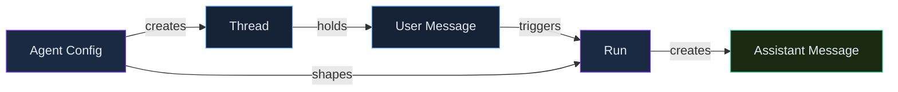

# Agent Service Fundamentals & Built-in Tools

> **Skill track**: Azure AI Foundry Practitioner — Module 2, Lesson 1

## Prerequisites

- Module 1 complete — you should already know how to deploy a model and which SDK does which job
- Comfortable with the general idea of a multi-turn chat conversation (turns, roles: system/user/assistant)
- No prior agent-framework experience needed — this lesson introduces the Agent Service from scratch

## Overview

This lesson covers the Azure AI Foundry **Agent Service** — its core conversation objects and built-in tools, the pieces you compose before reaching for multi-agent orchestration in the next lesson.

> 💡 **Human Angle**: *A well-tooled single agent is like one very capable generalist employee — give it the right set of tools before assuming it needs a whole team.*

## Core Conversation Objects

### Key Concept

**These four objects exist because a single API call can't hold a stateful, multi-turn conversation — something has to remember what happened before this turn.**

An **Agent** is the configured persona: its instructions (system prompt), model, and enabled tools. A **Thread** is a persistent conversation that stores the ordered message history server-side. A **Message** is one turn within that thread. A **Run** is one execution of the agent against the thread's accumulated messages. Put together: you configure the Agent once, then every subsequent user turn becomes a Message on the same Thread, and each Run picks up the full history automatically — no manual resending required.

| Object | Role |
|---|---|
| Agent | The configured persona: instructions (system prompt), model, and enabled tools |
| Thread | A persistent conversation — stores the ordered message history server-side |
| Message | One turn within a thread |
| Run | One execution of the agent against a thread's messages |

Editing an agent's **instructions** changes its tone/behavior immediately on the next run — no redeployment or retraining needed.

*How Agent config, Thread state, and Run connect.*

### In Practice

**What breaks without this**: a developer new to the Agent Service tries to manually resend the full conversation history on every call — the way a plain chat-completion API would require — and ends up either fighting the Thread abstraction or duplicating state it already manages for free.

**Decision trigger**: ask *"does this feature need to remember earlier turns without me resending them?"* If yes, you want a Thread. If it's a genuinely stateless one-shot task (classify this text, yes/no), you don't need the Agent Service's conversation machinery at all — a plain data-plane inference call is simpler and cheaper.

**When you'd choose differently**: even a mostly-stateless feature might still use a Thread if you want the *option* of follow-up questions later — the cost of an unused Thread is negligible compared to redesigning the feature later to add memory.

## Built-in Tools

### Key Concept

**Each built-in tool answers a different question about where the agent's knowledge or capability comes from — your own uploaded docs, the live web, structured data, arbitrary code execution, or an external API.**

| Tool | What it does | Not to be confused with |
|---|---|---|
| Code interpreter | Executes Python in a sandbox — data analysis, calculations, chart generation | File search (retrieval, not execution) |
| File search | Retrieves grounded passages from an uploaded document vector store, with citations | Code interpreter |
| Function calling | Model decides when to invoke a developer-defined function with structured (JSON-schema) arguments | OpenAPI tool |
| OpenAPI tool | Agent calls an external REST API directly from a published OpenAPI 3.0 spec (anonymous / API-key / managed-identity auth) | Function calling (which needs a hand-written wrapper per function) |
| Bing grounding | Grounds answers in live web search results (via a Grounding with Bing Search resource) — for time-sensitive info | File search (only searches your own uploaded docs) |
| Fabric data agent | Queries structured data already modeled in Microsoft Fabric, without re-exporting it | File search (unstructured documents) |

### In Practice

**What breaks without this**: a developer reaches for Function calling to wrap an internal REST API that already has a full, published OpenAPI 3.0 spec — hand-writing a JSON-schema function definition for every endpoint, when the OpenAPI tool would have consumed that spec directly with zero wrapper code. Real engineering time lost to picking the more familiar-sounding tool instead of the right one.

**Decision trigger**: ask *"what kind of knowledge or action does this need — my own documents, the live web, structured data already in Fabric, arbitrary code execution, or an external API call?"* That answer picks the tool; for an API call specifically, follow up with *"does a spec already exist?"* — spec exists → OpenAPI tool, no spec / one specific custom action → Function calling.

**When you'd choose differently**: even when an OpenAPI spec exists, Function calling can still be the right call if you need custom validation or logic injected *before* the underlying request fires — the OpenAPI tool's direct pass-through doesn't give you that hook.

### Common Pitfall ⚠️

"Which tool lets the agent call an internal REST API?" has *two* plausible-looking answers: Function calling and the OpenAPI tool. The distinguishing detail: the OpenAPI tool works directly from an existing OpenAPI 3.0 spec with no per-endpoint wrapper code; Function calling requires you to define each function's schema by hand. Look for "already has a published spec" vs. "one specific custom action" to pick correctly.

## Deep Dive: Making Agent Fundamentals & Tools Click

### 1. The connective narrative

The conversation objects are the skeleton; tools are what the agent can actually *do* once it's holding a conversation. An agent with excellent instructions but no tools enabled can only talk — it can't look anything up, run any calculation, or take any action. And once tools are in play, picking the wrong one doesn't just under-deliver, it actively misleads: an agent grounded in live web search when it should be citing your own uploaded policy document will confidently answer from the wrong source entirely. The core objects and the tool choices aren't two separate topics — they're "what remembers the conversation" and "what the conversation can accomplish," and you need both working correctly for an agent to be useful.

### 2. Worked scenario

> **Scenario.** Northwind Traders' internal operations team wants one assistant that can: (a) look up live inventory counts for any SKU via an internal REST API that already has a published OpenAPI 3.0 spec, (b) analyze an ad-hoc uploaded spreadsheet of return-rate data to answer "why are returns up this month?", and (c) check current shipping-carrier delay reports from the public web.
>
> Walking the tool choice for each requirement:
>
> 1. **(a) Live inventory lookup via an existing REST API → OpenAPI tool, not Function calling.** The spec already exists, so the OpenAPI tool consumes it directly — no per-endpoint wrapper code to write or maintain as the API evolves.
> 2. **(b) Ad-hoc spreadsheet analysis → Code interpreter.** This needs actual computation — grouping, filtering, maybe a quick chart — over a file uploaded in the moment. File search would only retrieve passages of text; it can't compute a return-rate trend.
> 3. **(c) Current carrier delays from the public web → Bing grounding.** This is explicitly *not* something in the team's own uploaded documents — it's live, external, time-sensitive information, which is exactly Bing grounding's job and exactly where File search would come up empty.
>
> **The gotcha to notice**: three different tools, three different requirements, and none of them is interchangeable with another — swapping File search in for (c), for instance, wouldn't just underperform, it would search the wrong universe of documents entirely (your own uploads, not the live web).

### 3. Memory aid

Ask what kind of knowledge or action the task needs, in this order:

1. **My own uploaded docs** → File search
2. **The live web** → Bing grounding
3. **Structured data already in Fabric** → Fabric data agent
4. **Run code / analyze an uploaded file** → Code interpreter
5. **Call a REST endpoint that already has a spec** → OpenAPI tool
6. **One specific custom action, no spec** → Function calling

### 4. Applying this in real projects

- Under time pressure, teams default to Function calling because it *sounds* the most generic and flexible — check for an existing OpenAPI spec first; it's almost always the faster, lower-maintenance path when one exists.
- Thread-based conversation state is easy to take for granted at small scale and easy to get wrong at real scale — verify you're not accidentally sharing one Thread across multiple concurrent users, which silently leaks one user's conversation history into another's.

## Cheat Sheet 📋

| Concept | Key Rule |
|---|---|
| Conversation objects | Agent, Thread, Message, Run |
| Code interpreter | Executes Python (analysis, charts) |
| File search | Retrieval + citation over uploaded docs |
| Function calling | Model fills args for a hand-defined function |
| OpenAPI tool | Calls an API directly from its spec, no wrapper needed |
| Bing grounding | Live web search grounding |
| Fabric data agent | Query structured Fabric data directly |
| Change agent tone/rules | Edit instructions, no redeploy needed |
