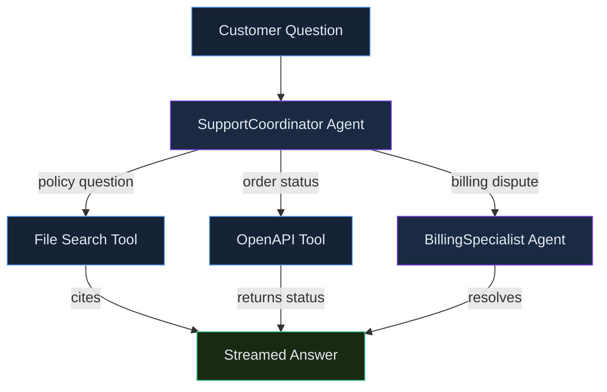

# Multi-Agent Orchestration & RAG

> **Skill track**: Azure AI Foundry Practitioner — Module 2, Lesson 2

## Prerequisites

- Lesson 1 complete (Agent Service fundamentals — conversation objects, built-in tools)
- This lesson is about what to do once a single agent with several tools stops being enough

## Overview

A well-tooled single agent handles a lot — but not everything. This lesson covers three ways to scale one agent into a real production system: coordinating with other agents when a problem genuinely splits into specialist roles, grounding it in your own data beyond a simple document upload, and delivering its output the way a live user actually experiences it.

> 💡 **Human Angle**: *A well-tooled single agent is like one very capable generalist employee; a multi-agent design is a small team of specialists with a triage lead — pick the team structure once the job actually splits into distinct roles, not before.*

## Multi-Agent Orchestration

### Key Concept

**Multi-agent design pays off exactly when a problem splits into genuinely different specialist roles — never because more agents sounds more sophisticated.**

| Pattern | Description |
|---|---|
| Connected agents | One Agent Service agent registers another agent as a callable tool — coordinator/specialist pattern, all within the Agent Service |
| Semantic Kernel | Microsoft SDK exposing existing app code as "plugins" the model can call; strong DI/.NET-Python-Java support |
| AutoGen | Microsoft framework for orchestrating multi-round conversations *among* multiple autonomous agents (planner/researcher/critic-style workflows) |

The three patterns aren't interchangeable difficulty tiers — they solve different shapes of coordination. Connected agents is a coordinator handing off *one bounded task* to a specialist. Semantic Kernel is about exposing *your own existing code* to the model, not about multiple agents talking to each other at all. AutoGen is for genuinely open-ended, multi-round reasoning *among peers* — nobody is just "handing off and waiting."

### In Practice

**What breaks without this**: a team builds a four-agent pipeline for a task that's really just "one agent needs two more tools" — adding orchestration overhead, more places for something to fail silently, and added latency, for a problem that never needed decomposing in the first place.

**Decision trigger**: ask *"would two different people on my team need genuinely different instructions, tools, and guardrails to do these two parts of the job?"* If yes, that's a real specialist split — reach for connected agents. If it's really the same job just using two tools, stay single-agent.

**When you'd choose differently**: even a decomposable-looking problem can sometimes stay single-agent if the "specialist roles" are simple enough that separate sections of one system prompt handle the distinction fine — every additional agent is additional infrastructure to maintain and monitor.

### Common Pitfall ⚠️

<div class="note-trap">
Multi-agent design is justified by **task decomposition into distinct specialist roles** (different instructions/tools/guardrails per role) — not by a desire to minimize API calls, cut cost, or because "more agents sounds more advanced."
</div>

## RAG Beyond File Search

### Key Concept

**File search is RAG with training wheels; building your own means you now own chunking and embedding quality yourself.**

A *custom* RAG pipeline (outside the File search tool) requires **chunking** documents into retrieval-sized passages, then generating **vector embeddings** for each chunk, indexed in Azure AI Search for vector/hybrid similarity search at query time. File search handles all of this for you with sensible defaults; rolling your own means those defaults become your responsibility.

### In Practice

**What breaks without this**: a team builds custom RAG without tuning chunk size, ending up with chunks either too small (losing surrounding context) or too large (diluting relevance per chunk) — producing *worse* retrieval quality than File search's defaults would have given them for free.

**Decision trigger**: ask *"do I need something File search genuinely doesn't offer — a specific embedding model, a non-Azure-AI-Search vector store, or fine control over chunk boundaries (e.g., respecting code function boundaries instead of a fixed character count)?"* If not, use File search; reach for custom RAG only against a specific, named gap.

**When you'd choose differently**: a team migrating an existing RAG pipeline from another vector database might build custom RAG even without a strict technical gap, purely for migration-cost reasons — legitimate, as long as it's an explicit trade-off rather than a default.

## Streaming

### Key Concept

**Streaming is a UX decision, not a capability decision — the model produces the same output either way.**

Streaming delivers run output incrementally (token-by-token / event-by-event) to the client, enabling a typewriter-style UI instead of waiting for the full completion. It's a delivery-layer concern entirely separate from tools or safety — it changes how quickly something *feels* to arrive, not what arrives.

### In Practice

**What breaks without this**: a team implements streaming on the backend, but the frontend still buffers and waits for the full response before rendering anything — the engineering effort produces zero perceived improvement because the UI never takes advantage of it.

**Decision trigger**: ask *"is a human staring at a screen waiting for this specific response right now?"* If yes, streaming meaningfully improves perceived latency. If it's a backend batch job nobody is watching in real time, streaming adds complexity for no benefit.

## Worked Example: Choosing Tools and an Orchestration Pattern

A support team wants one assistant that can: (a) answer questions from an uploaded 40-page policy PDF, (b) look up a customer's live order status via an internal REST API that already has a published OpenAPI 3.0 spec, and (c) hand off complex billing disputes to a specialist that reasons more carefully about refund policy — and because customers are watching the chat live, the assistant should stream its answers rather than making them wait for a full paragraph.

Walking the tool/pattern choice for each requirement:

1. **(a) Policy Q&A over an uploaded PDF → File search.** This is grounded retrieval with citations over a document the team controls — exactly File search's job. Bing grounding would be wrong here (it searches the live web, not your own uploaded document), and Code interpreter would be wrong too (it executes Python, it doesn't retrieve text).
2. **(b) Order lookup via an existing REST API → OpenAPI tool, not Function calling.** The distinguishing detail is that a spec *already exists* — the OpenAPI tool consumes it directly with no per-endpoint wrapper code. Function calling would require hand-writing a JSON-schema function definition for this one action; reach for it when there's no existing spec, or the "function" is really custom logic (e.g., a calculation) rather than a real HTTP endpoint.
3. **(c) Escalate to a billing specialist → Connected agents, not AutoGen.** This is a coordinator delegating one specific, bounded task to a specialist with different instructions/guardrails — precisely the connected-agents pattern (register the billing agent as a callable tool on the coordinator). AutoGen is for open-ended, multi-round conversations *among* peer autonomous agents (e.g., a planner/researcher/critic loop) — reaching for it here would be over-engineering a simple delegation.
4. **Streaming, layered on top**: since customers are watching the chat live, every one of these responses — the File search answer, the order-status lookup, the specialist's reply — streams token-by-token rather than arriving as one delayed block.

```json
// Simplified agent definition showing tool composition for requirements (a) and (b)
{
  "name": "SupportCoordinator",
  "instructions": "Answer policy questions from the knowledge base. For order status, call the Orders API. Escalate billing disputes to BillingSpecialistAgent.",
  "model": "gpt-4o",
  "tools": [
    { "type": "file_search", "vector_store_ids": ["vs_policy_docs"] },
    { "type": "openapi", "spec_url": "https://internal.contoso.com/orders/openapi.json", "auth": "managed_identity" }
  ]
}
```


*SupportCoordinator routing three request types to three tools.*

**Common gotcha to notice**: nothing above required AutoGen or Semantic Kernel — most real support-bot scenarios resolve with File search + OpenAPI tool + (at most) connected agents. Reach for the heavier orchestration frameworks only when the scenario actually describes autonomous multi-agent reasoning, not just "the agent uses several tools."

## Deep Dive: Making Multi-Agent Orchestration & RAG Click

### 1. The connective narrative

These three topics are the three axes along which a single working agent scales up into a production system. Multi-agent orchestration answers *how it coordinates* once one job genuinely splits into specialist roles. Custom RAG answers *how it gets grounded* once File search's defaults stop being enough for your specific retrieval needs. Streaming answers *how its output reaches a human* who's watching live. None of the three is required for every agent — a simple internal tool might need none of them — but production systems that scale past a demo tend to need at least one, and the mistake to avoid is reaching for any of them before the specific need shows up.

### 2. Worked scenario

See the **Worked Example** above — it's deliberately placed inline with the topic bodies (rather than only here) because it's the connective thread through this entire lesson: one support assistant, three tool/pattern decisions, one streaming decision layered on top. The scenario earns its place precisely because none of its four decisions were interchangeable — swap in the wrong pattern for any one of them (AutoGen for a bounded handoff, Bing grounding for an internal PDF, no streaming for a live chat UI) and the system either over-engineers or under-delivers.

### 3. Memory aid

For multi-agent pattern choice specifically:

- **One coordinator delegating ONE bounded task** → Connected agents
- **Existing app code you want the model to call as plugins** → Semantic Kernel
- **Open-ended, multi-round conversation among peer agents** → AutoGen

### 4. Applying this in real projects

- Most real support-bot-shaped problems resolve with File search + OpenAPI tool +, at most, connected agents. Reach for AutoGen or Semantic Kernel only when the scenario genuinely describes autonomous multi-round reasoning among peers — not just "the agent happens to use several tools."
- Streaming is close to a free UX win for anything with a human watching live — there's rarely a good reason to skip it for a chat interface, and it costs little beyond wiring the frontend to actually consume the stream.

## Cheat Sheet 📋

| Concept | Key Rule |
|---|---|
| Connected agents | Agent-as-a-tool-for-another-agent, bounded handoff |
| Semantic Kernel | Plugin-style code integration, DI-friendly |
| AutoGen | Multi-agent conversational orchestration among peers |
| Custom RAG steps | Chunk → embed → index (Azure AI Search) |
| Streaming | UX/delivery decision, not a capability change |
