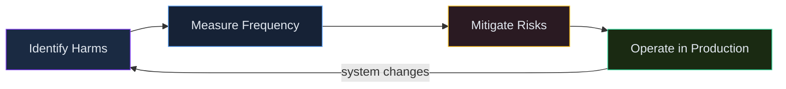

# Security, Privacy & Operations

> **Skill track**: Azure AI Foundry Practitioner — Module 3, Lesson 2

## Prerequisites

- General familiarity with the idea of roles/permissions (RBAC) on any cloud platform — no deep Azure AD/Entra ID experience required
- Lesson 1 complete (Content Safety & Evaluation) — this lesson covers the operational layer underneath everything built so far

## Security

### Key Concept

**These four controls answer four independent questions — who authenticates, what they're allowed to do, where traffic can reach, and who holds the encryption key — and a real security review needs a deliberate answer to all four, not just one.**

| Control | Purpose |
|---|---|
| Managed identity | Authenticate to Foundry/Azure OpenAI via Microsoft Entra ID — no stored secret to leak or rotate |
| RBAC / least privilege | Assign scoped roles (e.g., Azure AI Developer) rather than broad ones (Owner) — least privilege still applies inside Foundry |
| Private endpoints | Disable public network access; keep hub/project traffic off the public internet |
| Customer-managed keys (CMK) | Customer controls the Key Vault-backed encryption key for data at rest, including rotation |

### In Practice

**What breaks without this**: a team enables private endpoints and considers the security job done, while still authenticating with a long-lived API key stored in application config — network isolation doesn't help if that key leaks and gets used from an already-trusted network path, such as a compromised VM sitting inside the same virtual network.

**Decision trigger**: for each of authentication, authorization, network reachability, and encryption, ask *"have I made a deliberate choice here, or am I relying on whatever the default happened to be?"* A security review that only checks one of the four and calls it done is an incomplete review.

**When you'd choose differently**: a low-stakes internal prototype might reasonably defer customer-managed keys (accepting Microsoft-managed encryption) while still insisting on managed identity and least-privilege RBAC from day one — the four controls don't all carry equal urgency for every workload, but skipping one should be a decision, not an oversight.

### Common Pitfall ⚠️

"IP allow-listing" is *not* the same as disabling public network access — it still exposes a public endpoint, just a restricted one. When compliance requires the resource to be unreachable from the public internet at all, the answer is private endpoints + disabling public network access, not allow-listing.

## Data Use & Privacy

### Key Concept

**Your prompts aren't training data for anyone else's model, but they're not instantly and unconditionally gone either — there's one narrow, limited-purpose exception.**

Microsoft's stated policy: customer prompts/completions sent to Azure OpenAI/Azure AI Foundry are **not** used to retrain or improve the shared base models, and remain isolated to the customer's own resource. A separate, limited **abuse-monitoring** process may briefly retain data for safety purposes; eligible customers can apply for **modified abuse monitoring** through a formal Limited Access review — this is not a self-service toggle either.

### In Practice

**What breaks without this**: a compliance reviewer assumes "not used for training" means "never retained under any circumstances," and is caught off guard when abuse-monitoring retention surfaces during an audit — the retention exists whether or not anyone reads the fine print, so it's better to ask about it before launch than to be asked about it during an audit.

**Decision trigger**: ask *"does my regulatory context care about ANY retention at all, even narrow, safety-purpose-only retention?"* If yes, apply for modified abuse monitoring as part of launch planning, not as a reaction to an audit finding.

## Operations

### Key Concept

**Tracing tells you what happened in one specific run; Azure Monitor tells you what's happening across all of them — neither substitutes for the other.**

| Capability | Purpose |
|---|---|
| Tracing (OpenTelemetry → Application Insights) | End-to-end trace of tool calls, retrieval steps, and model calls within a specific run |
| Azure Monitor | Production metrics: token usage, latency, error rate, alerting |

### In Practice

**What breaks without this**: a team sets up Azure Monitor dashboards for aggregate metrics but never enables tracing — so when one specific user reports a single bad response, there's no way to reconstruct which tool calls or retrieval steps actually produced it. Aggregate metrics answer "is the system healthy overall," never "what happened in *this* run."

**Decision trigger**: ask *"am I trying to understand one specific incident, or the overall health trend?"* One incident → tracing. Trend over time → Azure Monitor. Most real investigations need both, in that order: Monitor flags that something's wrong, tracing shows you which run and why.

**When you'd choose differently**: for a very low-traffic internal tool, some teams skip Azure Monitor dashboards entirely and read tracing output manually — workable at small scale, but it doesn't hold up once usage grows past a handful of users.

## The Responsible AI Lifecycle: Identify → Measure → Mitigate → Operate

### Key Concept

**This four-stage lifecycle isn't a pre-launch checklist you complete once — it's a loop that restarts every time your system changes.**

Microsoft frames responsible AI as four ongoing stages, applied iteratively:
1. **Identify** potential harms for the specific use case
2. **Measure** their frequency/severity (evaluations, red-teaming)
3. **Mitigate** them (content filters, system prompt design, grounding/RAG)
4. **Operate** safely in production (monitoring, incident response)

*A loop that restarts whenever inputs or the model change.*

### In Practice

**What breaks without this**: a team runs through all four stages once before launch, checks the box, and never revisits Measure or Mitigate as new documents get ingested into a RAG pipeline or the underlying model gets swapped — drift and new failure modes accumulate undetected because nobody re-ran the loop.

**Decision trigger**: ask *"has anything about my inputs, documents, or model changed since I last measured?"* If yes, the loop starts over from Identify or Measure — it doesn't pick up wherever felt convenient.

## Worked Example: Scoping Access for a Contractor

A data-science contractor is brought on to tune prompts and evaluate quality in the Foundry playground for one specific project — nothing more. They should **not** be able to deploy new models, change other projects' settings, or see connections belonging to unrelated teams.

- **Wrong**: granting `Owner` at the resource-group level "to save time" — violates least privilege and exposes every project under that group.
- **Wrong**: IP allow-listing their office network as the only control — that's a network-reachability restriction, not an authorization one; it doesn't limit *what* they can do once connected, and it doesn't survive them working from a coffee shop.
- **Right**: assign the contractor the **Azure AI Developer** role, scoped to *that one project* via Microsoft Entra ID / RBAC. This satisfies least privilege (a scoped role, not Owner) while still letting them do their actual job (playground access, running evaluations) without touching deployment or cross-project settings.

Three months later, an anomaly shows up in Azure Monitor — a spike in error rate traced back to the contractor's project. Because tracing was already enabled, the on-call engineer can pull up the exact run and tool call that failed, rather than knowing only "something in that project broke." The scoped role assignment also means the blast radius of investigating (and, if needed, revoking access) stays contained to that one project.

## Deep Dive: Making Security, Privacy & Operations Click

### 1. The connective narrative

These four topics are the production-operations layer underneath everything else in this track — invisible to an end user, but the difference between a demo and something you can actually run and be accountable for. Security controls decide who can do what, before anything goes wrong. Data-use policy decides what happens to the data your system already processed. Operations (tracing and monitoring) decide how quickly you *find out* something went wrong, and how precisely you can diagnose it. And the Responsible AI lifecycle ties all of it into a recurring loop rather than a one-time launch artifact — because every one of these controls degrades in value the moment your system changes and nobody re-checks them.

### 2. Worked scenario

See the **Worked Example** above — it deliberately continues past the initial access-scoping decision into an operations beat three months later, because that's the point: a security decision made correctly on day one (a scoped role, not Owner) is what makes the day-90 investigation *tractable* rather than a scramble across every project the contractor could theoretically have touched.

### 3. Memory aid

Four security controls, four questions — if you can't answer all four for a workload, the security review isn't finished:

- **Managed identity** → who authenticates?
- **RBAC** → what can they do?
- **Private endpoint** → where can traffic reach?
- **Customer-managed keys** → who holds the encryption key?

### 4. Applying this in real projects

- Least-privilege role assignment is the single highest-leverage security decision most teams under-invest in — defaulting to Owner "to save time" is the most common real-world mistake, and it's the one that turns a contained incident into an org-wide one.
- Treat the Responsible AI lifecycle as a recurring calendar item — re-run evaluations after every significant document or model change — rather than a launch-day artifact that never gets revisited.

## Cheat Sheet 📋

| Concept | Key Rule |
|---|---|
| Managed identity | No stored secret; preferred over API keys |
| Least privilege | Scoped roles (Azure AI Developer) over Owner |
| Private endpoint | True public-network isolation (IP allow-list ≠ this) |
| Customer-managed keys | Customer controls at-rest encryption key |
| Data use | Prompts/completions not used for base-model retraining |
| RAI lifecycle | Identify → Measure → Mitigate → Operate, on a loop |
