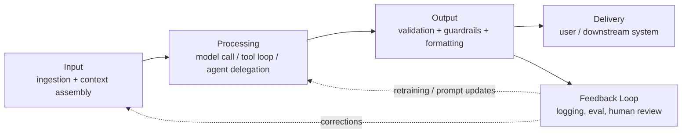
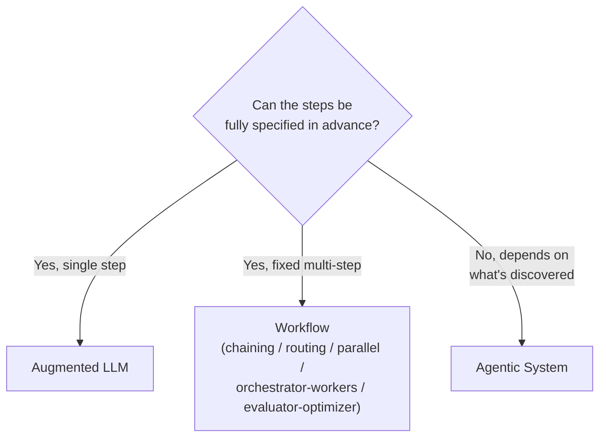
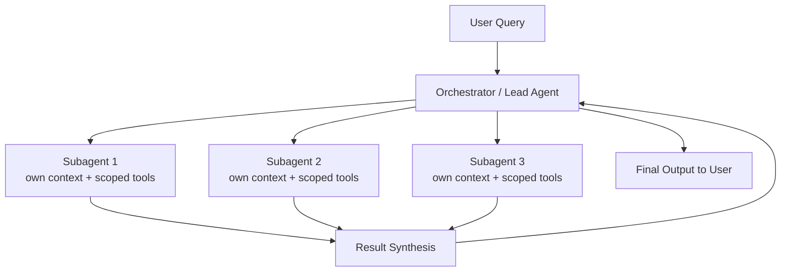

# D1: Solution Design & Architecture

> **Exam weight**: 17% · **Questions**: ~20 of 120

## Overview

This domain tests whether you can turn an ambiguous business problem into a defensible Claude-based system architecture — and defend the trade-offs you made. It spans the full arc: framing the problem correctly, choosing between workflow/agentic/augmented-LLM patterns, designing input-to-feedback pipelines, decomposing complexity, and orchestrating multiple agents when a single LLM call can't carry the load. At the professional tier, the exam is less interested in "what is an agent" and much more interested in "why did you choose an orchestrator-worker topology instead of a simple prompt chain, and what does that cost you in latency and token spend."

> 💡 **Human Angle**: A good solution architect is like a structural engineer, not a decorator — the question isn't "can this look impressive," it's "will this still be standing, on budget, under load, a year from now." The most elegant multi-agent swarm is the wrong answer if a two-step prompt chain solves the same business problem for a tenth of the cost.

## Translating Business Problems into Claude-Based AI Solutions

### Key Concept

Business stakeholders describe outcomes ("reduce support ticket backlog," "speed up contract review"), not architectures. The architect's first job is translating that outcome into a *problem shape*: is this classification, extraction, generation, multi-step reasoning, or open-ended research? The shape determines whether Claude is even the right tool, and if so, which pattern applies. A recurring professional-tier trap is skipping straight to "let's build an agent" before establishing whether the task is deterministic enough that a traditional rules engine or a single well-crafted prompt would outperform an agent on cost and reliability.

A disciplined translation process asks, in order: (1) What is the input, and how variable is it? (2) What does "correct output" look like, and can it be evaluated programmatically? (3) Does the task require external state or tools mid-reasoning, or is it a single input→output transformation? (4) What is the acceptable latency and error-cost budget? Only after answering these should you reach for a pattern.

### In Practice

**What breaks without this**: Teams that jump straight to "build an agent" for a task that is actually a stable, well-defined transformation (e.g., "extract these five fields from an invoice") end up with a system that is slower, more expensive, and *less* reliable than a single structured-output prompt — because every extra agentic hop introduces a new place for the model to wander off-task.

**Decision trigger**: Ask "if I wrote this as a flowchart today, would a human follow the same fixed sequence of steps every time, or would the sequence itself depend on what they discover along the way?" Fixed sequence → workflow. Discovery-dependent sequence → agentic.

**When you'd choose differently**: If the business genuinely needs open-ended investigation (e.g., "find out why this account is at risk of churn" with no predefined data sources), forcing it into a rigid workflow will under-deliver — the problem shape itself demands agentic flexibility, even though it costs more per run.

### Exam Trap ⚠️

The exam will describe a task that *sounds* complex ("multi-department approval routing") but is actually deterministic and rule-based. The distractor answer is the most sophisticated-sounding architecture (multi-agent orchestration). The correct answer is usually the simplest pattern that satisfies the requirements — think of over-architecting as bringing a crane to hang a picture frame: impressive, but it doesn't fit through the door and costs ten times more.

## Designing End-to-End Architectures (Input → Processing → Output → Feedback Loops)

### Key Concept

Every production Claude system, regardless of pattern, decomposes into four stages: **Input** (ingestion, normalization, context assembly — retrieval, tool schemas, conversation history), **Processing** (the model call(s), including any tool-use loop or multi-agent delegation), **Output** (parsing, validation, formatting, guardrail checks before the result reaches the user or downstream system), and **Feedback loops** (logging, human review, evaluation signals, and — critically — a path for corrections to flow back into prompts, retrieval indexes, or fine-tuning data). Architects who design only the "happy path" processing stage and treat feedback as an afterthought build systems that degrade silently in production because there's no mechanism to detect drift or recurring failure modes.

The feedback loop is what separates a demo from a production system. It closes the gap between "the model got it right in testing" and "we know when the model gets it wrong in production, and we have a mechanism to fix it" — whether that's a human-in-the-loop review queue, an automated eval harness re-scoring live traffic samples, or a retrieval index that gets corrected entries appended.

### In Practice

**What breaks without this**: Systems with no feedback loop can pass every pre-launch eval and still fail in production within weeks, because real-world input distribution shifts (new document formats, new user phrasing) and nobody is watching for it. The team finds out via a customer complaint, not a dashboard.

**Decision trigger**: Ask "when this system is wrong, how would we know — and how would that knowledge get back into the system?" If the honest answer is "someone would eventually notice and file a ticket," the feedback loop is missing, not just informal.

**When you'd choose differently**: For low-stakes, low-volume internal tools (a one-off migration script using Claude to reformat 200 files), a full feedback/eval loop is over-engineering — spot-checking manually is proportionate to the risk.

### Exam Trap ⚠️

Scenario questions often present an architecture diagram missing the feedback loop and ask "is this architecture complete?" Students focused on whether the model call is correct miss that the diagram has no return path. Treat the feedback loop like a smoke detector: irrelevant on a good day, the only thing that matters on a bad one — and exam scenarios are testing whether you installed it before the fire, not after.

## Selecting Architectural Patterns (Workflow, Agentic, Augmented LLM)

### Key Concept

Anthropic's own guidance (*Building Effective Agents*) draws a clear line between three tiers of system:

- **Augmented LLM**: a single Claude call enhanced with retrieval, tools, and memory — no autonomous multi-step control flow. This is the baseline building block for everything else.
- **Workflows**: predefined code paths that orchestrate LLM calls in a fixed structure — prompt chaining, routing, parallelization, orchestrator-workers, evaluator-optimizer. The *sequence of steps is fixed by the developer*, even though the content of each step is generated by the model.
- **Agentic systems**: Claude dynamically directs its own process and tool use, maintaining control over how it accomplishes a task. The *sequence itself* is decided by the model at runtime, typically in a loop of plan → act → observe → repeat until a stopping condition is met.

The professional-tier decision is not "which pattern is more advanced" — it's "which pattern matches the task's need for control versus flexibility." Workflows are more predictable, auditable, and cheaper to run because you can reason about exactly what will execute. Agentic systems trade that predictability for the ability to handle tasks whose steps cannot be fully specified in advance. Anthropic's explicit guidance is to *find the simplest solution possible, and only increase complexity when it demonstrably improves outcomes* — agentic complexity is a cost to be justified, not a default.

### In Practice

**What breaks without this**: Deploying an agentic loop for a task that fits a workflow means every run has non-deterministic step count and cost — production runbooks can't set reliable SLAs, and debugging a failure means reconstructing an arbitrary trajectory instead of checking a known sequence of five steps.

**Decision trigger**: Ask "can I write down, today, the exact sequence of LLM calls this task requires, regardless of the input?" Yes → workflow (pick the sub-pattern: chaining for sequential dependent steps, routing for input-type branching, parallelization for independent sub-tasks, orchestrator-workers for dynamic task breakdown with a fixed control layer, evaluator-optimizer for iterative refinement against a quality bar). No → agentic.

**When you'd choose differently**: A coding agent that needs to read a codebase, decide what to change, run tests, and react to failures cannot be pre-scripted as a fixed workflow — the *number* and *order* of steps genuinely depends on what the agent discovers, which is exactly when agentic control is justified despite its higher variance and cost.

### Exam Trap ⚠️

The exam frequently uses "agentic" and "agent" loosely in a scenario stem, then asks you to pick the correct pattern from an answer set that includes both "orchestrator-workers workflow" and "multi-agent system." These look similar but differ in *who controls the sequence*: in an orchestrator-workers workflow, a central LLM call (not autonomous looping) breaks work into subtasks and dispatches them — it's still a fixed workflow shape. A true multi-agent system has each agent making its own autonomous control-flow decisions. Confusing "multiple LLM calls" with "multiple agents" is the single most common distractor in this domain.

## Designing Multi-Agent Systems and Orchestration Strategies

### Key Concept

Multi-agent systems become the right answer when a task's breadth exceeds what a single context window or a single agent's tool set can handle coherently — for example, research tasks that require parallel exploration of independent sub-questions, or systems where different agents need different tool permissions for security isolation. Anthropic's published multi-agent research system uses an **orchestrator (lead agent) + subagents** topology: the lead agent decomposes the user's query into parallelizable sub-tasks, spins up subagents with narrow, well-defined objectives and their own context windows, and synthesizes their results. This works because subagents operate with clean, focused context rather than one agent's context becoming polluted with every intermediate research step.

Three orchestration topologies recur in practice:

- **Pipeline (sequential handoff)**: Agent A's output becomes Agent B's input, in a fixed order — good for staged transformations (draft → critique → revise) where each stage genuinely depends on the last.
- **Supervisor/orchestrator-worker**: a lead agent dynamically assigns and collects work from subagents it spins up, in parallel or sequence, and owns the synthesis step. Good for breadth-first tasks (research, multi-source data gathering) where subtasks are independent enough to parallelize.
- **Swarm/peer-to-peer**: agents communicate with each other directly with no single controller — rare in production because it's the hardest to debug, audit, and bound; usually a workflow or supervisor pattern achieves the same outcome with far less operational risk.

The orchestration choice has direct cost implications: Anthropic's own data on their multi-agent research system shows multi-agent architectures can consume roughly 15x the tokens of a single-agent chat interaction — a number that must be explicitly weighed against the value of the parallelism and quality gained.

### In Practice

**What breaks without this**: Giving every subagent the full tool set (including write/delete-capable tools) "for flexibility" collapses the security and cost benefits of decomposition — a compromised or misfiring subagent now has blast radius equal to the whole system, and you've paid the multi-agent token tax without the isolation benefit it was supposed to buy.

**Decision trigger**: Ask "do these subtasks have independent, non-overlapping objectives that don't need to see each other's intermediate reasoning?" If yes, parallel subagents under an orchestrator are worth the token cost. If subtasks are tightly sequential and each needs the full context of the last, a pipeline (or a single agent with a longer context) is cheaper and easier to debug than fanning out.

**When you'd choose differently**: For a task with a hard, tight latency SLA (e.g., a customer-facing chat response needing sub-2-second turnaround), spinning up an orchestrator and multiple subagents adds coordination latency that a single augmented LLM call cannot match — multi-agent orchestration is a throughput/quality optimization, not a latency optimization.

### Exam Trap ⚠️

Distractor answers love to conflate "using multiple tools" with "multi-agent system." A single agent calling three different tools in sequence within one control loop is still a single-agent (possibly agentic-workflow) system — there is one locus of reasoning and control. Multi-agent requires multiple independent loci of reasoning, each with its own context and decision-making, coordinated by an orchestration layer. Think of it as one chef using three knives versus three chefs in a kitchen — tool count and agent count are not the same axis.

## Apply Decomposition Techniques for Complex Problem Solving

### Key Concept

Decomposition is the discipline of breaking a problem too large or too ambiguous for one prompt/agent into smaller units that are independently solvable, verifiable, and (ideally) parallelizable. Three decomposition strategies map directly onto the workflow patterns above: **sequential decomposition** (each step depends on the prior step's output — use prompt chaining), **parallel decomposition** (subtasks are independent and can run concurrently — use parallelization or orchestrator-workers), and **hierarchical decomposition** (a top-level goal breaks into sub-goals that themselves break into tasks — use nested orchestrator-worker layers or a planning agent).

The quality bar for good decomposition is that each resulting sub-unit has a clear, independently verifiable success criterion. A decomposition that produces sub-tasks nobody can evaluate in isolation just relocates the ambiguity rather than resolving it — you've made the system more complex without making it more testable.

### In Practice

**What breaks without this**: A single sprawling prompt asking Claude to "analyze this 200-page contract, flag risks, summarize obligations, and draft a response" produces inconsistent quality across the sub-tasks because the model is juggling four different objectives with four different "good answer" criteria in one pass — accuracy on each individual sub-task drops compared to decomposing into four focused calls.

**Decision trigger**: Ask "can I write a single, unambiguous grading rubric for what a good response to this whole prompt looks like?" If the rubric has to say "and also" more than once, decompose along those "and also" boundaries.

**When you'd choose differently**: Over-decomposing a genuinely simple, tightly-coupled task (e.g., splitting "translate this paragraph" into "identify tone" + "translate" + "verify tone preserved" as three separate calls) adds latency and cost without improving quality — decomposition should track genuine independent sub-problems, not be applied reflexively to every task.

### Exam Trap ⚠️

The exam sometimes presents a decomposition that looks reasonable but creates sub-tasks with circular or overlapping dependencies (e.g., Task B needs Task C's output, and Task C needs Task A which needs Task B). The correct answer identifies that the "decomposition" isn't actually decomposed — it's a single tightly coupled task wearing a workflow diagram as a costume. Always trace the dependency graph before accepting a proposed decomposition as valid.

## Align Solutions to Business Value Pillars

### Key Concept

Every architectural decision in this domain should be traceable to one or more of five business value pillars, because a professional architect is accountable for value delivered, not elegance achieved:

- **Efficiency** — doing the same work with fewer resources (time, headcount, steps).
- **Transformation** — enabling work that was previously impossible or impractical (not just faster, but *new* capability).
- **Productivity** — increasing the output or throughput of existing human workers (augmentation, not replacement, framing).
- **Cost** — direct reduction in operating expense, including model spend, infra, and human review overhead.
- **Performance SLAs** — meeting explicit, contracted thresholds for latency, accuracy, or availability that the business has committed to (internally or to customers).

These pillars often trade off against each other, and the architecture is the mechanism that encodes the trade-off the business actually wants. An agentic multi-agent research system might score high on transformation and productivity but poorly on cost and latency SLA; a narrow single-prompt classifier might score high on cost and SLA but deliver no transformation. Naming which pillar(s) a design decision optimizes for — and which it knowingly sacrifices — is what separates a professional-level architectural justification from an enthusiast's tech-stack preference.

### In Practice

**What breaks without this**: Teams that build the "best" architecture on technical merit without pillar alignment frequently get their project cancelled at the business review — not because the system doesn't work, but because nobody can answer "what did this save or unlock, in terms leadership tracks" (dollars, hours, SLA compliance, new revenue). Technical excellence without a named business pillar is invisible to the people who fund the next phase.

**Decision trigger**: Before finalizing an architecture, ask "if I had to put one number in front of a VP, which pillar would it be, and does my design choice actually move that number?" If the answer is vague ("it'll be smarter"), the design isn't yet aligned to a pillar.

**When you'd choose differently**: Early-stage exploratory pilots intentionally deprioritize cost and SLA alignment in favor of proving transformation is even possible — it's appropriate to build an expensive, slow proof-of-concept multi-agent system purely to validate that a new capability exists, before any cost-optimization pass.

### Exam Trap ⚠️

Scenario questions will describe a technically sound architecture and ask "what is the primary business justification" with five answer choices that each name a different pillar. The trap is picking the pillar that sounds most impressive (transformation) when the scenario's actual numbers (e.g., "reduces manual review time from 4 hours to 20 minutes") point to efficiency or productivity. Read the scenario for the *metric actually mentioned*, not the *vibe* of the technology described.

## Deep Dive: Making Solution Design Click

### 1. The connective narrative

All six concepts in this domain are really one decision process viewed from different angles. It starts with translation: turning a vague business ask into a concrete problem shape. That shape determines the architectural pattern — augmented LLM for single-step tasks, workflow for fixed multi-step sequences, agentic for genuinely open-ended ones. Whichever pattern you pick, it has to be built out as a full input→processing→output→feedback pipeline, because a pattern without a feedback loop is a demo, not a system. When a single agent's context or tool scope can't carry the whole task, you reach for multi-agent orchestration — but that's a cost you pay for parallelism and isolation, not a default upgrade. Underneath both workflow design and multi-agent design sits decomposition: the discipline of breaking work into independently verifiable units, which is what makes a workflow's fixed steps or an orchestrator's subagent tasks actually gradable. And running through every one of those decisions is the business value pillar test — every added layer of complexity (an extra agent, an extra orchestration hop, an extra decomposition step) has to earn its cost against efficiency, transformation, productivity, cost, or SLA, because complexity that doesn't map to a pillar is just risk with no offsetting return.

The unifying principle Anthropic states directly in its own agent-building guidance is to favor the simplest architecture that satisfies the requirement, and add complexity only when it demonstrably improves outcomes. Every concept in this domain is a tool for either measuring "does this satisfy the requirement" (translation, pillars) or for adding calibrated complexity when needed (workflow patterns, multi-agent orchestration, decomposition) — never complexity for its own sake.

### 2. Worked scenario

> **Scenario.** A mid-size insurance company asks you to "use Claude to speed up claims processing." Today, a claims adjuster manually reads each submitted claim packet (a PDF bundle of forms, photos, and a police report), cross-references policy terms, checks for red flags (mismatched dates, inconsistent damage descriptions), and either approves, denies, or escalates to a senior adjuster. Average handling time: 45 minutes per claim; backlog is 3,000 claims.
>
> **Translation.** The input is a semi-structured PDF bundle (variable per claim). The output is a decision + supporting rationale. The task has three distinct sub-objectives: extraction (structured data from unstructured docs), verification (cross-reference against policy + fraud heuristics), and judgment (approve/deny/escalate). This is not open-ended research — the *category* of check the adjuster runs is stable, even though the *content* of each claim varies. That points toward a workflow, not a free-roaming agentic system.
>
> **Pattern selection.** Decompose sequentially: Step 1, an augmented LLM call (with document parsing tools) extracts structured claim data. Step 2, a routing step classifies claim complexity — simple claims (matching policy terms, no red flags) proceed down a fast path; complex claims (conflicting details, high dollar amount) route to a more thorough path. Step 3, an orchestrator-workers step runs three parallel checks on the complex path: policy-terms verification, fraud-heuristic scoring, and prior-claim history lookup — three independent sub-tasks with no shared dependency, well suited to parallelization. Step 4, an evaluator-optimizer loop drafts the recommendation and checks it against a rubric (all required fields cited, confidence threshold met) before finalizing. This is a **workflow**, explicitly *not* a full multi-agent system — the sequence of stages is fixed by the architect; only the routing branch and the parallel-worker fan-out introduce runtime variability, and even those are bounded and predictable.
>
> **Feedback loop.** Every claim decision — especially escalations and denials — is logged with the extracted data, the check results, and the model's rationale. A sample is reviewed weekly by senior adjusters; overturned decisions feed a correction log that's reviewed monthly to catch systematic extraction errors (e.g., a new state's police-report format the extractor mishandles) and update the extraction prompt/schema accordingly.
>
> **Business value pillar.** The primary pillar is **efficiency** (45 minutes → an estimated 8 minutes of adjuster review time on simple claims) with a secondary **cost** benefit (backlog of 3,000 claims cleared faster reduces reserve-holding costs). It is explicitly *not* pitched as transformation — the company isn't doing anything it couldn't do before, it's doing the same judgment faster and more consistently, which is the correct, honest framing for the leadership review.
>
> **Why not multi-agent?** A tempting distractor is "spin up an autonomous agent per claim that decides its own investigation path." Rejected because: claim complexity is boundable and the check types are known in advance (no genuine discovery-dependent branching), and the insurer's compliance team requires an auditable, reproducible sequence of checks per claim — a fixed workflow gives them exactly that; an autonomous agent's variable trajectory would fail an audit requirement, not just add unnecessary cost.

### 3. Memory aid

**TAPED** — the five-step check before committing to an architecture:
- **T**ranslate the business ask into a problem shape first.
- **A**sk whether steps are fully specifiable in advance (Augmented LLM / Workflow) or genuinely discovery-dependent (Agentic).
- **P**arallelize or decompose only where sub-tasks are independently verifiable.
- **E**ngineer the feedback loop — no architecture is complete without a return path.
- **D**efend the design against a named business value pillar, not vibes.

### 4. Exam strategy for this domain

- The dominant trap category is **complexity inflation**: scenario stems describe a task that sounds sophisticated, and the wrong-but-tempting answer is the most advanced-sounding pattern (multi-agent, autonomous agentic loop) rather than the simplest pattern that satisfies the stated requirement. Default to the simplest pattern unless the scenario explicitly contains discovery-dependent branching or a stated need for tool/context isolation.
- A second trap category is **terminology look-alikes**: "workflow" vs. "agentic," "orchestrator-workers workflow" vs. "multi-agent system," "multiple tools" vs. "multiple agents." These hinge on one axis — who controls the sequence of steps, fixed-by-developer or decided-at-runtime-by-the-model — so anchor every classification question to that axis.
- The domain rewards reading scenarios for concrete numbers (time saved, cost delta, SLA figures) and punishes answers chosen for technical impressiveness alone. If a scenario states a metric, the correct business-pillar answer almost always maps directly to it.
- The one sentence to remember five minutes before the exam: **pick the simplest architecture that satisfies the requirement, and be ready to name the exact business pillar and feedback mechanism that justify every added layer of complexity.**

## Cheat Sheet 📋

| Concept | Key Rule |
|---------|----------|
| Problem translation | Determine input variability, output evaluability, need for mid-task tool/state, and latency budget *before* picking a pattern |
| Augmented LLM | Single call + retrieval/tools/memory, no autonomous control flow — the default building block |
| Workflow | Developer-fixed sequence of LLM calls (chaining, routing, parallelization, orchestrator-workers, evaluator-optimizer) — predictable, auditable, cheaper |
| Agentic system | Model decides its own step sequence at runtime in a plan→act→observe loop — flexible, but variable cost/latency, harder to audit |
| Input→processing→output→feedback | All four stages required; feedback loop is what prevents silent production drift |
| Multi-agent orchestration | Justified when subtasks are independent, parallelizable, and/or need tool-scope isolation — costs ~15x tokens of single-agent chat |
| Pipeline vs supervisor vs swarm | Pipeline = fixed sequential handoff; supervisor = orchestrator dispatches/synthesizes parallel subagents; swarm = peer-to-peer, rare, hard to audit |
| Decomposition | Valid only if each sub-task has an independent, verifiable success criterion; check for circular dependencies |
| Business value pillars | Efficiency, Transformation, Productivity, Cost, Performance SLAs — every design choice should map to a named pillar and its explicit trade-off |
| Complexity default | Anthropic's own guidance: start simple, add complexity only when it demonstrably improves outcomes |

## What to Remember

Solution design in this domain is a chain of justified decisions, not a showcase of capability. Translate the business problem honestly before reaching for a pattern. Choose augmented LLM, workflow, or agentic based on whether the step sequence can be fixed in advance — not on how advanced each option sounds. Build the full input→processing→output→feedback loop every time, because the feedback loop is what makes a system observable and correctable in production. Reserve multi-agent orchestration for genuine independence or isolation needs, knowing it costs roughly an order of magnitude more in tokens than a single-agent call. Decompose only along real, independently verifiable sub-problem boundaries. And close every architectural decision by naming which business value pillar it serves and what it costs elsewhere — an architecture without a named pillar is a hobby project, not a professional deliverable.
