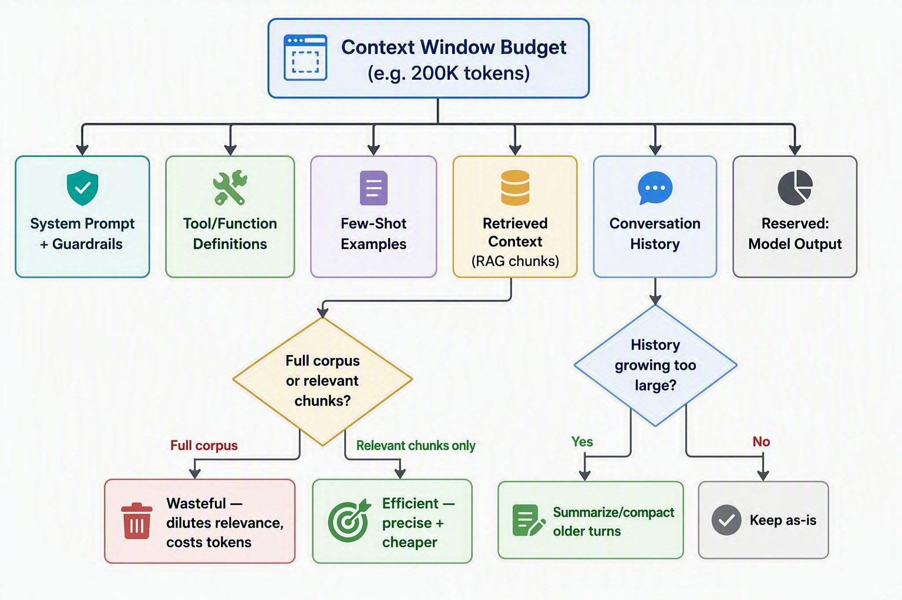
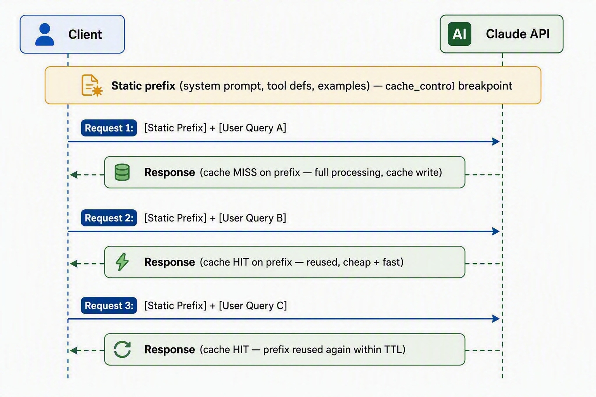

# D2: Claude Models, Prompting & Context Engineering

> **Exam weight**: 13% · **Questions**: ~16 of 120

## Overview

This domain covers the decisions an architect makes *before* a single line of orchestration code is written: which model family fits the workload, how the system prompt and guardrails are structured, which prompting technique gets the model to reason correctly, and how the context window's finite token budget is spent and reused across a session. These are cost, latency, and reliability levers — get them wrong and the rest of the architecture (routing, tools, evaluation) inherits the problem.

> 💡 **Human Angle**: Prompting is not "asking nicely" — it's specification. A system prompt is closer to an API contract than a conversation opener: the more ambiguity you leave in it, the more the model has to guess, and guessing is where inconsistency lives.

## Model Selection Trade-offs

### Key Concept

**Model selection is a portfolio decision, not a search for the single smartest model.**

Claude ships as a family of models along a capability–cost–latency spectrum rather than a single model with settings. At a given point in time the family typically spans three tiers:

- **Opus-class** — the most capable reasoning tier. Best for open-ended agentic tasks, multi-step planning, ambiguous instructions, and work where a wrong answer is expensive (legal analysis, complex code refactors, multi-agent orchestration/lead-agent roles). Highest cost per token and highest latency.
- **Sonnet-class** — the balanced production workhorse. Strong reasoning at meaningfully lower cost and latency than Opus; the default choice for most customer-facing and production agentic workloads. Supports extended context (up to 1M tokens on some Sonnet versions via a beta header) and extended thinking.
- **Haiku-class** — optimized for speed and cost at high volume. Best for classification, routing/triage, extraction, moderation, and other narrow, well-specified tasks where the acceptable error tolerance is symmetric with the cost savings.

A production architecture commonly mixes tiers: Haiku for routing, Sonnet for the primary task, Opus reserved for escalation paths or a lead/orchestrator role that spawns cheaper subagents. **Extended thinking is a lever to pull on hard problems, not a default setting** — it trades latency and token spend for accuracy on multi-step reasoning, so save it for the calls that are actually struggling.

### In Practice

**What breaks without this**: The single biggest line item in a Claude bill is often a classification step routed through Opus instead of Haiku — defaulting every call to the top-tier model inflates cost and latency without a proportional accuracy gain, and at millions of calls the 10x+ cost multiplier compounds fast. The opposite mistake is just as real: defaulting to the cheapest tier for ambiguous, high-stakes reasoning produces silently wrong answers that pass a smoke test but fail in production edge cases.

**Decision trigger**: Ask three questions per call site: (1) Is the task narrow and well-specified, or open-ended and ambiguous? (2) What is the cost of a wrong answer here — retry-able, or does it reach a customer/compliance boundary? (3) Is this call on a latency-sensitive path (user-facing, synchronous) or a batch/async path? Narrow + cheap-to-retry + latency-sensitive → Haiku. Ambiguous + high-stakes + can tolerate seconds of latency → Opus. Everything in the broad middle → Sonnet as the default, with extended thinking enabled only when a specific reasoning chain is failing.

**When you'd choose differently**: A single-tier architecture (all Sonnet, for example) is the right call for early-stage products where engineering time to build a tiered router costs more than the token savings would recoup, or where request volume is too low for the cost delta to matter. Don't build a three-tier routing layer to save a few dollars a day.

### Exam Trap ⚠️

Common distractor: "always use the most capable model to maximize accuracy." The exam rewards trade-off reasoning — cost and latency are explicit architectural constraints, not afterthoughts. If a scenario mentions high request volume, tight latency SLAs, or per-request cost budgets, the correct answer routes simple work to a smaller model rather than defaulting everything to the largest one. Think of it like hiring: you don't put your most senior engineer on data entry just because they're capable of it.

## System Prompts, Templates & Guardrails

### Key Concept

**Treat the system prompt as a strong preference, not a guarantee.**

The system prompt fixes role, scope, tone, constraints, and output format before any user input arrives — the architectural control surface for behavior, distinct from the turns that follow. A well-designed one is layered: role/persona, task scope, output format contract, and explicit guardrails (refusal conditions, escalation triggers, prohibited actions). Templating separates stable structure from variable payload, rendering a prompt from slots (tenant policy, tool availability, retrieved context) instead of hand-writing one per use case.

Guardrails operate at two levels: prompt-level (shapes what the model attempts) and system-level (validation or business logic outside the model that catches what the prompt didn't prevent). Critical constraints — PII handling, transaction limits, irreversible actions — belong in code-enforced guardrails, never prompt text alone. **A prompt-only guardrail is a suggestion the model can be talked out of** — the code-level check is what still holds when the suggestion fails.

### In Practice

**What breaks without this**: Later instructions get deprioritized or silently contradict earlier ones once a system prompt mixes persona, task instructions, and formatting rules in unstructured prose — format adherence (e.g., "always return valid JSON") gets inconsistent under load. Relying on the prompt alone as the only guardrail against a high-stakes action ("never approve a refund over $500") means one successful jailbreak or edge-case phrasing bypasses the only line of defense.

**Decision trigger**: Ask: "If this instruction is violated, what is the blast radius?" If the answer is reputational or low-stakes (wrong tone, minor format drift), a prompt-level guardrail is sufficient. If the answer touches money, data exposure, or irreversible external side effects, the constraint needs a code-level check (validation, allow-list, human approval step) in addition to the prompt instruction — the prompt reduces how often the check fires, the code guarantees it fires when needed.

**When you'd choose differently**: For internal, low-stakes tooling (an engineer-facing summarization assistant, for example) a single well-scoped system prompt without a separate enforcement layer is proportionate — building a full guardrail pipeline for a tool with no external side effects is over-engineering.

### Exam Trap ⚠️

Common distractor: treating the system prompt as sufficient for safety-critical constraints. Exam scenarios that describe a regulated or financial workflow are testing whether you add a code-enforced guardrail *outside* the model call — not whether you write a more emphatic instruction inside it. A system prompt is a steering wheel, not a seatbelt.

## Prompt Engineering Techniques (Zero-Shot, Few-Shot, Chain-of-Thought)

### Key Concept

**Match the technique to what the task is actually testing — format, reasoning, or neither.**

Three core techniques cover most production prompting decisions, and they are not mutually exclusive escalation tiers — they're tools matched to task shape:

- **Zero-shot** — the model performs the task from instructions alone, no examples. Works well when the task is common, well-represented in training data, and the desired output format is simple or can be fully specified in words (e.g., "summarize in three bullet points").
- **Few-shot** — the prompt includes 2-5+ input/output examples before the real task. This is the highest-leverage technique for *format precision and edge-case calibration* — when the desired output has a specific structure, tone, or handles ambiguous edge cases in a particular way, showing beats describing. Few-shot examples consume context window and, if long, are strong candidates for prompt caching (see below).
- **Chain-of-thought (CoT)** — the model is instructed to reason step by step before producing a final answer ("think through this before answering"), or explicit extended thinking is enabled. This materially improves accuracy on multi-step reasoning, math, and tasks with several dependent sub-decisions, at the cost of additional output tokens and latency.

These compose: a production prompt commonly combines a small number of few-shot examples (to lock the output schema) with a chain-of-thought instruction (to get correct reasoning before that schema is populated). **The question is never "which technique is best"** — it's what the task is testing: format fidelity points to few-shot, reasoning correctness points to CoT, and a simple well-defined task needs neither.

### In Practice

**What breaks without this**: Output drifts across runs when zero-shot is used for a task with a strict, non-obvious schema (a specific JSON shape with conditional fields) — the model has to infer structure it was never shown. The opposite mistake costs just as much: CoT on every call, including simple classification, adds tokens and latency for no accuracy benefit and can even hurt performance by encouraging over-thinking.

**Decision trigger**: Ask: "Is the model getting the *content* right but the *format* wrong?" → add few-shot examples showing the exact target format. Ask: "Is the model jumping to a plausible-sounding wrong answer on a multi-step problem?" → add a chain-of-thought instruction or enable extended thinking. If neither symptom is present, zero-shot with a clear instruction is the cheaper, faster, equally accurate choice.

**When you'd choose differently**: Skip CoT entirely for latency-critical, simple, high-volume classification (spam/not-spam on a support queue) even if it would nudge accuracy up marginally — the latency and token cost multiplied across volume outweighs the gain. Reach for CoT/extended thinking selectively, only on the calls that are actually hard.

### Exam Trap ⚠️

Common distractor: framing chain-of-thought as strictly superior to zero-shot, so the "safe" exam answer always adds reasoning steps. The exam tests situational fit — a scenario describing a simple, high-volume, latency-sensitive classification task is testing whether you *avoid* unnecessary CoT overhead, not whether you apply it everywhere. Similarly, few-shot is the answer to format-consistency problems, not reasoning-accuracy problems — mixing these up is a classic distractor pairing.

## Context Window Optimization & Token Usage

### Key Concept

**A bigger context window is a ceiling, not a target — unused capacity still costs and can dilute relevance.**

The context window is a finite, shared budget across system prompt, conversation history, tool definitions, retrieved documents (RAG), few-shot examples, and the model's own output — every token spent in one category is unavailable to another, and quality degrades as the window fills (models attend less reliably to information buried in the middle of a very long context, sometimes called the "lost in the middle" effect). Claude models commonly support a 200K-token standard context window, with some Sonnet versions supporting up to 1M tokens via a beta context header for workloads that genuinely require it.

Optimization techniques include summarizing or compacting older conversation turns instead of retaining full history, retrieving only relevant document chunks instead of stuffing entire corpora into context, pruning tool definitions to only what's needed for the current task, and placing important instructions near the start or end of the prompt (edges are attended to more reliably than the middle). **A wider highway doesn't fix a traffic jam caused by badly placed signs** — window size and context quality are separate problems, and upgrading capacity only solves one of them. Token usage is tracked via the `usage` object on every API response, the primary signal for cost and budget tracking in production.

### In Practice

**What breaks without this**: The model contradicts itself or "forgets" constraints stated at session start once truncation silently drops early instructions — this is what happens when an agent appends full conversation history turn after turn with no summarization. Stuffing an entire knowledge base into context instead of retrieving relevant chunks costs far more per call and measurably reduces answer quality, diluting relevant facts among irrelevant ones.

**Decision trigger**: Ask: "Does the model need this information for *this* turn, or is it historical context I'm carrying out of habit?" If a fact was relevant three turns ago but isn't load-bearing now, it's a summarization candidate. Ask: "Am I retrieving because the model needs it, or including it because it might be relevant?" — RAG retrieval should be a precision operation, not a hedge.

**When you'd choose differently**: Context optimization is largely moot for short-lived, single-turn tasks (a one-shot extraction or classification call) — there's no history to compact and no benefit to engineering a retrieval pipeline for a prompt that's already small. Optimization effort should scale with session length and document volume, not be applied uniformly.

### Exam Trap ⚠️

Common distractor: "a bigger context window solves context management" — the exam tests whether you recognize that window *size* and context *quality* are separate problems. A scenario describing degraded answer quality in a long-running agent session is testing summarization/compaction and retrieval precision, not "upgrade to the 1M-token window." Bigger doesn't mean effectively used — think of it as a bigger suitcase not the same thing as packing efficiently.

## Prompt Reuse Strategies (Caching, Modular Prompts, Skills)

### Key Concept

**Structure prompts with static content first, variable content last — caching only pays off for the shared prefix.**

Three complementary mechanisms let architects avoid re-sending and re-processing the same content on every call:

- **Prompt caching** — marking a stable prefix of the prompt (system prompt, tool definitions, few-shot examples, a large reference document) with a cache breakpoint so Claude reuses the already-processed representation on subsequent calls instead of reprocessing it from scratch. Cache reads are billed at a fraction of the base input token price and return with materially lower latency; cache writes carry a modest premium over standard input pricing. Caches expire on a short default TTL (minutes) with an extended-TTL option available for longer-lived sessions. The architectural implication: anything that changes per-request (the actual user query) belongs after the cache breakpoint, not mixed into it.
- **Modular prompts** — decomposing a prompt into reusable components (a persona block, a task-instruction block, a formatting-rules block, an examples block) assembled per use case rather than duplicating near-identical prompt text across many call sites. This is a maintainability and consistency strategy as much as a token strategy: a policy change updates one module instead of every prompt that used it.
- **Skills** — packaged, reusable capability bundles (instructions, optionally scripts and reference resources) that Claude loads *progressively* — only a short name/description is in context by default, with the full instructions and resources loaded on demand when the task actually needs that capability. This keeps a large library of specialized capabilities available to an agent without permanently consuming context budget for capabilities that aren't relevant to the current task.

### In Practice

**What breaks without this**: Every request pays full input-token price to reprocess content that hasn't changed when a high-volume agent sends an identical, lengthy system prompt and tool block without caching — at scale this is a direct, avoidable cost multiplier that also adds latency the cache would have eliminated. Duplicating prompt text across a dozen use-case-specific prompts instead of modular components means a single guardrail update requires hunting down every copy, and some inevitably drift out of sync.

**Decision trigger**: Ask: "Is a meaningful chunk of this prompt identical across many calls (system prompt, tool schema, a reference document, few-shot set)?" → put it before a cache breakpoint, with variable content after it. Ask: "Am I about to copy-paste a prompt block into a new use case?" → extract it into a shared module instead. Ask: "Does this agent need a capability only occasionally, and would loading its full instructions permanently crowd the context window?" → package it as a Skill loaded on demand rather than inlining it into the base system prompt.

**When you'd choose differently**: For low-volume or single-shot use cases (an internal script run a handful of times), the engineering overhead of setting up cache breakpoints or a modular prompt library exceeds the savings — plain, self-contained prompts are the right call until volume or reuse actually materializes.

### Exam Trap ⚠️

Common distractor: assuming caching applies to the entire conversation indiscriminately, or that variable user input can be cached. Caching only benefits a stable, repeated prefix — a scenario where the "reusable" content is actually the fast-changing user query is testing whether you recognize caching doesn't apply there. Also watch for scenarios testing Skills vs. simply appending more instructions to the system prompt: the "load only when needed" progressive-disclosure property is the load-bearing distinction, not just "another way to store instructions."

## Deep Dive: Making Model, Prompt & Context Decisions Click

### 1. The connective narrative

These five concepts are really one decision: **how do you get the right behavior out of Claude at the lowest sustainable cost, reliably, at scale?** Model selection sets the ceiling on what's possible per call. The system prompt and guardrails set the floor on what's acceptable. Prompting technique (zero-shot/few-shot/CoT) is how you close the gap between "the model could theoretically do this" and "the model reliably does this, every time, in the format you need." Context management is the budget constraint all of the above operates within — every token spent on a bloated system prompt, an unpruned tool list, or unsummarized history is a token not available for the actual task, and past a point it actively degrades quality rather than just costing money. Prompt reuse (caching, modularity, Skills) is what makes all of this affordable and maintainable once you're not writing one prompt for one demo, but hundreds of call sites running millions of times a month.

The throughline is that none of these are independent settings — they trade against each other. Choosing Opus for a task that's really a classification problem wastes the "capability" lever. Writing an unstructured, monolithic system prompt makes the "guardrail" lever unreliable. Skipping few-shot examples on a format-sensitive task means the "technique" lever isn't doing its job, so the model's raw capability gets undermined by ambiguity you introduced. And ignoring caching on a high-volume, static-prefix workload means you're paying full price for a lever (prompt reuse) that costs nothing to pull. A mature architecture tunes all five together for a given workload, not one in isolation.

### 3. Memory aid

**MTGCR** — the order to reason through this domain in:
- **M**odel — pick the tier by task shape (narrow/cheap vs. ambiguous/high-stakes), not by "best available."
- **T**echnique — zero-shot for simple/clear, few-shot for format precision, CoT for multi-step reasoning.
- **G**uardrails — prompt-level shapes behavior, code-level enforces anything with real blast radius.
- **C**ontext — budget every token category; bigger window ≠ better-used window.
- **R**euse — cache the static prefix, modularize the shared blocks, package occasional capabilities as Skills.

Read top to bottom: pick the model, shape the prompt technique, back critical rules with code, watch the token budget, then make it cheap to run at scale.

### 4. Exam strategy for this domain

- **The trap pattern**: absolute-language answers ("always use the largest model," "chain-of-thought improves every task," "a bigger context window fixes context problems," "the system prompt is sufficient for safety-critical rules"). Domain 2 questions are almost always trade-off questions with a scenario constraint (volume, latency SLA, stakes, budget) that points to one option over another — read for that constraint before picking an answer.
- **What the exam rewards**: matching technique to task shape (format problem → few-shot; reasoning problem → CoT; classification-at-volume → smaller model + zero-shot), and recognizing when a code-level guardrail is required versus when prompt-level instruction is proportionate.
- **What it punishes**: "maximalist" answers that add more model capability, more context, or more instructions as a default response to every scenario, ignoring the stated cost/latency/scale constraint.
- **The one sentence for 5 minutes before the exam**: match the model tier, prompting technique, and reuse strategy to the task's actual shape and stakes — bigger, more capable, and more instructed is not automatically better, it's automatically more expensive.

## Cheat Sheet 📋

| Concept | Key Rule |
|---------|----------|
| Model selection | Match tier to task: Haiku = narrow/high-volume/cheap, Sonnet = balanced production default, Opus = ambiguous/high-stakes/orchestration |
| Extended thinking | Enable selectively for hard multi-step reasoning, not as a default on every call — costs latency and tokens |
| System prompt structure | Layer role, scope, output format, and guardrails distinctly; don't blend into unstructured prose |
| Guardrail placement | Prompt-level = shapes typical behavior; code-level = required for anything with real blast radius (money, PII, irreversible actions) |
| Zero-shot | Use for simple, well-specified, common tasks — no examples needed |
| Few-shot | Use to fix output *format* consistency and edge-case handling — show, don't just describe |
| Chain-of-thought | Use to fix *reasoning* correctness on multi-step problems — not a blanket accuracy booster |
| Context window | Finite shared budget across system prompt, tools, examples, RAG, history, output — bigger window ≠ automatically better answers |
| Context optimization | Summarize/compact aging history; retrieve relevant chunks, not whole corpora; prune unused tool defs |
| Prompt caching | Cache the static prefix (system prompt, tool defs, examples, reference docs); put variable content after the breakpoint; cache reads are far cheaper and faster than reprocessing |
| Modular prompts | Extract shared blocks (persona, format rules, guardrails) into reusable components to keep policy changes single-sourced |
| Skills | Package occasional/specialized capabilities with progressive disclosure — full instructions load only when the task needs them, not permanently in context |

## What to Remember

- Model choice, prompting technique, guardrail placement, context budget, and reuse strategy are five levers on the *same* decision — tune them together against the task's actual shape, stakes, and volume, not in isolation.
- The exam consistently rewards trade-off reasoning over maximalist answers: the "most capable/most context/most instruction" option is rarely correct when a scenario states a cost, latency, or scale constraint.
- Safety-critical constraints need code-level enforcement outside the model call; the system prompt shapes behavior, it does not guarantee it.
- Few-shot fixes format problems; chain-of-thought fixes reasoning problems — conflating the two is a recurring distractor pattern.
- A larger context window raises the ceiling; it does not by itself improve answer quality — summarization, retrieval precision, and pruning are what keep a long-running session accurate.
- Prompt caching only pays off on a genuinely static, repeated prefix — structure prompts static-content-first, variable-content-last to make caching effective.
