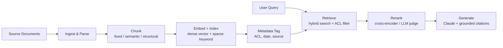
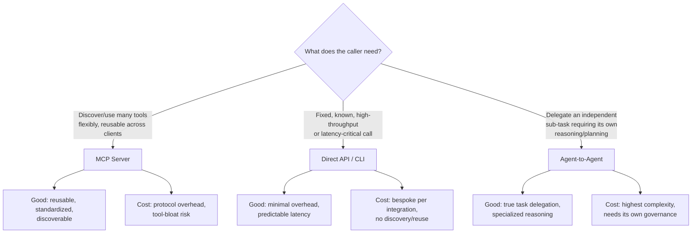

# D3: Integration

> **Exam weight**: 19% · **Questions**: ~23 of 120

## Overview

Integration is the domain where architecture meets the messy reality of production systems: how many tools an agent actually needs, who is allowed to call what, how fast an answer has to come back, how you'd know if any of it silently broke, and how a retrieval pipeline finds the right ten sentences out of ten million. It is the largest domain on the exam because it is where the most expensive mistakes get made — not in the model, but in the plumbing around it.

> 💡 **Human Angle**: A junior architect asks "can we add this tool?" A senior architect asks "what happens to accuracy, latency, and the blast radius of a compromised credential if we do?" Integration is the domain that turns the first question into the second.

## Tool & Agent Configuration: Avoiding Capability Bloat

### Key Concept

Capability bloat is the accumulation of tools, permissions, or sub-agents beyond what any single task actually requires. It happens gradually — a team adds "just one more tool" to solve a narrow problem, and eighteen months later an agent has forty tool definitions, most unused on any given turn. The cost is not just token overhead in the system prompt; it is a measurable degradation in tool-selection accuracy. As the number of semantically similar tool descriptions grows, the model's ability to pick the *correct* one drops, because ambiguity between look-alike tools (`update_ticket` vs `update_ticket_status` vs `patch_ticket`) rises faster than the model's discriminative signal.

The architectural response is **least-privilege tool scoping**: give each agent or sub-agent only the tools it needs for its role, and use routing/orchestration (a coordinator agent, or MCP server segmentation) to keep any single context window's tool list small and semantically distinct. This is the same principle as least-privilege IAM, applied to capability surfaces instead of permissions.

### In Practice

**What breaks without this**: Tool-selection accuracy degrades measurably once an agent's active tool list crosses roughly 15–20 concurrently exposed tools, especially when several tools act on the same object type (e.g., three different "update ticket" variants). The failure mode isn't a crash — it's silent: the agent picks a plausible-but-wrong tool, and the error surfaces downstream as a data-quality or audit problem, not an exception.

**Decision trigger**: Ask — do any two tools in this agent's active set act on the same object type, or do more than ~15 tools need to be visible in a single turn? If yes, split by domain (billing agent, ticketing agent, inventory agent) and route between them with a coordinator, or use MCP server-level segmentation so only the relevant tool subset loads into context at a time.

**When you'd choose differently**: For a narrow, single-purpose agent (e.g., a dedicated "refund processor" that only ever calls 3 tools), consolidating everything into one flat tool list is correct — introducing a coordinator layer for 3 tools adds latency and failure surface for no accuracy benefit. Scoping is a response to breadth, not a default posture.

### Exam Trap ⚠️

Common distractor: "more tools = more capable agent." The exam will present a scenario where a team wants to add tools to "cover more cases" and reward the answer that instead proposes decomposition (multiple scoped agents) over a single monolithic tool list. Think of tool bloat like a Swiss Army knife with sixty blades — technically more capable, practically harder to find the one blade you need in an emergency.

## Authentication & Authorization: Identifying Security Gaps

### Key Concept

Agentic systems introduce a class of security gap that traditional application security doesn't fully anticipate: the *agent* is a caller with its own credential, but the *user* behind the agent has their own identity and entitlements too. Analyzing auth requirements means distinguishing **authentication** (is this agent/tool call cryptographically who it claims to be — API keys, OAuth tokens, mTLS) from **authorization** (given that identity, is this specific action on this specific resource permitted — RBAC/ABAC scoped per tool, per data source, per user session).

The common gap: a tool is authenticated with a single service-level credential (e.g., one API key for the whole MCP server) but the agent is expected to act on behalf of many different end users with different entitlements. If authorization isn't re-checked per-call against the *acting user's* permissions — not the service credential's broad permissions — the agent becomes a confused-deputy: it has more access than any individual user should, and it will use that access if asked (including via prompt injection from untrusted tool output).

### In Practice

**What breaks without this**: An agent connected to an internal MCP server with a single admin-scoped service token will, when asked (including by a malicious instruction embedded in a document it retrieved), read or modify records the requesting human user was never authorized to touch. This is the confused-deputy problem, and it is the single most common security gap found in enterprise agent audits — not a broken auth *system*, but a missing per-call authorization *check*.

**Decision trigger**: Ask — does this tool call cross a trust boundary (different user, different data sensitivity tier, external system)? If yes, verify that authorization is evaluated per-call against the acting user's actual entitlements, not just validated once at session start against a broad service credential.

**When you'd choose differently**: For a fully internal, single-tenant automation with no untrusted input path (e.g., a scheduled batch agent with no user-facing surface and no external tool output ingested), a single scoped service credential with authorization checked once at boot is proportionate — the confused-deputy risk requires an untrusted input path or multi-tenant context to materialize.

### Exam Trap ⚠️

Common distractor: questions conflate "we use OAuth" (authentication is solved) with "access is controlled" (authorization is solved). They are independent axes. An agent can be perfectly authenticated and still catastrophically over-authorized. Treat auth like a hotel key card: authentication is the card working at the front door; authorization is which floors it opens — a working card that opens every floor is not a security control.

## Accuracy-Latency Trade-offs

### Key Concept

Every integration decision — model choice, RAG retrieval depth, number of tool calls in a chain, extended thinking budget, prompt caching strategy — sits on an accuracy/latency/cost frontier, and there is no configuration that maximizes all three simultaneously. Architects are expected to **justify** a chosen point on that frontier against the actual SLA and failure cost of the use case, not default to "most accurate" or "fastest" as a universal answer.

Concretely: retrieving 20 chunks and reranking them is more accurate than retrieving 5 and skipping reranking, but costs an extra round trip and reranking latency. A multi-step agentic tool chain (search → fetch → verify → summarize) is more accurate than a single-shot answer but multiplies latency roughly by the number of sequential steps. Extended thinking improves reasoning-heavy accuracy but adds token cost and time that a synchronous chat UI may not tolerate.

### In Practice

**What breaks without this**: Teams that default to "maximum accuracy configuration" for a synchronous, user-facing chat surface (e.g., a support widget with a 3-second user-patience budget) ship a pipeline that takes 12 seconds end-to-end and gets abandoned by users before the accurate answer ever renders. Conversely, teams that default to "fastest" for a compliance-adjacent use case (e.g., contract clause extraction) ship an unreviewed single-pass answer that fails audit because no verification step existed.

**Decision trigger**: Ask two questions in order — (1) what is the cost of a wrong answer here (a bad support macro suggestion vs. a bad contract clause), and (2) what is the user's actual latency tolerance (synchronous chat vs. an async batch job)? The intersection of those two answers — not a fixed preference — determines whether you add reranking, multi-step verification, and extended thinking, or strip them out.

**When you'd choose differently**: For high-stakes, asynchronous workflows (legal review, financial reconciliation, medical-adjacent summarization) where the consumer is not waiting in real time, always bias toward the higher-accuracy, higher-latency configuration — there is no latency budget to defend, so the trade-off collapses to a non-decision in favor of accuracy.

### Exam Trap ⚠️

Common distractor: the exam will present a scenario with a stated SLA (e.g., "sub-2-second response required") and a tempting "most thorough" answer choice that violates it. The correct answer is the one that fits the stated latency budget, even if a more accurate configuration exists on paper. Read the SLA in the scenario like a hard constraint, not a preference.

## Observability at Scale

### Key Concept

Agentic systems fail in ways traditional application monitoring doesn't catch: a tool call can succeed (200 OK) while returning semantically wrong data; a multi-step agent can loop or silently drop a step; a RAG pipeline can retrieve confidently-wrong chunks with no error signal at all. Observability for agentic integrations therefore needs **three layers beyond standard infra metrics**: (1) trace-level visibility into each tool call and its inputs/outputs (not just "did the API call succeed"), (2) output-quality signals (grounding checks, citation validation, confidence/uncertainty scoring) sampled or run continuously in production, and (3) drift detection — is retrieval quality, tool-selection accuracy, or task success rate degrading over time as data or usage patterns shift.

At scale, full human review of every trace is infeasible, so the strategy shifts to **statistical sampling plus automated grading** (LLM-as-judge or rule-based checks on a subset of traffic) combined with alerting on aggregate metrics (tool error rate, retrieval hit rate, escalation/fallback rate) rather than per-transaction inspection.

### In Practice

**What breaks without this**: A RAG-backed support agent silently starts retrieving stale documentation after a source system migration changes document IDs — every tool call returns 200 OK, so infra dashboards stay green, while answer quality degrades for weeks before a human notices via customer complaints. Standard APM (application performance monitoring) has no signal for this because nothing "errored."

**Decision trigger**: Ask — if this component silently returned plausible-but-wrong output instead of failing loudly, how would we know, and how long would it take? If the honest answer is "we wouldn't, until a user complains," you need an output-quality or drift-detection layer, not just uptime monitoring.

**When you'd choose differently**: For low-stakes, low-volume internal tools (an experimental prototype used by five people), full automated grading infrastructure is disproportionate — spot-check sampling and a feedback button are sufficient until the system reaches production scale or stakes.

### Exam Trap ⚠️

Common distractor: equating "monitoring" with "the API returned 200." Agentic failure is frequently silent and semantic, not thrown as an exception. Think of it like a translator who confidently mistranslates: the conversation continues smoothly, nothing "breaks," but the meaning is wrong — you need someone checking the meaning, not just checking that words were spoken.

## Design a RAG Pipeline: Chunking and Indexing

### Key Concept

A RAG pipeline is a sequence of decisions, each of which trades off recall, precision, and cost, and each of which must match the shape of the source data:

- **Chunking**: fixed-size chunking (e.g., 512 tokens with overlap) is cheap and predictable but can split a coherent idea across chunk boundaries. Semantic/structure-aware chunking (splitting at paragraph, section, or heading boundaries; using document structure like Markdown headers or code function boundaries) preserves meaning but is more expensive to compute and produces variable chunk sizes. Overlap (10–20% of chunk size) mitigates boundary loss at the cost of index size.
- **Indexing**: dense vector embeddings capture semantic similarity ("cars" matches "automobiles") but underperform on exact-match needs (part numbers, error codes, legal citations). Sparse/keyword indexes (BM25) excel at exact-match and rare-term retrieval but miss paraphrase and synonym matches. **Hybrid indexing** (dense + sparse, combined via reciprocal rank fusion or a weighted score) is the production default for heterogeneous enterprise content because it covers both failure modes.
- **Metadata filtering**: indexing structured metadata (document date, source system, access-control tags) alongside content allows retrieval to pre-filter before similarity search — critical for both relevance (don't retrieve a 2019 policy when a 2026 one exists) and authorization (don't retrieve documents the querying user can't access).

### In Practice

**What breaks without this**: Fixed-size chunking applied to a legal contract splits a defined term from its definition across two chunks; the retriever finds the usage but not the definition, and the model confidently generates an answer using the wrong meaning of the term — with no error surfaced anywhere in the pipeline. This is a chunking-strategy failure, not a model failure, and it looks identical to a hallucination from the outside.

**Decision trigger**: Ask — does this content have a real internal structure (headings, clauses, functions, table rows) that a naive fixed-size split would ignore? If yes, chunk along that structure. Ask separately — will users search with exact terms (SKUs, error codes, statute numbers) as often as with natural language? If yes, hybrid indexing is not optional.

**When you'd choose differently**: For large, homogeneous, low-structure corpora (e.g., millions of short customer chat transcripts) fixed-size chunking with generous overlap is the right default — the engineering cost of structure-aware chunking has no payoff when there's no meaningful structure to preserve, and the uniform chunk size simplifies index management at scale.

### Exam Trap ⚠️

Common distractor: "always use the smallest chunk size for precision" or "always use the largest chunk size for context." Both are wrong as universal rules — chunk size is a function of the content's natural unit of meaning, not a fixed constant. Think of chunking like editing sentences out of a book for a highlight reel: cut too short and you lose the point; cut too long and you bury it in noise.

## Retrieval Strategies Matched to Data Shape and Query Pattern

### Key Concept

Retrieval strategy is not one-size-fits-all; it must match both the **shape of the data** and the **pattern of the queries**:

| Data shape | Query pattern | Matched strategy |
|---|---|---|
| Unstructured prose (docs, wikis) | Natural-language, conceptual questions | Dense vector semantic search |
| Structured/tabular (pricing, inventory) | Exact lookups, filters, aggregations | Direct query (SQL/API) over vector search — retrieval isn't always "search" |
| Mixed (support tickets with codes + prose) | Both exact-match and conceptual | Hybrid dense + sparse retrieval |
| Highly interconnected (org charts, dependency graphs, codebases) | "What depends on X" / relationship questions | Graph-based retrieval (traverse relationships, not just similarity) |
| Long single documents (contracts, manuals) | "Find the clause about X" | Hierarchical retrieval: retrieve section/summary first, then drill into chunk |

The core architectural insight tested here is that **retrieval is not synonymous with vector search**. When data is structured and the query is a lookup ("what is the current price of SKU-4471"), the correct "retrieval" is a direct database or API query — using a vector index for this is slower, less accurate, and more expensive than the obvious alternative.

### In Practice

**What breaks without this**: Routing every query type through a single vector-similarity retriever means an exact-match query ("order #48213 status") gets converted to embedding space, compared against thousands of semantically similar-but-wrong orders, and returns approximately-right instead of exactly-right results — for data that had an exact, deterministic answer available via a direct database call the whole time.

**Decision trigger**: Ask — does this query have a deterministic, structured answer available from a system of record (a database row, an API response)? If yes, route there directly and skip the vector index entirely. Only fall back to semantic retrieval when the query is genuinely open-ended or the answer is embedded in unstructured prose.

**When you'd choose differently**: For exploratory or conversational queries against structured data ("what trends do you see in Q3 refunds"), pure structured querying fails — you need retrieval (or a text-to-SQL/analysis step) layered on top, because the query itself isn't a lookup, it's an analytical question requiring synthesis.

### Exam Trap ⚠️

Common distractor: a scenario describing clearly structured, lookup-pattern data (inventory, pricing, order status) paired with an answer choice proposing a vector RAG pipeline. The trap tests whether the candidate defaults to "RAG" as a reflex for all integration problems instead of recognizing a direct-query solution was simpler, faster, and more accurate.

## Connection Protocols: MCP vs. API/CLI vs. Agent-to-Agent

### Key Concept

Choosing how a Claude-based system connects to external capability is itself an architecture decision with real trade-offs, not a stylistic preference:

- **MCP (Model Context Protocol)**: standardizes how an agent discovers and invokes tools/resources across many servers with one consistent interface. Best when you need the *same* agent to flexibly discover and use a changing or wide set of external tools, or when multiple different client applications need to reuse the same tool integrations without rebuilding them. Cost: an added protocol layer, and (per capability-bloat above) discipline is needed to avoid exposing every tool from every server at once.
- **Direct API/CLI integration**: a hand-built, purpose-specific call to a known endpoint or command. Best when the integration is fixed, high-throughput, latency-sensitive, or when the overhead of a general discovery protocol isn't justified by a stable, small, well-known set of calls. Lower abstraction cost, less flexibility, more integration code to maintain per system.
- **Agent-to-agent (A2A) communication**: one agent delegates a sub-task to another autonomous agent (potentially with its own tools, memory, and reasoning) rather than calling a stateless tool. Best when the sub-task genuinely requires independent reasoning, multi-step planning, or ownership of a distinct capability domain (e.g., a "billing agent" that owns billing logic end-to-end) — not just data retrieval or a single function call.

### In Practice

**What breaks without this**: Building a bespoke direct-API integration for every new data source an agent might need — instead of an MCP server — means each new connector requires custom client code, and every client application (chat UI, batch pipeline, internal CLI) that wants the same capability has to reimplement it. Conversely, wrapping a single, fixed, high-frequency internal API call in a full MCP server adds discovery and protocol overhead to a call pattern that was never going to change or need reuse — pure latency cost for no benefit.

**Decision trigger**: Ask three questions in order: (1) Will more than one client/agent need this capability over time? (2) Does the set of available tools/resources need to be discoverable/changeable without redeploying the client? (3) Does the sub-task require independent multi-step reasoning, or is it a single well-defined function call? Reusable + discoverable → MCP. Fixed + single-purpose → direct API/CLI. Independent reasoning required → agent-to-agent delegation.

**When you'd choose differently**: A latency-critical trading or fraud-detection path calling the same three internal APIs millions of times a day should stay on direct API integration even if MCP is used everywhere else in the org — the protocol overhead is a real cost at that volume, and there's no discovery benefit when the endpoints never change.

### Exam Trap ⚠️

Common distractor: treating MCP as strictly "more advanced" and therefore always preferable to direct API calls, or treating agent-to-agent as interchangeable with a plain tool call. MCP standardizes *discovery and invocation*, it doesn't make an integration inherently smarter; A2A implies a delegate with its own reasoning loop, not just a remote function. Picking A2A for what is actually a stateless lookup is the same category of over-engineering as capability bloat, just at the architecture layer instead of the tool layer.

## Progressive Discovery vs. Monolithic Context Strategy

### Key Concept

When an agent has access to a large body of tools, documents, or capabilities, there are two ways to expose them: **monolithic context** (load everything — every tool description, every document, every instruction — into the context window up front) or **progressive discovery** (expose a minimal entry point, and let the agent request more detail, list available tools, or fetch specific resources only as needed, layer by layer).

Monolithic context is simpler to reason about and guarantees the model always "sees" every option, but it consumes context budget whether or not any given item is relevant to the current turn, degrades tool-selection and retrieval accuracy as volume grows (see capability bloat), and increases per-request cost and latency. Progressive discovery (e.g., an MCP server exposing a `list_tools`-then-`describe_tool`-then-`call_tool` pattern, or a document index the agent searches before loading full text) keeps the active context lean, scales to far larger capability/document sets, but adds round trips (latency) and risks the agent failing to discover something relevant if the discovery layer itself is poorly designed (e.g., ambiguous top-level categories).

### In Practice

**What breaks without this**: A monolithic system prompt that inlines full descriptions for 60 tools and 40 policy documents "just in case" consumes tens of thousands of tokens before the user's actual question is even read, inflating cost and latency on every single turn — including the 95% of turns that only need 2 of those 60 tools. As the tool/doc count grows, this isn't a one-time cost, it's a permanent tax on every request.

**Decision trigger**: Ask — does the total candidate set of tools/documents/instructions exceed what's relevant to a typical single turn by a wide margin (e.g., 60 tools available, ~3 typically used)? If yes, progressive discovery (list → describe → invoke, or search → fetch) pays for itself in reduced per-turn cost and improved selection accuracy, despite the added round-trip latency.

**When you'd choose differently**: For a small, stable, always-relevant capability set (a dedicated agent with 4 tools it uses on nearly every turn), monolithic context is correct — progressive discovery would add latency (extra round trips) for information the agent needed anyway on almost every call.

### Exam Trap ⚠️

Common distractor: framing progressive discovery as strictly "better" in every scenario. It is better for large, sparsely-used capability sets and worse for small, densely-used ones, where the extra round trip is pure overhead. The exam rewards matching the strategy to the ratio of "total available" to "typically needed per turn," not picking a universal favorite.

## Deep Dive: Making Integration Click

### 1. The connective narrative

Every concept in this domain answers a version of the same question: *how much should this system be exposed to, trust, and wait for, given what's actually at stake?* Capability bloat and progressive-vs-monolithic context are both about exposure — how much of the available world does the agent see in a given turn, and does more visibility actually help or just add noise and cost. Authentication/authorization is about trust — once the agent can see and act, who is it acting *as*, and does its access match that identity rather than a broad service-level default. Accuracy-latency trade-offs and observability are both about consequence and confidence — given a chosen level of exposure and trust, how do you decide how much verification is worth the wait, and how do you know, continuously, whether the system is still behaving the way you designed it to.

RAG design, retrieval-strategy matching, and connection-protocol selection are the concrete mechanics that implement those decisions. A RAG pipeline is exposure control applied to documents (chunking and indexing decide what's *findable*, metadata filtering decides what's *visible to this user*). Retrieval-strategy matching is a refusal to over-apply one mechanism (vector search) to every data shape — the same discipline as refusing to over-apply one tool to every task. Connection-protocol selection (MCP vs. API/CLI vs. A2A) is exposure control applied to systems: how much of the outside world does this agent get to discover and invoke, through what interface, and at what overhead.

The unifying discipline is **proportionality**: every mechanism in this domain — scoping, chunking, indexing, protocol choice, discovery pattern, verification depth — should be sized to the actual shape of the data, the actual stakes of the task, and the actual latency budget of the consumer. The exam consistently rewards the answer that matches configuration to context, and punishes the answer that applies a maximal or universal default (most tools, most accurate, most secure-sounding, most modern protocol) without justifying it against the scenario's real constraints.

### 3. Memory aid

**SCALE** the integration decision, every time:
- **S**cope — least-privilege tools, per role, not per convenience
- **C**redential match — authorization tied to the acting user, not the service account
- **A**ccuracy vs. latency — justified against the real SLA and the real cost of being wrong
- **L**ookup vs. language — structured data gets a direct query, unstructured data gets retrieval
- **E**xposure — progressive discovery for broad/sparse capability sets, monolithic only for small/dense ones

### 4. Exam strategy for this domain

- The exam's favorite trap is the "impressive-sounding default": more tools, maximum accuracy, the newest protocol (MCP), full monolithic context, vector search for everything. In each case there is a scenario detail (SLA, data shape, tool count, trust boundary) that makes a *less* impressive-sounding answer the correct one. Read for that detail before picking the answer that sounds most sophisticated.
- Integration questions reward matching, not maximizing. The exam is testing whether you can size a mechanism (chunking, protocol, discovery pattern, verification depth) to the actual shape of the problem in the scenario — not whether you know that a more thorough mechanism exists.
- Security-gap questions specifically test the authentication/authorization distinction — expect at least one question where "we use OAuth" is a distractor for a scenario whose actual problem is a missing per-call authorization check.
- The one sentence to remember five minutes before the exam: *every integration choice in this domain is a proportionality question — match the mechanism to the data shape, the trust boundary, and the latency budget the scenario actually describes.*

## Cheat Sheet 📋

| Concept | Key Rule |
|---------|----------|
| Capability bloat | Tool-selection accuracy degrades past ~15–20 concurrently exposed tools or when tools overlap on object type — scope by role, split with a coordinator |
| Authentication vs. authorization | Authentication = who is calling; authorization = what that identity may do. Check authorization per-call against the *acting user*, not a broad service credential |
| Accuracy-latency trade-off | No universal "most accurate" default — justify against the scenario's stated SLA and the cost of a wrong answer |
| Observability at scale | Tool calls can succeed (200 OK) while being semantically wrong — add output-quality sampling and drift detection, not just uptime monitoring |
| Chunking | Match chunk boundaries to the content's natural structure (sections, clauses, functions); fixed-size + overlap for homogeneous low-structure corpora |
| Indexing | Hybrid dense (semantic) + sparse (exact-match/BM25) is the production default for mixed enterprise content; metadata tagging enables relevance and ACL filtering |
| Retrieval strategy | Structured/lookup data → direct API/DB query; unstructured/conceptual → semantic retrieval; interconnected data → graph traversal; RAG is not a universal default |
| MCP vs. API/CLI vs. A2A | MCP = reusable/discoverable tool access across clients; API/CLI = fixed, high-throughput, low-overhead single integration; A2A = delegate independent multi-step reasoning, not a function call |
| Progressive discovery vs. monolithic | Progressive discovery when available capability greatly exceeds per-turn need (large/sparse); monolithic when the set is small and used almost every turn (small/dense) |

## What to Remember

Integration is a domain of proportionality, not maximization. For every mechanism — tool exposure, authorization checks, accuracy investment, monitoring depth, chunking granularity, index type, connection protocol, and context-loading strategy — the correct architectural answer sizes the mechanism to three things: the actual shape of the data, the actual trust boundary being crossed, and the actual latency/stakes budget stated in the scenario. When an exam question offers a more sophisticated-sounding option (more tools, more accuracy, a newer protocol, full context up front), check the scenario for the constraint that makes a leaner, better-matched answer correct instead — that check is the skill this domain is built to test.
