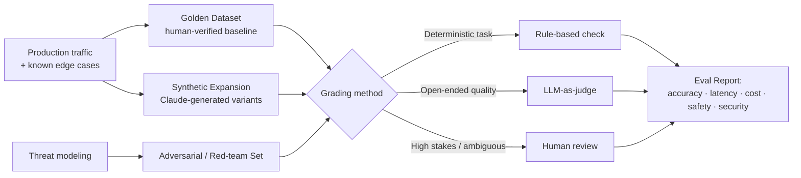
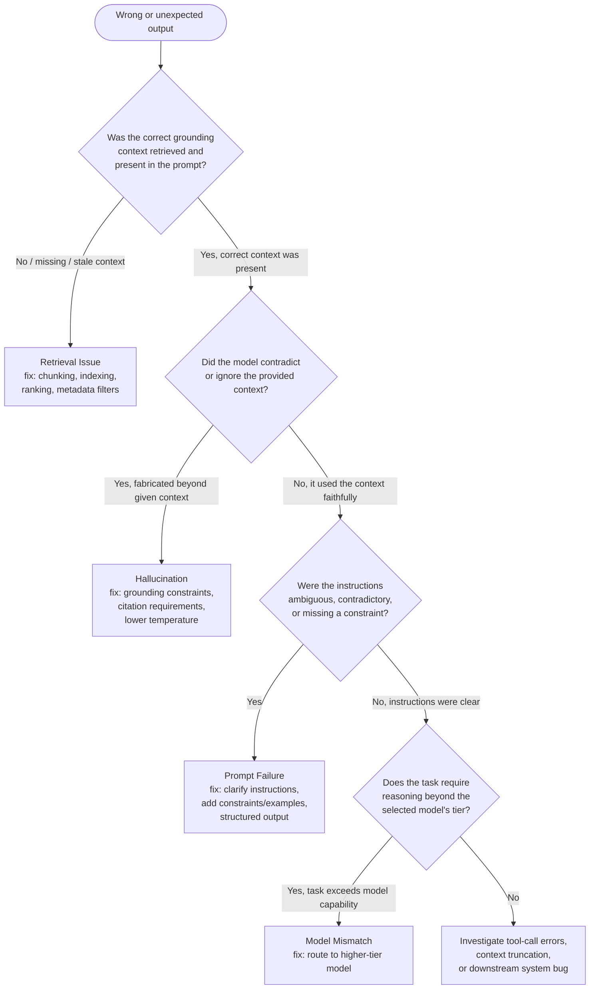

# D4: Evaluation, Testing & Optimization

> **Exam weight**: 16% · **Questions**: ~19 of 120

## Overview

Evaluation, Testing & Optimization is the domain that turns "it seems to work" into a defensible, measurable claim. Architects in this domain are expected to define what "good" means before shipping (metrics and datasets), prove a change actually helped rather than just feels different (A/B testing), tell apart failure modes that look identical from the outside but demand opposite fixes (prompt failure vs. hallucination vs. model mismatch vs. retrieval issue), and keep a system honest in production long after launch (logging, observability, cost/latency tuning).

> 💡 **Human Angle**: A doctor doesn't treat a fever by guessing — they run tests to find out *which* underlying problem is causing the symptom, because the wrong treatment for the right symptom makes things worse. Diagnosing an agentic system is the same discipline: the symptom ("wrong answer") is never the diagnosis, and treating the wrong root cause burns a sprint without fixing anything.

## Evaluation Metrics: Accuracy, Latency, Cost, Safety, Security

### Key Concept

An evaluation strategy is only as good as the metrics it optimizes for, and a mature architect defines all five categories up front rather than defaulting to the one that's easiest to measure:

- **Accuracy** — task success rate against a ground-truth or rubric-graded standard (exact match, F1, rubric score, or LLM-as-judge score). Accuracy is not one number: a support-triage agent needs *intent classification accuracy*, *tool-selection accuracy*, and *final-answer correctness* tracked separately, because a system can be right about the tool and wrong about the answer, or vice versa.
- **Latency** — time-to-first-token (perceived responsiveness) and time-to-completion (total task time), measured at percentiles (p50/p95/p99), not just the mean. A mean latency of 800ms hides a p99 of 6 seconds that a real user actually experiences.
- **Cost** — dollars per request (input tokens + output tokens + tool-call overhead + any reranking/embedding cost), tracked per unit of business value (cost per resolved ticket, not just cost per API call), because a cheaper-per-call system that resolves fewer tickets can be more expensive overall.
- **Safety** — rate of harmful, biased, or policy-violating outputs, typically measured against a red-team or adversarial test set and tracked as a refusal-accuracy pair (correctly refusing unsafe requests *and* correctly not over-refusing safe ones).
- **Security** — rate of successful prompt injection, jailbreak, or data-exfiltration attempts against the system under adversarial testing, distinct from safety because a system can be perfectly "safe" (never says harmful things) while still being trivially exploitable by an injected instruction in retrieved content.

These five metrics trade off against each other (D3's accuracy-latency frontier is one slice of this), so evaluation design must report them together, not pick the one that looks best.

### In Practice

**What breaks without this**: A team ships a system optimized purely on an accuracy leaderboard and discovers in production that p99 latency triples under real traffic, or that cost-per-resolved-ticket is actually higher than the human baseline once tool-call overhead is counted — because latency and cost were never part of the pre-launch gate, only measured after the fact when it's expensive to fix.

**Decision trigger**: Ask — for this use case, which of the five metrics has a hard floor (a compliance-mandated safety bar, a contractual latency SLA, a budget ceiling) versus which one is the optimization target? Define the floors as non-negotiable gates and only then tune the target metric within them — never the reverse.

**When you'd choose differently**: For an internal, low-stakes prototype with five users and no compliance exposure, a full five-metric evaluation harness is disproportionate — track accuracy and rough cost, and defer formal safety/security red-teaming until the system has a real user base or moves toward production.

### Exam Trap ⚠️

Common distractor: a question that presents "accuracy improved" as sufficient evidence a change should ship. The exam rewards recognizing that accuracy is one of five required metrics — a change that improves accuracy while blowing the latency SLA or tripling cost per resolution is not a shipping decision, it's an incomplete evaluation. Treat the five metrics like a pilot's pre-flight checklist: one green light doesn't mean cleared for takeoff.

## Designing Evaluation Datasets and Test Frameworks Using Mixed Methodologies

### Key Concept

A single evaluation dataset or grading method cannot cover both breadth and depth, so production-grade eval frameworks combine methodologies deliberately:

- **Golden datasets** — a curated, human-verified set of representative input/expected-output pairs, used as a stable regression baseline across model or prompt changes. Small, high-trust, expensive to build, and must be refreshed as real usage patterns drift from what it originally captured.
- **Synthetic/generated datasets** — Claude-generated variations (paraphrases, edge cases, adversarial phrasings) that scale coverage cheaply but require human spot-checking, because a model-generated test set can inherit the same blind spots as the model being tested.
- **Adversarial / red-team sets** — deliberately hostile or ambiguous inputs designed to probe safety and security failure modes (prompt injection payloads, jailbreak attempts, contradictory instructions), distinct in purpose from accuracy datasets.
- **Grading methods, mixed**: rule-based checks (exact match, regex, schema validation) for deterministic tasks; **LLM-as-judge** (a separate Claude call scoring output against a rubric) for open-ended quality where no single correct string exists; human review for the highest-stakes or most ambiguous cases, sampled continuously rather than exhaustively at scale.

The core design principle is **coverage matched to risk**: golden + rule-based for the deterministic core, synthetic + LLM-as-judge for breadth on open-ended behavior, adversarial + human review concentrated on the highest-consequence failure modes.

### In Practice

**What breaks without this**: A team ships evaluation using only a 50-example golden dataset hand-written by the original engineers. It passes at 96% — but the golden set never included the adversarial phrasing a real attacker used, or the edge-case input pattern that appears in 8% of real traffic, so the eval score is confidently wrong about production readiness.

**Decision trigger**: Ask — does this dataset cover the *distribution* of real inputs (including adversarial and edge cases), or only the *happy path* the team thought of? If only the happy path, add synthetic expansion for breadth and an adversarial set sized to the system's actual threat model before treating a passing score as a launch signal.

**When you'd choose differently**: For a narrow, deterministic internal tool (e.g., a data-format converter with a fixed, well-understood input schema), a small rule-based golden dataset alone is sufficient — LLM-as-judge and adversarial red-teaming add cost with no signal when the task has no open-ended or safety-relevant surface.

### Exam Trap ⚠️

Common distractor: treating "we have an eval dataset" as equivalent to "we have evaluation coverage." A 30-example hand-picked set that passes 100% tells you almost nothing about a system serving millions of varied real-world requests. Think of it like tasting one spoon from a giant pot of soup — it tells you about that spoon, not the pot, unless you stirred first (representative sampling) and tasted more than once (mixed methods).

## A/B Testing and Iterative Improvements

### Key Concept

A/B testing (champion/challenger) is the mechanism that converts "this prompt/model/pipeline change feels better" into a statistically defensible decision. The design requirements: a **holdout or control group** running the current (champion) configuration, a **treatment group** running the proposed (challenger) configuration, **randomized and comparable traffic allocation** between them, and a **pre-registered primary metric** (not picking the metric that happened to improve after the fact — that's p-hacking). Statistical significance requires enough sample size to distinguish real effect from noise; for low-traffic systems, this can mean an A/B test needs weeks to reach a trustworthy conclusion, not hours.

Common confounds to control for: the **novelty effect** (users or graders react differently to a change simply because it's new/different, inflating short-term results that regress later), **seasonality/traffic-mix shifts** (comparing a weekday cohort to a weekend cohort), and **selection bias** (routing "easier" traffic to the challenger to make it look better). Iterative improvement is the loop this enables: evaluate → form a hypothesis about the failure mode → make one isolated change → A/B test that single change → adopt or discard → repeat. Changing multiple variables at once (prompt *and* model *and* retrieval depth) breaks attribution — you cannot tell which change caused the result.

### In Practice

**What breaks without this**: A team changes the system prompt and the underlying model in the same release, sees accuracy improve 4%, and attributes it to the prompt rewrite — then spends the next quarter refining prompts with no further gains, because the actual improvement came entirely from the model upgrade. Without isolated, controlled testing, the org draws the wrong lesson and optimizes the wrong lever going forward.

**Decision trigger**: Ask — before shipping this change, is it isolated enough that a result can be attributed to it alone, and is the traffic split randomized and large enough to distinguish signal from noise at this volume? If the answer to either is no, don't treat the result as a decision — treat it as a hypothesis needing a cleaner test.

**When you'd choose differently**: For an emergency fix to a safety-critical failure (e.g., the system is actively leaking data), ship the fix immediately to 100% of traffic rather than running a slow, statistically clean A/B test — the cost of continued exposure during the test period outweighs the value of a controlled comparison. Roll out fast, then evaluate the fix's side effects retroactively.

### Exam Trap ⚠️

Common distractor: a scenario where a team bundles several changes into one release and then claims the A/B test "proves" a specific change worked. The exam rewards recognizing that bundled changes make attribution impossible, regardless of how statistically significant the aggregate result is. Think of it like a doctor prescribing three new medications at once and then declaring which one worked — you can only know that *something* in the bundle helped.

## Diagnose System Issues: Prompt Failure, Hallucination, Model Mismatch, Retrieval Issue

### Key Concept

"The agent gave a wrong answer" is a symptom, not a diagnosis — and the exam expects candidates to systematically distinguish between root causes that look identical to an end user but require entirely different fixes:

- **Prompt failure**: the instructions were ambiguous, underspecified, contradictory, or missing a needed constraint — the model did what it was plausibly told to do, just not what was intended. Fix: clarify or restructure the prompt (explicit constraints, examples, structured output format).
- **Hallucination**: the model generated a confident, fluent, but factually ungrounded claim — a fabricated citation, a nonexistent API parameter, a wrong number stated with full confidence. Fix: grounding (RAG with citation requirements), lower temperature for factual tasks, explicit "say you don't know" instructions, and output verification steps.
- **Model mismatch**: the task's complexity exceeds what the selected model tier can reliably handle (e.g., multi-step quantitative reasoning routed to a fast/small model chosen for cost), or conversely the task is over-served by a large model that adds latency/cost with no accuracy benefit. Fix: route to a different model tier — this is a routing/architecture fix, not a prompt fix.
- **Retrieval issue** (RAG-backed systems, cross-linking D3): the model reasoned correctly over the context it was given, but the context itself was wrong, incomplete, or stale — a chunking, indexing, or retrieval-ranking failure upstream of generation. Fix: inspect retrieval logs directly; if the wrong or no chunks were retrieved, the fix is in the retrieval pipeline, not the prompt or the model.

The diagnostic discipline is to **inspect the trace before hypothesizing the fix**: look at what context was actually retrieved, what instructions were actually sent, and what the model actually said, in that order — because the same visible symptom (a wrong fact in the final answer) has four different upstream traces depending on the real cause.

### In Practice

**What breaks without this**: A team sees a RAG-backed legal assistant cite an incorrect clause and immediately concludes "the model is hallucinating" — then spends weeks trying prompt tweaks and a model upgrade with no improvement, because the actual cause was a chunking failure that split the clause from its governing definition (a retrieval issue, per D3). The fix was never in the model layer, so no model-layer change could have worked.

**Decision trigger**: Ask, in strict order, before proposing any fix: (1) What context was actually retrieved and sent to the model — was the right information present? (2) Given that context, did the model's answer stay faithful to it? (3) Were the instructions unambiguous? (4) Is this task within the selected model's reliable capability range? Skipping straight to "let's try a different model" or "let's rewrite the prompt" without checking retrieval first is the single most common wasted diagnostic cycle.

**When you'd choose differently**: For a non-RAG, single-turn task with no external context (e.g., "summarize this pasted text"), skip the retrieval-check step entirely — there is no retrieval layer to inspect, so the diagnostic tree starts directly at the hallucination/prompt-clarity check.

### Exam Trap ⚠️

Common distractor: labeling any wrong-fact output as "hallucination" by default, including cases where the real cause was a missing or wrong retrieved chunk (a retrieval issue) or an ambiguous instruction (a prompt failure). The exam tests whether you check the trace before naming the cause. Think of "hallucination" like diagnosing every headache as a migraine — sometimes it's dehydration (missing context) or eye strain (bad instructions), and treating the wrong cause doesn't help.

## Optimize Token Usage, Latency, and Cost-Performance Trade-offs

### Key Concept

Optimization in production is not a single lever but a set of independent techniques, each addressing a different part of the cost/latency curve, and the architect's job is knowing which lever addresses which symptom:

- **Prompt caching** — caching stable prefix content (system prompts, tool definitions, retrieved reference documents that don't change per-request) cuts both cost and latency on repeated calls sharing that prefix, because cached input tokens are billed and processed at a fraction of the cost of fresh tokens.
- **Context trimming / compression** — removing stale conversation turns, summarizing long histories, or dropping unused tool definitions from the active context reduces token count directly; this is the token-usage side of the capability-bloat and progressive-discovery principles from D3.
- **Model routing** — sending simple/high-volume requests to a smaller, faster, cheaper model tier and reserving the largest model for genuinely complex reasoning steps, rather than routing all traffic through one model uniformly. This requires a triage step (often a cheap classifier or a small model itself) to route correctly.
- **Batch processing** — for non-real-time workloads, batching requests trades latency for substantial cost reduction, since batch APIs are typically priced well below synchronous real-time calls.
- **Streaming** — doesn't reduce total tokens or cost, but improves *perceived* latency by returning tokens as they're generated instead of waiting for the full completion — the correct fix when the metric that matters is time-to-first-token, not total completion time.
- **Extended thinking budget tuning** — allocating more reasoning tokens improves accuracy on hard problems but adds real cost and latency; the budget should be sized to task difficulty, not maxed by default (echoes D3's accuracy-latency frontier).

### In Practice

**What breaks without this**: A team notices rising API costs and responds by switching every request to a smaller model uniformly, causing accuracy to drop on the subset of genuinely complex requests that needed the larger model — the actual fix (route only simple requests to the smaller model; cache the repeated system prompt and tool schema) would have cut cost without an accuracy hit, but "just downgrade the model" was the wrong lever for a cost problem caused mostly by uncached repeated prefix tokens.

**Decision trigger**: Ask, before optimizing: is the pain latency (users waiting) or cost (spend per request), and is the token waste in the *repeated, stable* part of the prompt or the *variable* part? Repeated stable content → prompt caching. Variable bloat (unused tools, stale history) → context trimming. Uniform overpay on simple tasks → model routing. Perceived-but-not-actual latency → streaming, not a smaller model.

**When you'd choose differently**: For a low-volume, high-stakes workflow (e.g., a handful of complex financial analyses per day), optimizing for cost via model routing or aggressive caching is not worth the engineering effort or the accuracy risk — at that volume, cost is negligible and accuracy is what matters; leave the largest reliable model in place uniformly.

### Exam Trap ⚠️

Common distractor: presenting "switch to a cheaper model" as the universal answer to a cost question, when the scenario's actual waste is in an uncached repeated system prompt or an unnecessarily bloated tool list. The exam rewards diagnosing *where* the token/cost waste actually is before picking a lever. Think of it like cutting your grocery bill by buying cheaper food across the board instead of noticing you're throwing out a third of it uneaten — the leak matters more than the price per item.

## Monitor System Performance Using Logging and Observability Tools

### Key Concept

Production monitoring for agentic systems closes the loop this whole domain builds toward: pre-launch evaluation tells you a system was good *at launch*, on the test set you built; continuous observability tells you whether it's still good *now*, on the traffic it's actually receiving. The required layers (extending D3's observability discussion into a testing/optimization frame): **structured, per-request logging** (inputs, retrieved context, tool calls and their arguments/results, final output, token counts, latency, cost — enough to reconstruct a trace after the fact); **distributed tracing** across multi-step or multi-agent flows so a single slow or failed step is attributable, not buried in an aggregate number; **quality sampling in production** (LLM-as-judge or rule-based grading run continuously on a sampled percentage of live traffic, not just at pre-launch eval time); and **alerting on aggregate drift metrics** (rising tool-error rate, falling retrieval hit rate, rising escalation-to-human rate, rising p99 latency, rising cost-per-resolution) rather than waiting for individual complaints.

The connection back to A/B testing and iteration: production logs and sampled quality scores are the raw material for the *next* hypothesis in the improvement loop — a rising escalation rate on a specific intent category is what tells you where to point the next evaluation dataset and the next A/B test, closing evaluation → monitoring → diagnosis → hypothesis → test back into evaluation.

### In Practice

**What breaks without this**: A team ships a system that passed pre-launch evaluation at 94% accuracy, then never instruments production sampling. Six weeks later, an upstream data source changes format, retrieval quality silently degrades, and accuracy in production has drifted to 78% — but no metric surfaced it, because the only accuracy number anyone ever measured was the one-time pre-launch score, not a continuously sampled production one.

**Decision trigger**: Ask — if quality degraded gradually in production starting today, what signal would surface it, and within what timeframe? If the honest answer is "a customer complaint, eventually," the system needs continuous sampled grading and drift alerting, not just a pre-launch eval report treated as permanently valid.

**When you'd choose differently**: For a short-lived, one-off batch job (e.g., a single one-time data migration task run once and decommissioned), full continuous production observability infrastructure is disproportionate — a thorough pre-run evaluation and a post-run spot-check are sufficient since there is no ongoing traffic to drift.

### Exam Trap ⚠️

Common distractor: treating a passing pre-launch evaluation score as a permanent guarantee of production quality. The exam rewards recognizing that evaluation is a point-in-time measurement and production behavior can drift as data, usage patterns, or upstream systems change — monitoring is what makes quality an ongoing claim instead of a one-time snapshot. A pre-launch eval is a photograph; production is the movie.

## Deep Dive: Making Evaluation, Testing & Optimization Click

### 1. The connective narrative

Every concept in this domain sits on one timeline: **before launch, you define what "good" means and prove a system meets it (metrics, datasets, mixed grading); at launch, you prove a specific change actually helped, not just felt different (A/B testing); when something goes wrong, you find the real upstream cause instead of the visible symptom (diagnosis); and after launch, forever, you keep measuring whether "good" is still true (monitoring) and keep tuning the cost/latency levers that let "good" stay affordable and fast (optimization)**. These are not five unrelated topics — they are one continuous loop, and the exam's questions in this domain are almost always testing whether the candidate can place a scenario correctly on that loop.

The reason mixed methodology matters (golden + synthetic + adversarial, rule-based + LLM-as-judge + human) is the same reason diagnosis requires checking the trace in order (retrieval → faithfulness → prompt clarity → model capability): a single measurement method or a single hypothesis about a failure cause will systematically miss whatever it wasn't designed to catch. A golden dataset alone misses distributional edge cases the same way jumping straight to "the model is hallucinating" misses a retrieval failure. The discipline in both cases is the same: broaden your evidence before you commit to a conclusion.

Optimization and monitoring are the domain's feedback mechanism. A/B testing proves *this specific change* helped; monitoring proves the system *is still* good after many changes accumulate over months; optimization is what keeps "good" within a budget the business can actually sustain. None of the five metric categories (accuracy, latency, cost, safety, security) can be improved in isolation without checking what it costs the other four — which is why the domain insists on measuring all five together rather than optimizing one and hoping the others hold.

### 3. Memory aid

**DIAGNOSE** the failure before you fix it:
- **D**ata (retrieval) first — was the right context even present?
- **I**nstruction clarity next — was the prompt ambiguous or underspecified?
- **A**ccuracy of grounding — did the model stay faithful to the context it had?
- **G**auge model capability — does this task exceed the selected model tier?
- **N**ever change more than one variable before testing — isolate for attribution
- **O**bserve continuously — a pre-launch score is a snapshot, not a guarantee
- **S**ample and grade in production — LLM-as-judge / rule checks on live traffic
- **E**valuate all five metrics together — accuracy, latency, cost, safety, security, never just one

### 4. Exam strategy for this domain

- The exam's signature move in this domain is presenting a wrong-output scenario and offering a tempting "hallucination" or "bad prompt" answer choice when the actual described cause (check the scenario for retrieval/context details) is a retrieval or model-mismatch issue. Always mentally run the diagnostic order — retrieval, faithfulness, instructions, model capability — before selecting an answer.
- Expect at least one A/B testing question testing whether bundled changes were isolated correctly, and at least one metrics question testing whether all five categories (not just accuracy) were considered before a "ship it" decision.
- The exam rewards continuous, sampled production monitoring over one-time pre-launch validation — watch for answer choices that treat a passing eval report as sufficient proof of ongoing quality.
- The one sentence to remember five minutes before the exam: *a symptom is not a diagnosis — check the trace, isolate the variable, and measure all five metrics together, both before launch and continuously after it.*

## Cheat Sheet 📋

| Concept | Key Rule |
|---------|----------|
| Five evaluation metrics | Accuracy, latency (p50/p95/p99), cost (per unit of value), safety, security — define and gate on all five together, never optimize one in isolation |
| Mixed-methodology datasets | Golden (regression baseline) + synthetic (breadth) + adversarial (safety/security) datasets, graded by rule-based + LLM-as-judge + sampled human review, matched to task risk |
| A/B testing | Randomized control/treatment split, pre-registered primary metric, one isolated variable per test, sample size adequate for the traffic volume; watch for novelty effect and selection bias |
| Diagnosis order | Check retrieval context first, then model faithfulness to that context, then prompt clarity, then model-tier capability — in that order, before proposing a fix |
| Prompt failure vs. hallucination vs. model mismatch vs. retrieval issue | Prompt failure = ambiguous instructions; hallucination = model contradicts/exceeds given context; model mismatch = task exceeds/underuses selected model tier; retrieval issue = wrong/stale/missing context upstream of generation |
| Token/latency/cost optimization | Prompt caching for repeated stable content; context trimming for bloat; model routing for uniform overpay; batching for non-real-time cost; streaming for perceived (not actual) latency |
| Production monitoring | Structured per-request logs, distributed tracing across multi-step flows, continuous sampled quality grading, alerting on drift (error rate, retrieval hit rate, escalation rate, p99 latency) — a pre-launch score is a snapshot, not a guarantee |

## What to Remember

This domain is a diagnostic and measurement discipline, not a tooling checklist. Every scenario reduces to the same two questions: *how do you know this system is actually good* (metrics defined across accuracy/latency/cost/safety/security, tested with mixed-methodology datasets, proven via clean A/B tests) and *when it isn't, how do you find out why* (trace-first diagnosis that distinguishes retrieval, faithfulness, prompt, and model-capability failures before proposing a fix). Optimization and monitoring are what keep both answers true over time instead of just at launch. When an exam question offers a plausible-sounding root cause or a passing pre-launch score as sufficient evidence, check for the detail that points to a different upstream cause or a missing continuous-monitoring signal — that check is the skill this domain is built to test.
