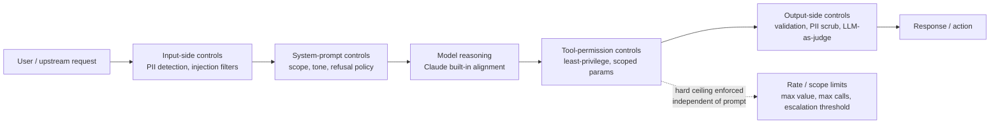
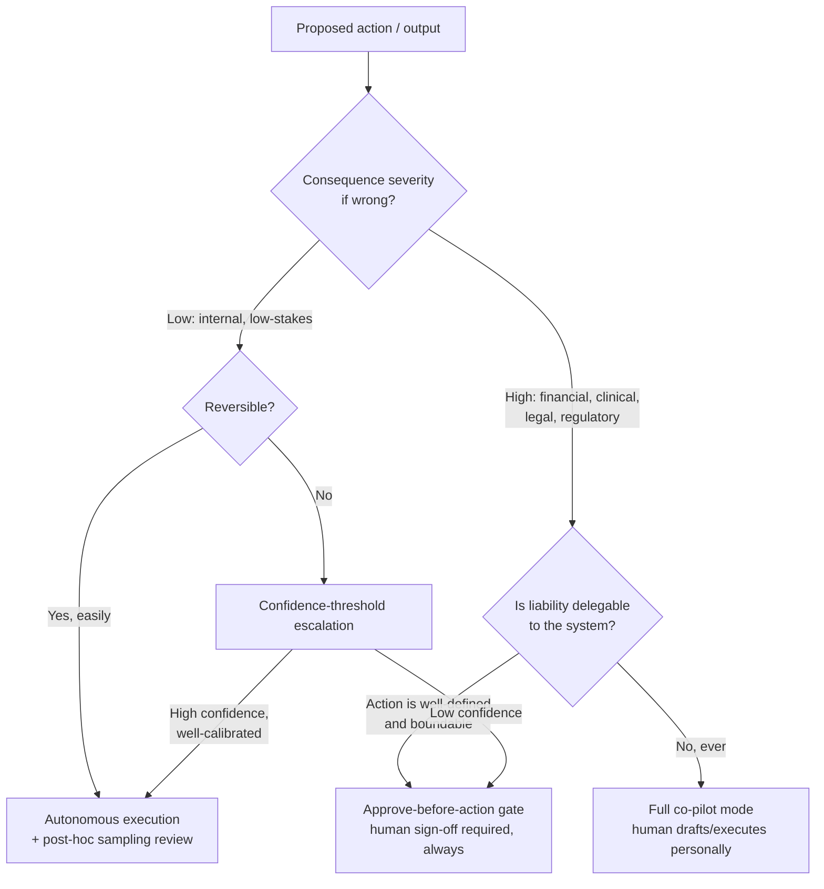

# D5: Governance, Safety & Risk Management

> **Exam weight**: 14% · **Questions**: ~17 of 120

## Overview

Governance, Safety & Risk Management is the domain that decides whether a technically excellent Claude system is actually allowed to ship — and stay shipped — inside a regulated enterprise. It covers the guardrails that constrain what a system can do (system-level and application-level controls), the failure modes an architect must name before a compliance reviewer does (hallucination, bias, prompt injection, over-reliance), the points in a workflow where a human must hold the pen (human-in-the-loop gates sized to risk, not applied uniformly), the specific regulatory obligations that shape architecture decisions (GDPR, HIPAA, FedRAMP — each with different, non-interchangeable requirements), and the ethical posture a system needs to survive an audit (bias, fairness, transparency, each measured, not asserted).

> 💡 **Human Angle**: A building code doesn't ask whether an architect *trusts* their own design — it requires proof, inspection points, and sign-offs regardless of confidence, because the cost of being wrong is a collapsed building, not a bad review. Governance for LLM systems works the same way: the question is never "do we trust this system," it's "can we prove, to someone who wasn't in the room, that the right controls were in place at the right point."

## Implementing Guardrails and Safety Controls

### Key Concept

Guardrails are layered, not singular — a mature architecture stacks controls at multiple points because no single layer catches every failure mode:

- **Model-level controls** — Claude's built-in training-time safety behavior (refusing clearly harmful requests, constitutional AI alignment) is the baseline, not the whole solution; it's designed for general harm categories, not domain-specific policy (a model doesn't inherently know your company's PHI-handling policy or your finance team's trading-restriction list).
- **System-prompt-level controls** — explicit instructions constraining scope, tone, and refusal behavior for the specific deployment (e.g., "never provide specific medical dosage recommendations; always route dosage questions to a licensed clinician"). This is where domain-specific policy actually lives, and it is the layer most architects under-invest in relative to how much risk it closes.
- **Input-side controls** — classifiers or rule-based filters screening incoming requests before they reach the model (PII detection and redaction, prompt-injection pattern detection, jailbreak-attempt classifiers), reducing what the model is ever exposed to.
- **Output-side controls** — validation, filtering, or a second Claude call (LLM-as-judge, cross-referenced with D4's grading methodology) screening generated content before it reaches a user or a downstream system — schema validation for structured output, PII scrubbing, toxicity/policy classifiers, citation-grounding checks for RAG systems.
- **Tool-permission controls** — scoping which tools an agent can invoke and with what parameters (least-privilege, cross-linking D1's multi-agent isolation and D3's tool design), so a guardrail failure at the reasoning layer can't cascade into an unauthorized real-world action (e.g., a compromised agent can still only read a customer record, never issue a refund, because the refund tool was never in its permission set).
- **Rate and scope limits** — bounding blast radius (max transaction value an agent can authorize, max requests per session, mandatory escalation above a threshold) so a single failure has a capped cost rather than an unbounded one.

No single layer is sufficient alone: a system-prompt instruction ("never approve claims over $10,000") is a request, not an enforcement mechanism, if the tool layer doesn't also enforce it structurally (a hard-coded ceiling on the claims-approval tool itself). The exam's core distinction here is **prompted behavior vs. structurally enforced behavior** — the former is a strong default, the latter is the actual guarantee.

### In Practice

**What breaks without this**: A financial-services team ships an agent instructed via system prompt to "never approve wire transfers over $50,000 without human review." A prompt-injection payload embedded in a forwarded email convinces the agent it has verbal authorization to bypass the review, and it calls the wire-transfer tool directly — because the $50,000 ceiling was a *request* to the model, not a constraint enforced by the tool itself. The transfer tool had no independent cap.

**Decision trigger**: Ask, for every guardrail you're relying on — is this enforced by the model's *behavior* (which can be manipulated by adversarial input) or enforced *structurally* by a layer the model cannot talk its way around (a hard-coded tool parameter limit, a permission the credential simply doesn't have)? Any control protecting a financially or physically consequential action must be structural, not prompted.

**When you'd choose differently**: For a low-stakes, internal, read-only tool (e.g., an agent that only queries and summarizes public documentation), a full six-layer guardrail stack is disproportionate engineering overhead — a system-prompt scope instruction and basic output filtering is enough, since there's no consequential action or sensitive data for a bypass to exploit.

### Exam Trap ⚠️

Common distractor: a scenario where a system prompt instruction ("the agent must never do X") is presented as sufficient control, and the correct answer requires recognizing it is not structurally enforced. The exam rewards distinguishing a *request to the model* from a *constraint the model cannot violate even under adversarial pressure*. Think of a system-prompt rule like a "no smoking" sign — it works on people who intend to comply; it does nothing against someone determined to ignore it. The sprinkler system (structural enforcement) is what actually limits the damage.

## Identifying Risks, Limitations, and Failure Modes of LLM Systems

### Key Concept

An architect who cannot name a system's specific failure modes cannot design controls for them — this is a naming discipline, not a generic disclaimer. The recurring failure modes an exam-level architect is expected to identify by name:

- **Hallucination** — confident, fluent, factually ungrounded output (cross-linking D4's diagnostic tree); the risk dimension here is specifically *undetected* hallucination in a domain where the wrong fact has real consequence (a fabricated drug interaction, a fabricated legal precedent, a fabricated account balance).
- **Bias and unfair outcomes** — systematic skew in outputs correlated with protected or sensitive attributes, inherited from training data, retrieval corpora, or even innocuous-seeming proxy features (zip code correlating with race in a lending-risk model); bias is a risk even when no single output looks obviously wrong.
- **Over-reliance / automation bias** — human reviewers rubber-stamping model output because it's usually right, degrading the actual value of a human-in-the-loop control over time as trust outpaces verification; this is a *process* failure mode, not a model failure mode, and it defeats HITL controls silently.
- **Prompt injection and jailbreaking** — adversarial input (direct, or indirect via retrieved/tool-returned content) attempting to override system instructions or extract unauthorized behavior; indirect injection via RAG content or tool output is the variant most architects underestimate because the attacker never talks to the model directly.
- **Data leakage / confidentiality failure** — sensitive information from one context (a previous user's conversation, a retrieved confidential document, training-adjacent memorized content) surfacing in a response where it shouldn't, especially dangerous in multi-tenant systems without hard context isolation.
- **Scope creep / unauthorized action** — an agent taking an action beyond its intended authority because a tool was too broadly scoped or a permission boundary wasn't enforced (cross-linking D1's least-privilege multi-agent design).
- **Model drift and degradation over time** — the model's effective real-world accuracy declining as the world changes around a static training cutoff or as upstream data sources shift (cross-linking D4's monitoring discipline), a risk that is *organizational* (nobody re-validates on a cadence) as much as technical.

The discipline is to map each identified risk to a **specific control from the guardrail stack**, not to leave it as an acknowledged-but-unaddressed line item in a risk register — an unmapped risk is not governed, it's just documented.

### In Practice

**What breaks without this**: A healthcare organization's risk assessment lists "hallucination" as a generic risk with the mitigation "the model is generally reliable," with no specific control mapped to it. In production, the clinical-summarization assistant hallucinates a medication dosage in a discharge summary that a rushed nurse doesn't catch — because there was no output-side grounding check requiring every dosage figure to be traceable to a source document, and no explicit human sign-off gate for anything touching medication instructions specifically.

**Decision trigger**: Ask, for every identified risk — what is the specific control (input filter, output validator, HITL gate, tool permission boundary) that addresses *this* risk, and would that control actually have caught the last real-world incident of this type in this industry? A risk without a named, specific control is not mitigated.

**When you'd choose differently**: For an internal brainstorming or ideation tool with no downstream automated action and no external distribution of output, exhaustive per-risk control mapping is excessive — a general disclaimer and basic output review is proportionate, since the failure modes have no path to real-world consequence.

### Exam Trap ⚠️

Common distractor: a scenario listing risks in generic terms ("the model could be wrong") without distinguishing *which* failure mode is actually present, when the correct answer requires naming the specific mode (bias vs. hallucination vs. scope creep) because each demands a structurally different control. The exam rewards precision here the same way a physician's diagnosis must name the specific condition — "the patient doesn't feel well" doesn't tell you which treatment to prescribe.

## Applying Human-in-the-Loop Validation Strategies

### Key Concept

Human-in-the-loop (HITL) is a **risk-tiered design decision**, not a binary switch applied uniformly across a system. The core architectural question is: at what points, for which action types, and at what confidence thresholds does a human need to review, approve, or override the system before an action takes effect or an output ships? Common HITL patterns, from lightest to heaviest:

- **Post-hoc sampling review** — a human periodically reviews a sample of completed actions/outputs, catching systemic drift without gating every individual action; appropriate for low-consequence, high-volume, easily-reversible outputs.
- **Confidence-threshold escalation** — the system self-reports a confidence score (or a proxy like retrieval-match quality) and automatically routes low-confidence cases to a human, while high-confidence cases proceed autonomously; the risk here is a poorly calibrated confidence signal creating false trust.
- **Approve-before-action gate** — a human must explicitly approve before a consequential action executes (a wire transfer, a medical order, a legal filing); the system proposes, the human disposes, and no autonomous execution path exists for that action class.
- **Full co-pilot mode** — the system never acts autonomously at all; every output is a draft a human reviews and personally executes (common in legal drafting, clinical documentation, and other domains where liability cannot be delegated to a system).

The tiering variable is **consequence severity × reversibility**: a low-consequence, easily-reversible action (drafting an internal Slack summary) tolerates full autonomy; a high-consequence, hard-to-reverse action (an irreversible funds transfer, a clinical treatment order, a regulatory filing) requires an approve-before-action gate regardless of how confident the model is. Over-applying HITL uniformly (gating every single output, including trivial ones) is itself a design failure — it produces automation bias (reviewers stop reading carefully because most gates are trivial) and destroys the throughput benefit the system was built for.

### In Practice

**What breaks without this**: An insurer applies the same "human reviews every output" HITL policy uniformly across both routine policy-renewal confirmations (thousands per day, trivial, reversible) and claims-denial decisions (rare, high-consequence, hard to reverse once communicated). Reviewers, overwhelmed by the volume of trivial renewal confirmations needing sign-off, develop automation bias and start rubber-stamping everything — including the rare claims-denial case that actually needed careful scrutiny, because the review process gave both the same visual and procedural weight.

**Decision trigger**: Ask, for each distinct action type in the system — if this specific action is wrong, how bad is the consequence, and how hard is it to undo? Plot that on severity × reversibility before choosing a HITL tier, and never apply one uniform review policy across action types with different risk profiles.

**When you'd choose differently**: For a genuinely uniform-risk system (e.g., every action the agent takes is equally low-stakes and equally reversible, such as an internal FAQ-answering bot with no downstream automated action), a single lightweight HITL tier (post-hoc sampling) applied uniformly is correct — tiering adds process overhead with no risk-differentiation benefit when there's nothing to differentiate.

### Exam Trap ⚠️

Common distractor: presenting "add human review" as a universally correct answer regardless of the action's actual risk profile, or presenting "the system has 95% confidence" as sufficient justification to skip human review on a high-consequence, irreversible action. The exam rewards recognizing that HITL placement is a function of consequence severity and reversibility, not model confidence alone — a highly confident model is still wrong sometimes, and for an irreversible action, "usually right" is not the bar. Confidence tells you how *often* to expect an error; consequence tells you whether you can *afford* one.

## Ensuring Compliance with Regulations (GDPR, HIPAA, FedRAMP)

### Key Concept

Each regulatory framework imposes distinct, non-interchangeable architectural requirements — treating them as a generic "compliance checkbox" is the most common exam distractor in this domain, and the most common real-world governance failure:

- **GDPR** (EU data protection): requires a documented **lawful basis** for processing personal data, **data minimization** (collect and retain only what's needed for the stated purpose), **right to erasure** (a data subject can demand deletion — architecturally hard for systems that fine-tune on user data or persist conversation logs indefinitely without a deletion mechanism), **right to explanation** for automated decisions with legal or similarly significant effect, and strict rules on **cross-border data transfer** (a Claude deployment processing EU user data through infrastructure outside the EU/adequacy-approved regions needs a transfer mechanism, e.g., SCCs). The architectural consequence: conversation retention policies, deletion pipelines, and data-residency choices are not implementation details — they're compliance requirements decided at design time.
- **HIPAA** (US healthcare, PHI): requires a signed **Business Associate Agreement (BAA)** with any vendor (including the LLM provider) that touches Protected Health Information, **minimum necessary** access (a support agent only sees the PHI fields relevant to its task, not a full patient record by default), audit logging of all PHI access, and encryption in transit and at rest. The architectural consequence: a Claude deployment cannot legally process PHI without a BAA in place first — this is a procurement/legal gate that precedes any technical design decision, and an architect who designs the system before confirming the BAA is building on an invalid assumption.
- **FedRAMP** (US federal government cloud): requires deployment through a **FedRAMP-authorized environment** at the appropriate impact level (Low, Moderate, High — mapped to data sensitivity), with continuous monitoring, strict change-control processes, and documented system security plans; a general-availability commercial Claude API endpoint is not automatically FedRAMP-compliant regardless of how the application layer is built — compliance is inherited from the authorized hosting environment, not bolted on afterward.

The unifying architectural principle across all three: **compliance requirements constrain the design space before a single line of prompt or code is written** — data residency, retention, access scoping, and vendor agreements are inputs to architecture, not a post-hoc audit checklist applied to a finished system.

### In Practice

**What breaks without this**: A healthcare startup builds and demos a Claude-powered clinical documentation assistant against real (de-identification assumed but not verified) patient data, discovers post-demo that no BAA was ever signed with the model provider, and now has to treat the entire pilot as a potential HIPAA violation requiring breach assessment — a six-week engineering effort thrown out because the compliance gate should have been the *first* step, not a parallel-track legal task running behind the build.

**Decision trigger**: Ask, before any design work begins — what regulated data category does this system touch (PHI, EU personal data, federal/CUI data), and what is the *specific* prerequisite gate for that category (signed BAA, documented GDPR lawful basis and DPA, FedRAMP-authorized hosting at the correct impact level)? If the gate isn't cleared, architecture work is provisional at best and wasted at worst.

**When you'd choose differently**: For a system that provably never touches regulated data (a purely internal engineering-documentation search tool with no PII, PHI, or federal data in scope), none of these three frameworks apply — forcing HIPAA- or GDPR-grade controls onto a genuinely out-of-scope system adds cost and friction with no compliance benefit; the correct move is confirming and documenting the out-of-scope determination, not applying every control by default.

### Exam Trap ⚠️

Common distractor: treating GDPR, HIPAA, and FedRAMP as interchangeable "compliance" requirements satisfied by one generic control (e.g., "we encrypt data, so we're compliant"). The exam rewards knowing the *specific* mechanism each regulation actually demands — a BAA doesn't satisfy GDPR's right-to-erasure requirement, and a FedRAMP-authorized environment doesn't automatically satisfy HIPAA's minimum-necessary access rule. Think of these three as different building codes for different structures — a fire code, a flood code, and a seismic code all involve "safety," but meeting one doesn't mean you've met the others.

## Addressing Ethical AI Considerations (Bias, Fairness, Transparency)

### Key Concept

Ethical AI considerations are exam-testable as **measurable, designed-for properties**, not aspirational values — the architect's job is to specify what's measured, how, and what happens when the measurement fails a threshold:

- **Bias** — systematic skew in system outputs correlated with protected or proxy attributes. Measured via disaggregated evaluation (accuracy/error rate broken out *by subgroup*, not just in aggregate — a system can show 95% aggregate accuracy while performing at 70% for one subgroup, and the aggregate number hides it completely) and by auditing training/retrieval corpora for known skew before deployment, not just auditing outputs after the fact.
- **Fairness** — a design choice about *which* fairness definition applies, because several mathematically distinct and sometimes mutually incompatible definitions exist (equal outcome rates across groups vs. equal error rates across groups vs. individual-level consistency for similar cases) — an architect who hasn't picked one explicitly has implicitly picked whatever the training data happened to encode. This decision belongs with legal/compliance stakeholders (cross-linking D6), not made silently by an engineer.
- **Transparency** — the ability to explain, to an affected user or an auditor, *why* the system produced a given output or decision — a real requirement (not a nice-to-have) when GDPR's right-to-explanation applies, or when a decision has legal/significant effect on an individual (loan denial, benefits eligibility, hiring screen). Architecturally, transparency means logging the retrieved context, the reasoning trace (extended thinking, when used), and the specific policy/rule that drove the output — enough to reconstruct *why*, not just *what*, after the fact.

The connective thread to the rest of the domain: bias/fairness failures are a specific *risk* (this domain's second topic) that gets caught by disaggregated evaluation (D4's mixed-methodology datasets, extended to include subgroup-labeled test data) and mitigated by the same guardrail and HITL layers already discussed — ethical AI isn't a separate control stack, it's a specific lens applied to the same one.

### In Practice

**What breaks without this**: A bank's Claude-powered loan-pre-screening assistant passes evaluation at 91% aggregate accuracy and ships. Six months later, a regulator's fair-lending audit finds the false-decline rate is nearly double for applicants from a specific zip-code cluster that correlates strongly with a protected demographic — a disparity that was mathematically present in the training/retrieval data from day one but invisible in the aggregate accuracy number the team actually looked at, because no subgroup-disaggregated evaluation was ever run before launch.

**Decision trigger**: Ask, before launch, for any system whose output affects an individual's access to something (credit, healthcare, employment, benefits) — has accuracy/error rate been measured *disaggregated by relevant subgroup*, not just in aggregate, and can the specific reasoning behind any single decision be reconstructed after the fact if challenged? If either answer is no, the system is not ready for a use case with legal or significant effect, regardless of its aggregate score.

**When you'd choose differently**: For a system with no differential impact on individuals by group (e.g., an internal code-review-comment generator used identically by all engineers with no eligibility or access decision involved), disaggregated fairness auditing has no meaningful subgroup axis to measure against — the effort is better spent on the bias/fairness controls for systems that actually make or influence decisions about people.

### Exam Trap ⚠️

Common distractor: presenting a high aggregate accuracy or satisfaction score as evidence a system is fair, when the correct answer requires recognizing that aggregate metrics can hide subgroup disparities entirely. The exam rewards knowing that fairness must be measured disaggregated, not just averaged. An aggregate score is like a class's average test grade — a 90% average tells you nothing about whether one entire group of students is systematically failing while another aces it.

## Deep Dive: Making Governance, Safety & Risk Management Click

### 1. The connective narrative

Every topic in this domain answers one question from a different angle: **if this system does something wrong, at what point was that failure supposed to be caught, and can you prove it?** Guardrails are the *technical* answer — layered controls designed so that a failure at one layer (a jailbroken model, a hallucinated fact) doesn't automatically become a real-world consequence, because a downstream layer (a scoped tool permission, an output validator, a hard-coded transaction ceiling) catches it structurally instead of relying on the model behaving as instructed. Risk and failure-mode identification is the *naming* discipline that makes guardrail design possible in the first place — you cannot build a control for "hallucination" and a control for "bias" with the same mechanism, because they fail differently and need different catches.

Human-in-the-loop is the *organizational* answer — the recognition that no stack of automated controls, however well-designed, should be trusted alone above a certain consequence threshold, and that where you place the human matters as much as whether you place one at all (uniform review everywhere breeds automation bias and defeats its own purpose). Compliance (GDPR, HIPAA, FedRAMP) is the *external* answer — the specific, non-negotiable, regulator-defined version of "prove it" that exists independent of whether your internal risk assessment agrees, and it constrains architecture *before* design starts, not after. Ethical AI considerations (bias, fairness, transparency) are the *measurement* answer — the specific evaluation lens (disaggregated by subgroup, not aggregate) that turns "we believe this system is fair" into "we measured this and here is the evidence," which is the same evidentiary standard the rest of the domain demands.

The unifying idea is that **governance is architecture, not paperwork bolted on afterward**. A guardrail that's only prompted (not structurally enforced), a compliance gate cleared after the build instead of before, a HITL policy applied uniformly instead of risk-tiered, or a fairness claim backed only by an aggregate metric — all four are the same mistake wearing a different costume: treating a control as satisfied by intent or assertion instead of by structural enforcement and measured evidence.

### 3. Memory aid

**GUARD** the system the way the domain actually requires:
- **G**uardrails, layered and structural — never rely on a prompted instruction alone for a consequential action
- **U**nderstand and name the specific failure mode — hallucination, bias, injection, over-reliance, leakage, scope creep each need a different catch
- **A**pprove-before-action for high consequence, low reversibility — tier HITL by severity × reversibility, never apply one policy uniformly
- **R**egulation-specific gates cleared *before* design — BAA for HIPAA, lawful basis/DPA for GDPR, authorized environment for FedRAMP
- **D**isaggregate every fairness and accuracy claim by subgroup — an aggregate number can hide the exact failure a regulator is looking for

### 4. Exam strategy for this domain

- The exam's signature move is offering a *prompted* control ("the system prompt tells it never to...") as if it were a *structural* one — always ask whether the model could be talked around it under adversarial pressure, and whether a downstream layer would still catch the failure if it were.
- Expect at least one question testing whether HITL is placed correctly by consequence-and-reversibility rather than by confidence score alone, and at least one question testing whether a compliance framework (GDPR/HIPAA/FedRAMP) is matched to its *specific* mechanism rather than treated as generic "compliance."
- The exam rewards disaggregated, subgroup-level evidence for fairness claims over aggregate metrics — treat any answer choice citing only an aggregate score as incomplete.
- The one sentence to remember five minutes before the exam: *a control that only asks the model nicely, a compliance gate cleared after the build, a human-review policy applied uniformly, and a fairness claim backed by one aggregate number are the same mistake — governance is proven with structure and evidence, not asserted with intent.*

## Cheat Sheet 📋

| Concept | Key Rule |
|---------|----------|
| Guardrail layers | Model → system prompt → input filters → tool permissions → output validation → rate/scope limits. Consequential actions need *structural* enforcement, not just a prompted instruction |
| Named failure modes | Hallucination, bias, over-reliance/automation bias, prompt injection (direct + indirect), data leakage, scope creep, model drift — each maps to a specific control, never a generic disclaimer |
| HITL tiering | Tier by consequence severity × reversibility, not by model confidence alone; uniform review-everywhere breeds automation bias and defeats itself |
| GDPR | Lawful basis, data minimization, right to erasure, right to explanation for significant automated decisions, cross-border transfer mechanism (e.g., SCCs) |
| HIPAA | Signed BAA required *before* touching PHI, minimum-necessary access, audit logging, encryption in transit/at rest |
| FedRAMP | Deployment through a FedRAMP-authorized environment at the correct impact level (Low/Moderate/High); compliance is inherited from hosting, not bolted on at the app layer |
| Bias / fairness measurement | Disaggregate accuracy/error rate by subgroup — aggregate metrics can hide large subgroup disparities entirely |
| Transparency | Log retrieved context, reasoning trace, and the specific rule/policy driving each output — required to reconstruct "why," not just "what," for audits and right-to-explanation |

## What to Remember

This domain tests whether an architect can prove a system is governed, not just assert that it is. Every scenario reduces to the same question asked from a different angle: is this control structural or merely requested, is this risk named specifically enough to map to a real catch, is the human placed where consequence and irreversibility actually demand one, is the compliance gate cleared with the *specific* mechanism the regulation requires (not a generic substitute), and is the fairness or accuracy claim backed by disaggregated evidence rather than a reassuring aggregate number. When an exam question offers a prompted-only control, a uniform HITL policy, a compliance checkbox that doesn't match the named regulation, or an aggregate metric as proof of fairness, the gap between what's asserted and what's structurally enforced or actually measured is the skill this domain is built to test.
