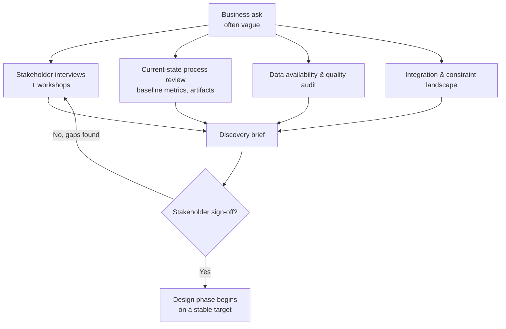
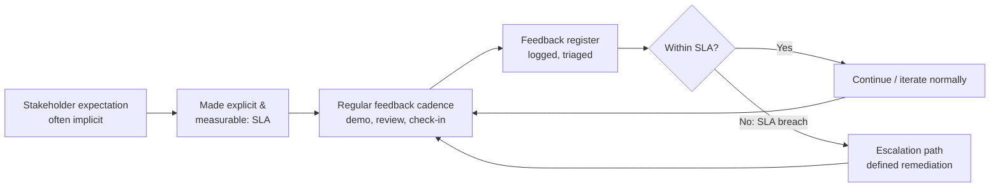
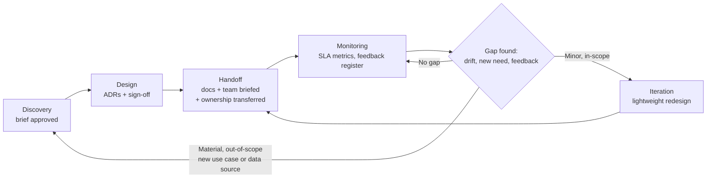

# D6: Stakeholder Communication & Lifecycle Management

> **Exam weight**: 14% · **Questions**: ~17 of 120

## Overview

Stakeholder Communication & Lifecycle Management is the domain that tests whether an architect can carry a Claude solution from a vague business ask to a running, trusted, still-owned production system — and do it in a way other humans can follow, sign off on, and operate after the architect has moved on. It covers structured discovery (asking the right questions before designing anything), communicating decisions and trade-offs to audiences who don't share the architect's technical vocabulary, managing feedback loops and setting SLAs that make expectations enforceable rather than implied, producing documentation that a different engineer can actually implement from, and recognizing which lifecycle phase a solution is in so the right activity happens at the right time instead of the wrong one.

> 💡 **Human Angle**: An architect who designs a beautiful system nobody asked for, that nobody can operate after handoff, and that nobody agreed was "done" has failed the assignment just as completely as one who designed something technically broken — a bridge that's structurally perfect but built at the wrong river crossing, with no maintenance manual, still doesn't get anyone across the water.

## Conducting Structured Discovery and Requirement Gathering

### Key Concept

**Skipping discovery is the single most common root cause of downstream failure — more than any specific technical mistake.**

Discovery is the phase where an architect converts an ambiguous business request ("we want an AI assistant for customer support") into a scoped, buildable problem statement. A structured discovery pass covers, deliberately and in this rough order:

- **Business objective and success definition** — what specific outcome does this solve, and what metric proves it worked (ticket deflection rate, time-to-resolution, cost per interaction) — not "make support better," which cannot be measured or scoped.
- **Current-state baseline** — how is the task done today, by whom, with what tools, at what volume and cost; without a baseline, "improvement" is unmeasurable after launch.
- **Data availability and quality** — what data exists to ground the system (knowledge base, past tickets, product docs), how current and clean it is, and who owns it; a discovery pass that skips this discovers the real blocker (stale, fragmented, or access-restricted data) only after design is finished.
- **Integration landscape** — which systems the solution must read from or write to (CRM, ticketing, billing), and who owns each integration point's API and access policy (cross-linking D3's integration patterns).
- **Constraints** — budget, timeline, existing technology commitments, compliance obligations (cross-linking D5's regulatory gates, which must be *known* at discovery even if resolved later).
- **Stakeholder map** — who is the business sponsor, who is the technical decision-maker, who are the end users, and critically, who has *veto power* versus who merely has *opinions* — conflating the two is a common real-world (and exam) trap.
- **Risk tolerance and definition of "good enough"** — what accuracy/quality bar is actually required for this use case, since that bar drives architecture decisions (a customer-facing legal-advice bot and an internal meeting-notes summarizer have wildly different acceptable error rates).

Discovery techniques include structured stakeholder interviews (open-ended first, then targeted), facilitated workshops with multiple stakeholders in the room simultaneously (surfaces disagreement early, when it's cheap to resolve), current-state process shadowing or artifact review (reading real support tickets beats a manager's summary of what support tickets look like), and reviewing existing documentation and system access. **The output is a discovery brief** — a written artifact stakeholders sign off on before design begins, so the design phase has a stable target instead of a moving one.

### In Practice

**What breaks without this**: The design has to be reworked around a data-remediation effort that discovery would have surfaced in week one — an architect starts designing a Claude-powered ticket-triage system directly from a one-line executive request ("automate our support triage"), skips the data-quality check, and discovers three weeks into build that the "knowledge base" the system is supposed to ground answers on is actually 40% outdated and split across two unlinked wikis nobody had mentioned.

**Decision trigger**: Ask, before any architecture diagram gets drawn — do I have a written, stakeholder-approved discovery brief covering objective, baseline, data quality, integrations, constraints, and success metric? If any of those six is unanswered, the design phase hasn't actually started yet, regardless of how much design work is happening.

**When you'd choose differently**: For a well-scoped extension of an existing, already-documented system (adding one new intent to a triage bot that already has a discovery brief, stable data sources, and known constraints), a full fresh discovery pass is redundant — a lightweight delta review (what's changing, what's not) is proportionate, since the prior discovery artifact is still valid for everything unchanged.

### Exam Trap ⚠️

Common distractor: a scenario where an architect jumps straight to comparing technical options (single-agent vs. multi-agent, RAG vs. fine-tuning) before establishing the business objective, success metric, or data quality — presented as decisive and efficient. The correct answer recognizes that a technically sound decision made on an unscoped problem is still a wrong answer, because it optimizes the wrong thing. Think of it like a doctor prescribing treatment before taking a history: confident and fast, but confidently wrong.

## Communicating Architectural Decisions and Trade-offs

### Key Concept

**Name the trade-off, not just the conclusion — a decision with no stated downside is a sales pitch, not an ADR.**

The core artifact for capturing a decision is an **Architecture Decision Record (ADR)**: a short, structured document per significant decision, containing the context (what problem prompted this), the options considered, the trade-offs of each, the decision made, and the consequences (including what becomes harder as a result — every decision has a cost, and naming it is what makes an ADR honest rather than a sales pitch).

Communicating trade-offs well means being explicit about the dimension being traded, not just asserting a conclusion:

- **Cost vs. latency vs. quality** — a smaller/faster model reduces cost and latency but may reduce output quality on complex reasoning tasks; naming this explicitly (rather than presenting the chosen model as strictly "better") lets a business stakeholder make an informed call if the trade-off changes later.
- **Build vs. buy / single-agent vs. multi-agent** — the trade-off is complexity and operational burden versus capability and flexibility (cross-linking D1's orchestration patterns); a stakeholder needs to know a multi-agent design costs more to build and monitor, in exchange for what capability.
- **Audience-tailored framing, same underlying decision** — a technical stakeholder needs the mechanism (why RAG over fine-tuning, what the retrieval architecture looks like); an executive sponsor needs the consequence (cost, timeline, risk, what capability this unlocks or defers) — the ADR contains both, but the *conversation* leads with what that specific audience needs to decide something.
- **Reversibility as a communication anchor** — explicitly stating whether a decision is easily revisited later or effectively locked in (a data-residency choice, a foundational architecture pattern) changes how much stakeholder deliberation the decision deserves; conflating a cheap, reversible decision with an expensive, structural one wastes stakeholder time on the former and rushes the latter.

### In Practice

**What breaks without this**: Not because the technical choice was wrong, but because the trade-off was never surfaced as a trade-off, the resulting trust damage costs the architect influence on every subsequent decision — an architect chooses a single large model over a cheaper routed multi-model setup and tells the business sponsor only "this is the better option" without naming the cost trade-off, and three months into production the sponsor is blindsided by a token-cost bill four times their mental estimate.

**Decision trigger**: Ask, before presenting any architectural decision — have I named the specific dimension being traded (cost, latency, quality, flexibility, operational burden), and does the audience in front of me actually need the mechanism or the consequence to make their decision? If a stakeholder can only repeat your conclusion but not your reasoning, the trade-off wasn't actually communicated.

**When you'd choose differently**: For a low-stakes, easily reversible implementation detail (choice of internal logging format, a prompt-template wording tweak), a full ADR with options-and-consequences is disproportionate ceremony — a one-line note in the engineering log is enough, since the cost of documenting exceeds the cost of just changing it later if wrong.

### Exam Trap ⚠️

Common distractor: a decision presented as objectively "the best option" with no trade-off named, where the correct answer requires identifying what the architect is *not* saying — every real architectural decision costs something. The exam rewards recognizing an ADR (or a decision explanation) that lists only benefits as incomplete, even if the decision itself is sound. A decision with no stated downside isn't a well-communicated decision — it's a sales pitch wearing an architecture document's clothes.

## Managing Stakeholder Feedback Loops and Expectation Alignment (including SLAs)

### Key Concept

**An SLA without a consequence for missing it is a wish, not an agreement.**

Expectations left implicit become disagreements later — the discipline here is converting vague expectations into structured feedback cadences and measurable SLAs before they're needed, not after a stakeholder is already unhappy. Two related but distinct mechanisms:

- **Feedback loops** — a defined, recurring cadence (not ad hoc, reactive check-ins) for stakeholders to see progress and raise concerns while they're still cheap to address: discovery-phase reviews, design-review sign-offs, iterative demo cycles during build, and post-launch review cadences. A feedback loop also needs a **capture mechanism** (a logged feedback register, not verbal-only conversations that evaporate) so feedback is tracked, triaged, and either acted on or explicitly declined with a reason — an untracked verbal comment in a hallway is not a functioning feedback loop, even if it happened.
- **Expectation alignment on model behavior specifically** — stakeholders coming from deterministic-software backgrounds often expect LLM output to be perfectly consistent and error-free; part of the architect's communication job is setting the expectation, early and explicitly, that probabilistic systems have a non-zero error rate by design, that quality improves iteratively (not in one shot), and that the evaluation methodology (D4) is how "good enough" gets proven rather than asserted.
- **SLAs (Service Level Agreements)** — the mechanism that converts expectation alignment into an enforceable, measurable commitment. A real SLA for a Claude-based system specifies concrete targets, not aspirations: response latency (e.g., p95 under 3 seconds), availability/uptime (e.g., 99.5% monthly), output quality thresholds tied to the evaluation suite (e.g., ≥90% pass rate on the golden-set eval, re-verified on a defined cadence), support response and incident-escalation times, and — critically — what happens when a target is missed (an escalation path, a remediation window, not just a silent miss).

A feedback loop without a cadence is reactive firefighting, and a quality commitment without a measurable SLA is a hope that becomes a dispute the first time reality disappoints someone's unstated assumption.

### In Practice

**What breaks without this**: There is no way to determine whether the system is underperforming an agreement or simply performing exactly as an LLM-based system was always going to — a team ships a Claude-powered document-summarization tool with an informal understanding that it should be "pretty accurate," and two months in, a business stakeholder escalates a complaint that the tool "keeps getting things wrong," but there was never an agreed accuracy threshold, evaluation cadence, or defined acceptable error rate. Every future conversation about the system starts from an argument instead of a data point.

**Decision trigger**: Ask, for every significant stakeholder commitment being made — is this written down as a specific, measurable number (latency, uptime, quality threshold) with a defined consequence if missed, and is there a recurring, logged cadence for surfacing feedback before it becomes an escalation? If the commitment only exists as a verbal impression from a meeting, it isn't an SLA and it isn't a functioning feedback loop.

**When you'd choose differently**: For an early internal prototype explicitly framed as exploratory (not production-committed), formal SLAs are premature and can create false confidence in an unproven system — a lightweight, informal feedback channel (a shared doc, quick weekly syncs) is appropriate until the system is stable enough for a real commitment to mean something.

### Exam Trap ⚠️

Common distractor: a scenario where stakeholder satisfaction is assumed because "no one has complained," presented as evidence the system is meeting expectations. The correct answer recognizes that silence is not a feedback loop — the absence of a structured, logged mechanism means dissatisfaction is either not being captured or is accumulating unaddressed. Think of it like a smoke detector with a dead battery: the absence of an alarm doesn't mean there's no fire, it means nothing is listening.

## Documenting Architectures and Providing Implementation Guidance

### Key Concept

**Documentation is what lets a system survive its architect's absence — specificity a different engineer can act on is the bar.**

Good architecture documentation is layered by audience, matching the same principle as decision communication:

- **Architecture overview** — system diagrams (component, data-flow, sequence), the business context, and top-level decisions with rationale (pointing to the relevant ADRs) — written for someone who needs to understand *what* exists and *why*, not necessarily how to build it.
- **Implementation guidance** — the detailed technical spec an engineering team actually builds from: API contracts, prompt/system-prompt specifications, tool definitions and permission scopes (cross-linking D3, D5), configuration values, error-handling behavior, and specific acceptance criteria per component. This is where an architect's design intent either survives contact with a different team's implementation or gets silently reinterpreted.
- **Operational runbooks** — what an on-call engineer or support team needs when something goes wrong in production: known failure modes and their symptoms, monitoring dashboards and alert thresholds, escalation contacts, and remediation steps for common incidents. A runbook written by the architect during handoff is dramatically cheaper than one reconstructed by an operations team during an actual incident.
- **Traceability to decisions** — implementation and runbook documentation should reference the ADRs that produced them, so a future engineer questioning "why is this built this way" finds the reasoning instead of having to reverse-engineer intent from code and configuration alone.

"The system should be reliable" is not implementation guidance; "the summarization tool call must retry twice with exponential backoff and fall back to a cached response after 3 consecutive failures" is — **that specificity gap is what separates a professional-grade handoff from an inadequate one**.

### In Practice

**What breaks without this**: The engineer reimplements it as a single call to "simplify," and silently reintroduces an accuracy problem the original design had specifically solved — an architect designs and personally builds the first version of a Claude-powered contract-review assistant, then moves to a different project without writing implementation guidance beyond a high-level diagram, and six months later a new engineer extending the system with a new document type has no record of why the original system used a two-pass extraction-then-validation pattern instead of a single call.

**Decision trigger**: Ask, before considering handoff documentation complete — could an engineer who was not in the room for any design conversation implement, operate, or safely extend this system using only what's written down? If the answer relies on "they can just ask me," the documentation isn't done, it's a placeholder for the architect's continued availability.

**When you'd choose differently**: For a short-lived proof-of-concept explicitly scoped to be discarded or fully rebuilt after validation (not extended or operated long-term), full operational runbook documentation is wasted effort — a concise overview of what was learned and why is sufficient, since there's no future operator or extender to document for.

### Exam Trap ⚠️

Common distractor: a system diagram presented as "complete documentation," when the correct answer requires recognizing that a diagram alone tells you *what* exists but not *why* it was built that way or *how* to safely change it. The exam rewards distinguishing documentation that describes a system from documentation that transfers the reasoning behind it — a floor plan tells you where the walls are, not which ones are load-bearing.

## Supporting Lifecycle Phases (Discovery, Design, Handoff, Monitoring, Iteration)

### Key Concept

**Doing the wrong activity in the wrong phase is expensive — match the activity to the phase's entry and exit criteria.**

A Claude solution's lifecycle is not a one-time build-and-ship event — it's a recurring cycle with distinct phases, each with its own entry criteria (what must be true to start) and exit criteria (what must be true to move on):

- **Discovery** — entry: a business need is identified. Exit: a stakeholder-approved discovery brief exists (this domain's first topic). The architect's role here is investigative and facilitative, not decisive.
- **Design** — entry: an approved discovery brief. Exit: architectural decisions are made, documented as ADRs, and signed off by the relevant technical and business stakeholders (this domain's second topic). The architect's role is decisive and communicative — proposing options, naming trade-offs, securing alignment.
- **Handoff** — entry: a signed-off design. Exit: implementation and operational documentation is complete, the receiving team (engineering, operations, support) is briefed and has demonstrated understanding (not just received a document), and ownership is explicitly transferred (this domain's fourth topic). Skipping this phase's exit criteria — treating "the doc exists" as equivalent to "the team can operate this" — is the most common real-world handoff failure.
- **Monitoring** — entry: the system is live. Exit: this phase doesn't formally exit while the system is in production — it's continuous, tracking the SLA metrics established earlier (quality via the D4 evaluation suite, latency, uptime, cost) and the feedback register against real usage, surfacing drift or degradation before a stakeholder has to.
- **Iteration** — entry: monitoring data or stakeholder feedback identifies a gap (quality regression, new requirement, scope expansion). Exit: the iteration is scoped and — critically — routed to the *right* re-entry point in the lifecycle: a minor prompt tweak may only need a lightweight design-and-redeploy cycle, while a new use case or a materially different data source needs to loop all the way back to discovery, because the original discovery brief no longer describes the actual problem being solved.

Designing before discovery produces a solution to the wrong problem; building before design sign-off produces rework when a late-surfaced stakeholder objection invalidates work already done; treating handoff as a formality produces a system nobody but the original architect can safely operate; and skipping the "return to discovery" step for a materially new requirement produces feature creep bolted onto an architecture that was never scoped for it.

### In Practice

**What breaks without this**: The degradation is only discovered when a customer complaint escalates, at which point the team realizes the "iteration" that's actually needed (re-scoping the data-freshness architecture) requires a return to discovery, not a quick prompt fix, and nobody had planned for that possibility — a team treats "handoff" as sending a Confluence link and considers the lifecycle complete; three months later, monitoring shows a steady quality decline (the underlying knowledge base has drifted from the retrieval index), but there's no defined monitoring phase with an owner or an SLA threshold that would have triggered an alert.

**Decision trigger**: Ask, for any system currently in production — is there a named owner and an active monitoring cadence checked against the original SLA, and when a gap is found, has anyone deliberately decided whether it's a lightweight iteration or a signal that the original discovery brief no longer matches reality? If monitoring is passive (nobody is actually looking) or every gap gets treated as a quick fix regardless of scope, the lifecycle discipline has broken down.

**When you'd choose differently**: For a genuinely one-off, time-boxed deliverable with an agreed end-of-life (a system built for a single event or a fixed-duration pilot with no planned continuation), formal ongoing monitoring and iteration phases don't apply — the lifecycle correctly ends at handoff plus a defined sunset date, and building out monitoring infrastructure for a system that won't exist in three months is wasted effort.

### Exam Trap ⚠️

Common distractor: a scenario presenting every post-launch change request as a simple "iteration" regardless of scope, where the correct answer requires recognizing that a materially new requirement (new data source, new use case, new regulatory exposure) invalidates the original discovery assumptions and must loop back to discovery, not be bolted on as a quick design tweak. The exam rewards distinguishing a change *within* the scoped problem from a change *to* the problem itself — the former is iteration, the latter is a new project wearing the old one's name.

## Deep Dive: Making Stakeholder Communication & Lifecycle Management Click

### 1. The connective narrative

Every topic in this domain is really answering the same underlying question from a different point in time: **does everyone who needs to understand this system actually understand it, at the moment they need to?** Discovery answers that question at the start — before design begins, has the architect actually understood the problem well enough that stakeholders agree it's the right problem? Communicating decisions and trade-offs answers it during design — as choices get made, does each relevant stakeholder understand not just *what* was decided but *why*, and what it cost? Feedback loops and SLAs answer it continuously — is there a standing mechanism (not a one-time event) for expectations to be checked against reality, and a consequence when they diverge? Documentation answers it at the moment of transfer — when the architect is no longer in the room, does the knowledge survive without them? And lifecycle-phase discipline answers it structurally — is the *right kind* of understanding-building activity happening at the *right time*, so that discovery-type questions don't get skipped in a rush to build, and handoff-type rigor doesn't get skipped in a rush to move to the next project?

The reason this domain exists separately from the technical domains (D1–D5) is that a technically correct architecture with a communication and lifecycle failure still fails as a *delivered solution* — the exam is testing whether an architect understands that their job doesn't end when the design is sound, it ends when the system is understood, agreed to, operable by someone else, and durable enough to keep being the right system as reality changes around it. Feedback loops and monitoring are the same discipline applied at two different lifecycle points: one keeps a build aligned with intent while it's happening, the other keeps a live system aligned with intent after it's shipped. An SLA is simply expectation alignment made measurable and consequential — the same information a discovery brief or an ADR communicates, but converted into a number someone can check.

### 3. Memory aid

**DDHM-I** — the five lifecycle phases in order, and what closes each gate:
- **D**iscovery — closes with a signed-off brief, not an assumption
- **D**esign — closes with documented, communicated trade-offs (ADRs), not a silent best-guess
- **H**andoff — closes with a briefed, demonstrated-capable owner, not a delivered document
- **M**onitoring — never closes while the system is live; it's the continuous check against the SLA and feedback register
- **I**teration — closes only after routing the gap to the *right* re-entry point: a lightweight fix loops to handoff, a scope-changing gap loops all the way back to discovery

### 4. Exam strategy for this domain

- The exam's signature move is presenting an activity that *looks* like progress (a diagram, a demo, a verbal agreement, a shipped feature) and asking whether it actually satisfies the phase's real exit criteria — a diagram isn't documentation, a demo isn't sign-off, a verbal impression isn't an SLA, and a shipped feature isn't a closed feedback loop unless it's logged and traceable.
- Expect at least one question testing whether a proposed change is an in-scope *iteration* or an out-of-scope change requiring a return to *discovery* — the exam rewards recognizing that scope, not effort level, is what determines the right lifecycle re-entry point.
- Expect at least one question where a decision is presented with only its benefits, and the correct answer identifies the missing, unstated trade-off — a well-communicated decision always names a cost.
- The one sentence to remember five minutes before the exam: *a system isn't done when it works, it's done when the right stakeholder understood the trade-off, the right team can operate it without you, and the right measurable commitment exists to know if that stops being true.*

## Cheat Sheet 📋

| Concept | Key Rule |
|---------|----------|
| Discovery brief must cover | Business objective + success metric, current-state baseline, data availability/quality, integration landscape, constraints, stakeholder map (decision-makers vs. opinion-holders), risk tolerance |
| ADR (Architecture Decision Record) | Context → options considered → trade-offs of each → decision → consequences (what gets harder). No stated downside = incomplete ADR |
| Communicating trade-offs | Name the specific dimension traded (cost / latency / quality / flexibility / operational burden); tailor mechanism-vs-consequence framing to audience, same underlying facts |
| Feedback loop | Recurring, scheduled cadence + a logged register (triaged, actioned or explicitly declined) — not ad hoc verbal comments |
| SLA components | Latency target (e.g., p95), uptime/availability, quality threshold tied to the eval suite (D4), support/escalation response time, and a defined consequence for a miss |
| Documentation layers | Architecture overview (what + why) → implementation guidance (how, buildable spec) → operational runbook (what to do when it breaks) — each traceable to its ADR |
| Handoff exit criteria | Docs complete **and** receiving team demonstrates capability (e.g., incident drill) **and** ownership explicitly transferred — a delivered doc alone does not satisfy handoff |
| Lifecycle phases | Discovery → Design → Handoff → Monitoring (continuous) → Iteration → routes back to Handoff (in-scope fix) or Discovery (scope-changing gap) |
| Iteration routing test | Does the gap fit inside the original discovery brief's scope? Yes → lightweight iteration. No (new use case, new data source, new risk profile) → return to discovery |

## What to Remember

This domain tests whether an architect can be trusted to run the full lifecycle of a solution, not just design one well. Every scenario reduces to the same underlying check: was the problem actually understood before it was solved (discovery), was every decision's trade-off named and communicated to the audience that needed to hear it (decisions and communication), is there a standing, measurable mechanism for expectations to be checked against reality (feedback loops and SLAs), can someone other than the architect operate the system from what's written down (documentation), and is the right lifecycle activity happening at the right time, including correctly distinguishing a minor iteration from a scope-changing gap that must loop back to discovery. When an exam question offers a diagram as documentation, a verbal impression as an SLA, a benefits-only decision as communication, or a scope-changing feature request treated as a quick iteration, the gap between what looks complete and what actually satisfies the phase's exit criteria is the skill this domain is built to test.
