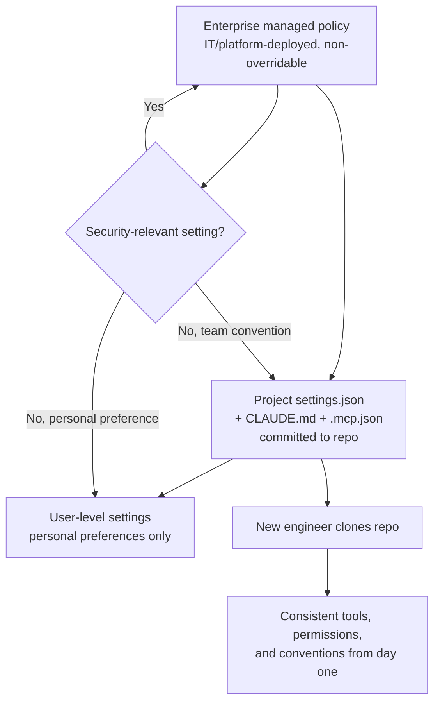
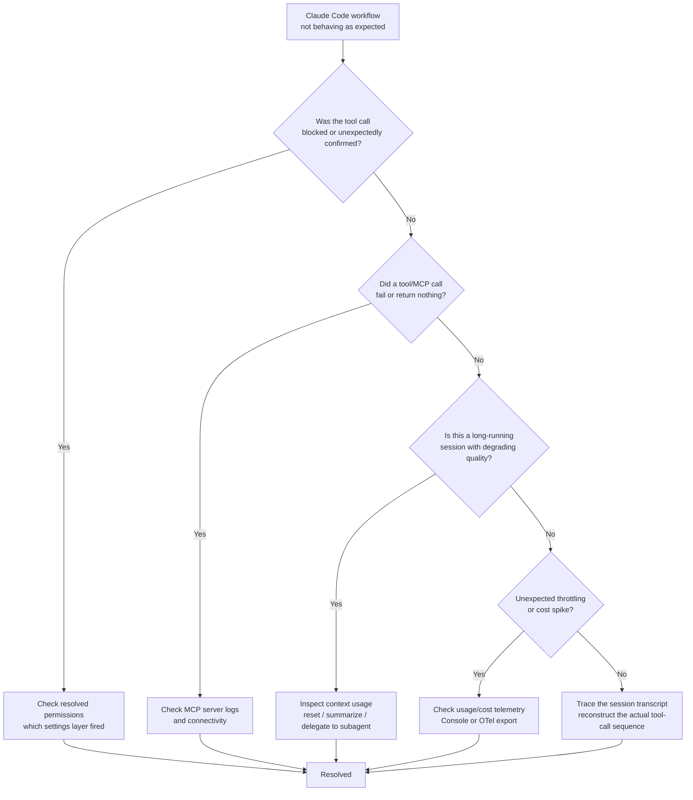

# D7: Developer Productivity & Operational Enablement

> **Exam weight**: 7% · **Questions**: ~8 of 120

## Overview

Developer Productivity & Operational Enablement is the smallest domain on the exam, but it tests a distinct skill from everything before it: can an architect turn a working Claude solution into something an entire engineering team can configure consistently, build faster with, and keep running when something breaks — without the architect personally answering every Slack message. It covers three things: setting up Claude tools (chiefly Claude Code) and shared environments so a team of engineers gets consistent, governed behavior rather than fifteen different personal configurations; using AI-assisted tooling to make the team's actual development workflow faster (not just to make individual prompts better); and diagnosing and resolving problems when an AI-assisted workflow misbehaves in practice.

> 💡 **Human Angle**: A single developer with a clever Claude Code setup is a party trick; a team with a shared `CLAUDE.md`, consistent permissions, and a debugging playbook is infrastructure — the difference between a chef who cooks a great meal once and a kitchen that can serve the same quality every night.

## Configuring Claude Tools and Environments for Teams

### Key Concept

Individual developers can configure Claude Code however they like on their own machine, but a *team* configuration has to be consistent, governed, and checked into version control the same way any other shared engineering asset is — otherwise every engineer's Claude behaves slightly differently, and "it works on my Claude" becomes a real support burden. Team-level configuration operates at layered scopes, and an architect needs to know which layer a given setting belongs in:

- **`CLAUDE.md` (project memory)** — a file checked into the repository root (and optionally nested in subdirectories for module-specific context) that documents project conventions: coding standards, build/test commands, architecture notes, and things Claude should always or never do in this codebase. Because it's committed to version control, it's reviewed in pull requests the same as code — the team's shared understanding of "how we work here" becomes a living document instead of tribal knowledge held by whoever's been on the team longest.
- **Settings hierarchy** — Claude Code resolves configuration from multiple `settings.json` locations with a defined precedence: enterprise-managed policy settings (deployed by IT/platform teams, not overridable by individual developers) sit above project-level settings (checked into the repo, shared by the team), which sit above user-level settings (personal preferences on a single machine). An architect designing team enablement decides *which settings belong at which layer* — a security-relevant permission belongs in managed policy, a personal keybinding preference belongs at the user level.
- **Permissions configuration** — `allow`, `deny`, and `ask` rules that govern which tools and commands Claude Code can execute without prompting, which it can never execute, and which require explicit human confirmation each time. Team-wide permission defaults (e.g., allow read-only git commands and test runners, deny destructive shell commands like `rm -rf` or force-pushes, ask before any network call) reduce both friction (fewer needless confirmation prompts for safe actions) and risk (no developer accidentally grants blanket trust to a destructive action).
- **Shared MCP server configuration (`.mcp.json`)** — connections to internal tools (ticketing systems, internal APIs, databases) that the whole team should have consistent access to, checked into the repo rather than configured ad hoc per developer, so onboarding a new engineer means cloning the repo, not manually wiring up five integrations from memory (cross-linking D3's integration patterns and D5's least-privilege scoping — the same permission-scoping discipline used for production agents applies to what a developer's local Claude Code session is allowed to touch).

### In Practice

**What breaks without this**: A team lets each developer configure their own Claude Code permissions individually. One developer, trying to move fast, grants blanket shell-command approval to skip confirmation prompts. A routine refactor session runs a destructive cleanup command against a directory that still contained uncommitted work from a teammate's shared branch checkout, and there's no team-wide `deny` rule that would have blocked it — because the safety net existed only as an individual habit, not as configuration.

**Decision trigger**: Ask, when adding a new team convention or permission — does this need to be true for *every* developer on every machine (managed policy or project settings, committed to the repo), or is it a personal preference that shouldn't constrain teammates (user-level settings)? If a security or destructive-action boundary is left to individual discretion, it isn't actually enforced.

**When you'd choose differently**: For a small, trusted exploratory team working in a low-stakes sandbox repository with no shared production access, heavyweight managed-policy enforcement is disproportionate — lightweight project-level `CLAUDE.md` conventions without strict enterprise permission locks are enough, since the cost of an accident is low and the friction of full governance would slow exploration for no real risk reduction.

### Exam Trap ⚠️

Common distractor: a scenario framing a well-written `CLAUDE.md` file alone as sufficient team enablement. The correct answer recognizes that `CLAUDE.md` documents conventions but does not *enforce* anything — it's read as context, not applied as a permission boundary. A destructive command that violates every convention in `CLAUDE.md` can still execute if the permissions configuration doesn't independently deny it. Think of `CLAUDE.md` as the employee handbook and permissions as the locked doors — a handbook that says "don't enter the server room" doesn't stop anyone who still has the key.

## Improving Developer Workflows Using AI-Assisted Tooling

### Key Concept

Beyond individual configuration, the productivity gain a team gets from Claude Code compounds when common, repeatable engineering tasks are turned into reusable, shareable tooling rather than re-prompted from scratch by every developer every time. The core mechanisms:

- **Custom slash commands** — team-defined, reusable prompts (stored as markdown files in the repo, e.g., `.claude/commands/review.md`) that codify a specific repeatable workflow — a PR-review checklist, a test-scaffolding routine, a release-notes generator. Because they're checked into the repo, the whole team invokes the same well-tuned workflow instead of everyone reinventing (and inconsistently tuning) their own prompt for the same task.
- **Subagents for delegated, specialized work** — a subagent scoped to a narrow task (a code-review subagent with read-only tool access, a test-writing subagent with access only to the test directory) lets a developer delegate a bounded piece of work without the primary session's context getting cluttered by that work's intermediate steps (cross-linking D1's orchestration patterns and D4's context-window discipline — the same reasons a production multi-agent system isolates subtask context apply to a developer's own working session).
- **Hooks for workflow automation** — deterministic scripts triggered at defined points in a Claude Code session (e.g., a `PostToolUse` hook that runs a linter or formatter automatically after any file edit, a pre-commit hook that blocks a commit if tests fail) enforce standards mechanically rather than relying on Claude — or the developer — to remember to do it every time.
- **CI/CD integration via headless mode** — Claude Code can run non-interactively in automated pipelines (`claude -p "<prompt>" --output-format json`), enabling automated PR summarization, changelog generation, or first-pass code review as part of a CI job rather than a manual developer step — turning an interactive productivity tool into an automated pipeline stage.

The unifying principle: the highest-leverage productivity gain isn't a smarter individual prompt, it's turning a workflow that used to be re-invented per developer, per task, into a shared, versioned, and where possible automated team asset.

### In Practice

**What breaks without this**: A five-person team each independently asks Claude Code to "review this PR for issues" with their own informal prompt, producing five different review depths and styles depending on how each developer happened to phrase the request that day. A critical issue gets caught in one developer's ad hoc review style but missed in another's, and there's no way to audit which review "version" was actually applied to a given PR, because none of it was a versioned, repeatable asset.

**Decision trigger**: Ask, when a task gets asked of Claude more than a couple of times across the team — is this worth codifying as a shared slash command, subagent, or hook so everyone gets the same tuned behavior, or is it genuinely one-off and not worth the maintenance overhead of a shared asset?

**When you'd choose differently**: For a genuinely novel, exploratory task that won't recur (a one-time data-migration investigation), building a reusable slash command or subagent is wasted effort — a direct, ad hoc prompt is the right tool, since there's no repeated workflow to amortize the setup cost against.

### Exam Trap ⚠️

Common distractor: presenting a hook and a slash command as interchangeable ways to enforce a standard. The correct answer distinguishes them by control: a slash command is a prompt a developer chooses to invoke — it improves consistency only when used, and a developer can simply not run it. A hook is a deterministic script that fires automatically at a defined trigger point regardless of whether anyone remembers to ask for it. If a standard *must* hold every time (e.g., "always run the linter after an edit"), only a hook actually guarantees it — a slash command is a convenience, not an enforcement mechanism.

## Supporting Debugging and Operational Issue Resolution

### Key Concept

When an AI-assisted workflow misbehaves in production or in day-to-day development, the diagnostic discipline is the same one used for any complex system: reproduce, isolate, and trace — but applied to a set of failure modes specific to Claude-based tooling. The recurring categories an architect needs to recognize:

- **Permission and configuration failures** — a tool call is silently blocked or requires unexpected confirmation because a `deny` or `ask` rule (correctly or incorrectly) fired; the fix starts with checking the resolved permissions configuration (which settings layer actually applied) before assuming the model itself made a bad decision.
- **Tool and MCP connectivity failures** — an MCP server is unreachable, misconfigured, or returning malformed responses, which surfaces to the developer as Claude "refusing" or "failing" to use a tool it should have access to; the fix is checking the MCP server's own logs and connection status, not re-prompting Claude repeatedly with the same request.
- **Context and session issues** — a long-running session degrades in quality as the context window fills with accumulated tool outputs and intermediate steps (cross-linking D2's context-engineering discipline); the operational fix is recognizing when a session needs to be reset, summarized, or handed to a fresh subagent rather than continuing to push more instructions into an already-saturated context.
- **Rate limits, token budgets, and cost anomalies** — unexpected throttling or an unusual spike in token spend is diagnosed through usage and cost telemetry (via the Claude Console or exported OpenTelemetry metrics), not guesswork; this is where operational monitoring (cross-linking D4's evaluation-and-monitoring practices) becomes a debugging tool, not just a reporting dashboard.
- **Transcript and audit-log tracing** — the session transcript (what tools were called, with what inputs, in what order, with what results) is the primary evidence for diagnosing *why* Claude took a given action; for governed or regulated environments, audit logs (cross-linking D5) serve the same purpose after the fact, for incidents that need to be reconstructed rather than watched live.

The operational habit that separates fast resolution from prolonged confusion is checking the transcript and the configuration layer *first*, before assuming the model reasoned incorrectly — a large share of "Claude did something wrong" reports turn out to be a permission rule, a disconnected tool, or a saturated context window, not a model failure.

### In Practice

**What breaks without this**: An on-call engineer gets paged because a Claude-powered internal tool "stopped working correctly," and spends an hour re-prompting the model with rephrased instructions, assuming it's a reasoning problem. The actual cause is an MCP server that silently lost its database connection two hours earlier — visible immediately in the server's own logs, invisible from the Claude session transcript alone, and never found because the engineer skipped straight to prompt-tuning instead of checking the tool layer first.

**Decision trigger**: Ask, when an AI-assisted workflow misbehaves — have I checked the resolved permissions, the tool/MCP connectivity, and the session transcript *before* concluding the model reasoned incorrectly? Most "the AI is wrong" reports are actually a configuration, connectivity, or context problem wearing a reasoning-failure costume.

**When you'd choose differently**: For a rare, genuinely non-reproducible one-off oddity in a low-stakes internal tool with no operational impact, a full trace-and-diagnose cycle is disproportionate effort — logging the occurrence and moving on is reasonable, reserving full root-cause investigation for issues that are reproducible, recurring, or production-impacting.

### Exam Trap ⚠️

Common distractor: a scenario where an unexpected Claude Code behavior is immediately attributed to "the model hallucinating" or "poor reasoning," skipping infrastructure diagnosis entirely. The correct answer recognizes that permission rules, disconnected tools, and saturated context are far more common root causes of unexpected behavior than a genuine reasoning failure, and the exam rewards checking the boring, mechanical layer first. Think of it like blaming a car's engine for a stall when the fuel gauge was already on empty — the dramatic explanation is rarely the right one to check first.

## Deep Dive: Making Developer Productivity & Operational Enablement Click

### 1. The connective narrative

The three parts of this domain are really one continuous lifecycle applied to the *developer's own tooling*, the same discipline this exam applies elsewhere to production systems. Configuration is what makes a team's use of Claude Code consistent and governed instead of fifteen individually-invented setups — it's the foundation everything else depends on, because a shared workflow built on top of inconsistent permissions or missing MCP connections will behave differently for every developer who runs it. Workflow tooling (slash commands, subagents, hooks, CI integration) is what turns that consistent foundation into actual speed — codifying a repeated task once, correctly, instead of re-inventing it per developer, per occasion. And debugging discipline is what keeps both of those working reliably once they're in daily use, because any sufficiently used piece of infrastructure eventually breaks, and the team's productivity gain evaporates the moment "Claude Code isn't working" becomes a mystery every developer has to independently re-solve.

The reason this domain sits last and smallest isn't that it matters least — it's that it's the domain that assumes everything else (architecture, integration, evaluation, governance, stakeholder handoff) has already happened, and asks a narrower, practical question: now that the system is real, can the *team building and running it* actually work efficiently and recover quickly when something goes wrong? A team with excellent architecture but no shared configuration, no codified workflows, and no debugging discipline will still be slow and fragile day to day — the same way a well-designed office building with no shared conventions for who books which room and no facilities team when the elevator breaks is still a frustrating place to work.

### 2. Worked scenario

> **Scenario.** A 15-engineer platform team adopts Claude Code for internal tooling development. Three months in, they file a request for architectural guidance: velocity gains have plateaued and there's been a rise in confused "Claude isn't working right" support tickets.
>
> **Reasoning it through:**
> - *Configuration audit.* The architect finds every engineer has their own personal `settings.json` with individually-chosen permission rules — some allow blanket shell access for speed, others deny almost everything and constantly hit confirmation prompts. There is no committed `CLAUDE.md`, so conventions (build commands, coding standards, what Claude should never touch) live only in each engineer's memory of onboarding conversations. The architect introduces a project-level `CLAUDE.md` and a managed-policy permission baseline (deny destructive shell commands and force-pushes org-wide; allow read-only operations and the team's standard test runner without prompting), leaving only genuinely personal preferences at the user level.
> - *Workflow tooling.* Interviewing the team surfaces that nearly everyone independently re-prompts Claude for the same PR-review checklist and the same test-scaffolding pattern, each with slightly different phrasing and results. The architect codifies both as shared slash commands checked into `.claude/commands/`, and adds a `PostToolUse` hook that runs the team's linter automatically after any file edit — removing "did you remember to lint" from code review entirely. A headless-mode CI step is added that runs an automated first-pass review on every PR (`claude -p` in the pipeline), catching obvious issues before a human reviewer's time is spent on them.
> - *Debugging discipline.* Reviewing the support-ticket backlog, the architect finds most "Claude isn't working" reports are one of three things: a permission `ask` rule firing on an action the engineer expected to be automatic (a configuration issue, now fixed by the new baseline), an MCP server for an internal ticketing integration that periodically loses its auth token (a connectivity issue with a five-minute fix, once someone checked the server's own logs instead of the Claude transcript), and long debugging sessions where context had quietly filled with dozens of prior tool-call outputs, degrading response quality — solved by adding session-reset guidance to the team's `CLAUDE.md` and training engineers to delegate long investigative subtasks to a scoped subagent instead of continuing in one saturated session.
> - *Result.* Nothing about the underlying Claude Code product changed. The gains came entirely from converting individual, inconsistent habits into shared, governed, and diagnosable team infrastructure — the same pattern this domain tests throughout.

### 3. Memory aid

**CAR** — the three load-bearing pillars of this domain, in the order they build on each other:
- **C**onfigure — `CLAUDE.md`, the settings hierarchy (managed → project → user), permissions, and shared MCP config — the governed foundation every developer inherits
- **A**utomate — slash commands, subagents, hooks, and CI/headless integration — turning repeated tasks into shared, versioned team assets instead of reinvented prompts
- **R**esolve — check permissions, then tool/MCP connectivity, then context saturation, then telemetry, then the transcript — in that order, before assuming the model reasoned badly

### 4. Exam strategy for this domain

- The exam's signature move here is offering a plausible-sounding but wrong root cause for a debugging scenario — "the model made a bad decision" — when the real cause is one settings layer, one disconnected tool, or one saturated context window down. The correct answer is almost always the boring, mechanical explanation, checked first.
- Expect a question distinguishing documentation (`CLAUDE.md`) from enforcement (permissions) — a written convention and an enforced boundary are not the same thing, and only one of them actually stops a destructive action.
- Expect a question distinguishing a slash command (developer-invoked, skippable) from a hook (automatic, unconditional) — know which one is appropriate when a standard must hold *every time* versus when it just needs to be *available*.
- The one sentence to remember five minutes before the exam: *team productivity comes from shared, governed configuration and codified workflows, not individual skill — and most "the AI is broken" incidents are a permission, connectivity, or context problem wearing a reasoning-failure costume.*

## Cheat Sheet 📋

| Concept | Key Rule |
|---------|----------|
| `CLAUDE.md` | Project-level (and nested) conventions doc, committed to the repo, reviewed like code — documents behavior, does **not** enforce it |
| Settings hierarchy | Enterprise managed policy (non-overridable) > project settings (team-shared, committed) > user settings (personal only) |
| Permissions (`allow`/`deny`/`ask`) | The actual enforcement layer — security-relevant boundaries belong here, not only in `CLAUDE.md` |
| `.mcp.json` | Shared team tool/integration config, checked into the repo, so onboarding doesn't mean manually rewiring integrations |
| Slash commands | Reusable, developer-invoked prompts for repeatable workflows — consistency only when actually used |
| Subagents (dev use) | Delegate bounded, specialized work to keep the primary session's context clean |
| Hooks | Deterministic scripts fired automatically at defined trigger points — the only mechanism that *guarantees* a standard holds every time |
| CI/headless integration | `claude -p "<prompt>" --output-format json` in pipelines — automated PR review, summaries, changelogs as a pipeline stage |
| Debugging order | Permissions → tool/MCP connectivity → context saturation → usage/cost telemetry → session transcript — mechanical layers before blaming model reasoning |
| Telemetry & audit logs | Usage/cost anomalies diagnosed via Console/OpenTelemetry export; audit logs reconstruct governed-environment incidents after the fact |

## What to Remember

This domain tests whether an architect can turn Claude tooling into reliable team infrastructure, not just a personal productivity trick. Every scenario reduces to the same underlying check: is the team's configuration shared, layered correctly, and actually enforced (not just documented); are repeatable workflows codified as shared, versioned assets (slash commands, subagents, hooks, CI integration) instead of reinvented per developer; and when something breaks, is the diagnostic path mechanical and evidence-based (permissions, connectivity, context, telemetry, transcript) before jumping to "the model reasoned badly." When an exam question offers a `CLAUDE.md` file as sufficient enforcement, a slash command as a guaranteed standard, or a confused "the AI is broken" conclusion without checking the boring infrastructure layers first, the gap between what looks like a fix and what actually resolves the issue is the skill this domain is built to test.
