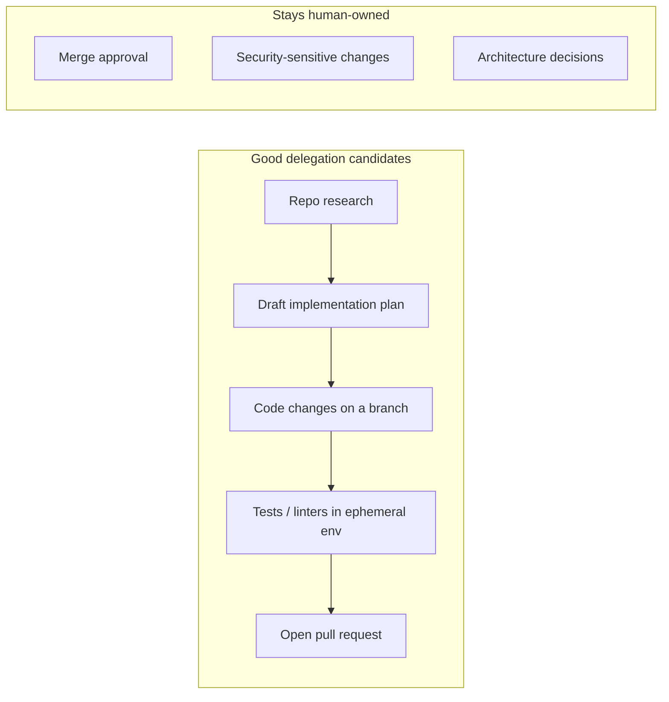
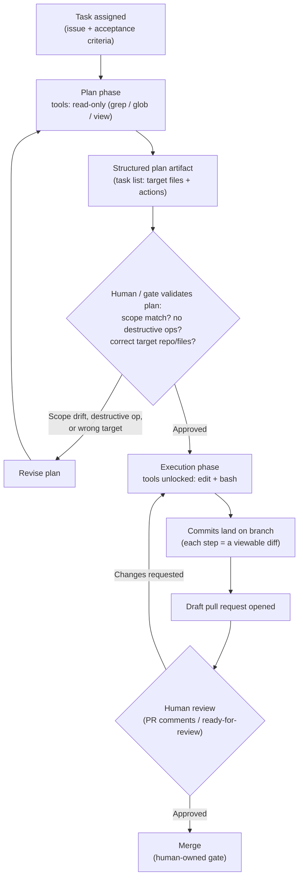

# D1: Prepare Agent Architecture and SDLC Processes

> **Exam weight**: 18% · **Questions**: ~22 of 120

## Overview

This domain covers the judgment layer that sits above any specific tool or configuration: knowing *which* SDLC steps an autonomous coding agent should own, *where* the line falls between an agent's reasoning and its ability to act, and *how* a team stays observably in control without babysitting every step. GitHub Copilot coding agent (and any agent architecture built on the same principles — planning phases, tool scoping, ruleset bypass configuration) only earns its autonomy inside guardrails that are enforced structurally, not requested politely.

> 💡 **Human Angle**: Delegating to a coding agent is like handing a new contractor the keys to your workshop — you inspect the blueprint before you let them near the table saw, not after.

## Integrating Agents into the SDLC

### Key Concept
**Good delegation candidates vs. steps that stay human-owned**

An agent session works best on tasks that have a clear start state, a clear end state, and a verifiable definition of "done." Repository research, drafting an implementation plan, making code changes on a branch, running tests and linters in an ephemeral environment, and opening a pull request all fit that shape — the agent can be evaluated purely on whether its output matches the acceptance criteria.

Some steps must stay human-owned regardless of how capable the agent is, because completing them isn't just execution — it's a judgment call the organization has to be accountable for. Merge approval is the clearest example: it's the moment a proposed change becomes an accepted one. Security-sensitive changes (credential rotation, access-control changes, anything with production blast radius and no easy rollback) and architecture decisions (adopting a new framework, choosing REST vs. GraphQL) require weighing trade-offs and organizational context that isn't the agent's to own.

### In Practice

**What breaks without this**: teams that delegate merge approval, credential rotation, or architecture direction to an agent lose the checkpoint where a human is accountable for what actually ships — a plausible-but-wrong change or a subtly incorrect security config can go live with nobody having evaluated intent, only correctness-of-syntax.

**Decision trigger**: ask "does completing this step also commit the organization to it, or is it still reversible and reviewable before it matters?" If the step is reversible and lands in the normal review pipeline (a PR, a draft plan), it's a good delegation candidate. If completing it *is* the commitment, keep it human-owned.

**When you'd choose differently**: a well-scoped, low-risk config change (bumping a pinned dependency version with no API surface change) can sometimes be pre-approved for auto-merge under strict conditions — but that's a deliberate, narrow policy decision made by a human in advance, not a default assumption that agent PRs are trustworthy.

### Key Concept
**Anti-patterns that sabotage delegation**

The most common failure isn't a broken agent — it's a broken task definition. A vague issue like "improve the checkout flow" gives the agent no boundary, so it fills the gap with its own inference of scope, often touching far more than intended (including services it shouldn't, like a payment gateway). Granting an agent bypass-actor status on branch protection without a compensating review control lets CI-green PRs merge with nobody evaluating whether the change matches intent — automated checks confirm the code behaves as written, not that it's the right thing to build.

Two structural anti-patterns are easy to miss because they look like convenience: assigning cross-repository work to a single agent session, and ignoring session/execution time limits. Coding agent sessions are scoped to **one repository** — a task spanning an auth library and three downstream consumers cannot be captured as one atomic session or one PR; it must be decomposed into separate per-repo tasks. And every session runs inside a bounded execution ceiling: a task that exceeds it doesn't fail loudly, it stops wherever it got to. Tests passing on a partial diff only proves the completed portion is internally consistent — not that the task is done. Finally, treating any agent-authored PR as pre-approved because "the agent already checked its own work" collapses the review gate that exists specifically to catch mismatches CI can't detect.

### In Practice

**What breaks without this**: an unbounded issue produces an oversized, hard-to-review diff that touches unrelated services; a bypassed review gate lets a correct-but-wrong-intent change merge; a cross-repo task silently only completes one repo's worth of work while the requester assumes all four are done; a truncated session gets merged as if it were complete because "tests pass."

**Decision trigger**: before delegating, ask three questions — Is this confined to one repository? Does the issue name concrete acceptance criteria and boundaries? Will the resulting PR still go through the same review gate a human's PR would? If any answer is no, fix the task definition or the ruleset before assigning it.

**When you'd choose differently**: for a repeatable, low-risk task class an org has validated over time (e.g., dependency bump PRs that only ever touch a lockfile), a team might build a narrow, explicitly-scoped auto-merge rule — but that's a deliberate exception carved out after evidence, not a default posture toward agent PRs in general.

### Exam Trap ⚠️

Scenario questions often reward the "obviously fast" answer — add the agent as a bypass actor, let one session handle a multi-repo change, treat green CI as approval. Each of these looks like it removes friction; each actually removes the compensating control that friction exists to provide. Think of it like a fire alarm you disable because it's noisy on toast day — the alarm wasn't the problem, and now nothing catches the actual fire.

### Key Concept
**Defining inputs, outputs, and success criteria before delegating**

A well-formed agent task specifies three things before any work starts: **inputs** the agent needs (the issue description, relevant custom instructions, explicit acceptance criteria — e.g., "must not change the public API," "the fix should make test `test_order_totals` pass"), **outputs** the agent will produce (a branch, a sequence of commits, a pull request, and a session log as the record of what happened), and **success criteria** a reviewer will check the output against (tests pass, lints pass, the stated acceptance criteria are met). This is the same discipline a well-written ticket requires for a human contributor, made explicit because the agent has no other source of shared context to draw on.

### In Practice

**What breaks without this**: without stated inputs, the agent guesses at conventions and constraints; without stated outputs, a requester doesn't know whether to expect one PR or four; without stated success criteria, a reviewer has no fast way to check the PR against intent and ends up re-deriving the requirements from the diff itself.

**Decision trigger**: before assigning a task, ask "could a reviewer check this PR off against a checklist in under two minutes?" If the acceptance criteria aren't specific enough to produce that checklist, tighten the issue before delegating — not after the PR shows up.

**When you'd choose differently**: for pure exploratory research tasks (e.g., "summarize how error handling works across this codebase") there's no code-modifying success criterion to define — the output is a plan or report, not a diff, so "success" is closer to "did it correctly represent the codebase" than to test/lint pass rates.

### Exam Trap ⚠️

Watch for questions that frame the "/tests directory" or a file path as the signal for whether something is safe to delegate. Delegability tracks accountability and risk — not file location. A change under `/tests` that quietly weakens an assertion is still a risk; a mechanical library-call update outside `/tests` can still be a great delegation candidate. Don't let a plausible-sounding shortcut replace the actual question: does completing this commit the org to something irreversible?

## Defining Boundaries Between Planning, Reasoning, and Action

### Key Concept
**Planning as a distinct, reviewable phase before any code-modifying tool runs**

Separating "decide what to do" from "do it" creates a checkpoint where a reviewable artifact exists before anything irreversible — a file edit, a commit, a shell command — happens. This is the same reason engineering teams write design docs before implementation: catching a wrong direction on paper is cheap; catching it in a merged diff is expensive. Configuring this well means two things: the plan step must run *before* execution, and its output must be a structured artifact — a task list naming specific files and actions — rather than free-form narration like "I'll look at the auth module and probably update a few files." Structured output is what makes a plan checkable: a reviewer can mentally diff a task list against the issue's acceptance criteria; vague prose can't be validated or falsified either way.

The plan-then-act boundary is the core conceptual model of this domain — the diagram below is the one worth memorizing cold.

### In Practice

**What breaks without this**: without a plan-review checkpoint, scope drift or an unintended destructive step only surfaces once the PR already exists — at which point the agent may have already touched files, run commands, or drifted past the issue's intent, all more expensive to unwind than a plan revision would have been. "I'll review the diff at the end instead" sounds equivalent to plan review but isn't: the first point of human contact has moved from *before any change* to *after everything already happened*.

**Decision trigger**: ask "if this plan is wrong, what does it cost to find out?" If the answer is "a re-read of a task list" the checkpoint is working; if the answer is "an unwind of committed changes," the checkpoint arrived too late.

**When you'd choose differently**: for genuinely trivial, single-line, previously-validated task classes (a version bump the team has run this exact pattern on dozens of times), a team might collapse plan review into a lighter-weight automated scope check rather than a full human read — but that's a calibrated exception for a known-low-risk pattern, not the default for novel work.

### Key Concept
**Enforcing the boundary through tool capability, not instructions**

A plan/act boundary is only a real safety boundary if it's enforced structurally — otherwise "planning phase" is just a label, and the same agent could act on its own plan if it happened to have the tools to do so. The durable mechanism is scoping the **`tools`** property of a planning-phase (sub)agent to read-only tools only (grep, glob, view) and withholding any edit- or bash-capable tools, so there is no code path by which the planner can modify the repository — the constraint holds even if its reasoning goes sideways or it's fed a misleading issue body. Only the execution-phase agent is granted edit/bash-capable tools, once a plan has been approved.

For an orchestrator agent that inherits a broad default toolset but should stay planning-only (reason, decide, delegate — never edit or run bash directly), the precise tool is **`excludedTools`**: it subtracts the specific edit/bash tools from the inherited defaults without requiring you to reconstruct and maintain a full allowlist by hand. A system-prompt instruction telling the model "don't make edits" is a soft guideline the model can deviate from under ambiguous or adversarial input; tool-availability scoping is a capability guarantee that holds regardless of what the model reasons its way into. Draft-PR gates and explicit approval requirements extend the same principle past the plan stage: they keep the *merge* decision human-owned even after execution has produced a diff.

### In Practice

**What breaks without this**: an instruction-only boundary ("please don't edit files during planning") can be bypassed by prompt injection embedded in a malicious or malformed issue body, or simply by model reasoning that decides an edit is warranted — the plan/act split becomes a label with no enforcement behind it.

**Decision trigger**: whenever an agent's role is "propose, don't act," ask "is this boundary enforced by what the agent *can* invoke, or only by what it's *told* not to invoke?" If it's the latter, tighten the `tools`/`excludedTools` configuration rather than the prompt wording.

**When you'd choose differently**: `excludedTools` is the right minimal edit when you're removing a small number of capabilities from an otherwise-good default set; if you're building a narrowly scoped agent from scratch with only two or three tools it should ever need, an explicit `tools` allowlist starting from empty is more precise and avoids silently inheriting new default tools the platform adds later.

### Exam Trap ⚠️

The exam frequently offers "instruct the agent not to do X in its system prompt" as a distractor alongside a correct tool-scoping answer. A system prompt is a request the model can be talked out of; a missing tool is a door that doesn't exist. Whenever a question asks how to <em>guarantee</em> a boundary — read that word literally — the answer is almost always a capability restriction (`tools` / `excludedTools`), not an instruction. Also watch for "skip plan validation, review the diff at the end instead" — it sounds like an equivalent checkpoint moved later, but it removes the pre-execution catch entirely.

## Configuring Observability and Control for Autonomous Agents

### Key Concept
**Guardrails that match the granularity of the actual risk**

Autonomy guardrails work best when their scope matches the scope of the actual concern rather than defaulting to an all-or-nothing switch. Org-level enablement paired with a per-repository opt-out lets an organization default to productivity while still respecting a specific repository's compliance or risk profile — disabling the feature org-wide because one repository has a concern discards the benefit for every team that doesn't share it. The same discipline applies to branch-protection ruleset bypass-actor configuration: bypass should be scoped **per rule**, not per actor wholesale. An agent can reasonably bypass rules meant to stop humans pushing straight to main (since the agent works on its own branches), while the rule requiring approving reviews before merge into main stays fully intact for every PR, including the agent's. Adding an agent as a bypass actor on the *review-requirement* rule specifically is the configuration mistake that removes the human checkpoint teams actually want to keep.

### In Practice

**What breaks without this**: a coarse org-wide enable/disable switch forces every team into the same policy regardless of their actual risk profile, and a coarse "add the agent as a bypass actor" (without specifying which rule) accidentally exempts the agent from required review, not just from friction that didn't apply to it in the first place.

**Decision trigger**: when configuring a guardrail, ask "does this bypass apply to the rule causing friction, or does it apply to the actor generally?" Scope to the rule, not the actor, whenever the actor should still be subject to some rules and not others.

**When you'd choose differently**: for a genuinely low-risk internal tooling repository with no compliance obligations, a team might reasonably decide the org default (agent enabled, standard review required) needs no repo-level override at all — the point isn't that every repo needs a custom policy, it's that the mechanism exists at the right granularity when one does.

### Key Concept
**Inspectable artifacts as the durable audit trail**

Observability for autonomous agents depends on the work being visible through the same tooling humans already use to review changes. An agent that commits incrementally to a branch, where each step is a viewable diff and the PR serves as the aggregated, durable record, produces an audit trail a human (or a future investigator) can reconstruct end-to-end — what changed, in what order, and why. A workflow that instead applies a single bulk change directly to a target branch through a side-channel automation pipeline, bypassing the PR flow, has no equivalent trail of intermediate reasoning or steps, no matter how fast it runs.

### In Practice

**What breaks without this**: when something goes wrong three weeks after a bulk, PR-bypassing change, there's no commit history to bisect, no diff sequence to review, and no PR thread documenting intent — the investigation has nothing to work from.

**Decision trigger**: for any new agent tooling integration, ask "does this land as standard Git/GitHub artifacts (commits, diffs, a PR) or as an opaque side-channel?" The former is auditable and reversible by construction; the latter usually isn't, regardless of how convenient it looks.

**When you'd choose differently**: a fully automated, human-supervised pipeline that applies a config change (e.g., a feature flag toggle recorded in a separate, already-audited system of record) may reasonably skip the PR flow — but only when that alternate system already provides an equivalent durable, reviewable trail.

### Key Concept
**Human intervention that doesn't slow delivery**

Human-in-the-loop controls don't have to be synchronous to be effective. Requiring a reviewer to approve every individual tool call, or to stay present in a live session for an agent's full runtime, turns the reviewer into a bottleneck that doesn't scale past one task at a time and defeats much of the purpose of delegating the work. The scalable pattern moves the checkpoint into artifacts a reviewer can engage with whenever they're available: PR comments, and a draft-to-ready-for-review transition, rather than a blocking live conversation. Session lifecycle events — started, completed, failed — give the same asynchronous model to monitoring: a team subscribes to these events and routes them to chat or a dashboard, so a human intervenes at a meaningful checkpoint (a failed session, a plan awaiting approval, a PR awaiting review) without polling or watching every step in between.

### In Practice

**What breaks without this**: synchronous, blocking approval collapses as soon as an organization runs more than one agent task concurrently — either delivery stalls waiting for a reviewer's real-time availability, or teams quietly stop enforcing the gate because it's too slow to keep up with.

**Decision trigger**: ask "does this oversight model require a human to be present in real time, or can it be satisfied whenever a human next checks in?" If real-time presence is required, look for the async equivalent (draft PR, comment-based approval, lifecycle event) before accepting the throughput cost.

**When you'd choose differently**: a genuinely high-blast-radius, irreversible action (e.g., a production data migration) may legitimately warrant a synchronous, live-attended approval step even at the cost of throughput — async checkpoints are the default for scaling oversight, not a rule that every gate must be async regardless of stakes.

### Exam Trap ⚠️

"Require a reviewer to approve every tool call in real time" and "require the reviewer present for the full session" are two flavors of the same wrong answer: continuous supervision. The exam rewards checkpoint-based oversight — plan review, PR review, and lifecycle-event alerts in between — over continuous monitoring. If an option describes a human watching every step, that's very likely the distractor, not the pattern the domain is testing for.

## Deep Dive: Making Agent Architecture and SDLC Processes Click

### 1. The connective narrative

The three task areas in this domain aren't independent topics — they're the same idea applied at three different points in the workflow. First, you decide *what* to hand the agent at all: bounded, verifiable execution tasks stay delegated; irreversible or judgment-heavy decisions stay human. Second, once a task is delegated, you decide *when* the agent is allowed to act on its own reasoning: not immediately, but only after a structured plan has been produced and checked against the task's actual scope. Third, once execution is underway, you decide *how* a human stays in control without becoming the bottleneck: not by watching every step, but by making every step land as an inspectable artifact and by placing checkpoints at the moments that actually branch the outcome.

The throughline connecting all three is that **guarantees come from structure, not from cooperation**. A vague issue relies on the agent guessing correctly — structure fixes that with explicit acceptance criteria. An instruction not to edit files during planning relies on the model choosing to comply — structure fixes that with a `tools` property that makes editing impossible. A "the agent already checked its own work" merge policy relies on trusting that CI catches everything — structure fixes that with a required-review rule scoped correctly in the bypass list. Every anti-pattern in this domain is a place where a team substituted a request for a constraint; every correct pattern is the same request re-expressed as something the platform enforces mechanically, regardless of what the agent decides to do.

This is also why the plan/act boundary is the domain's centerpiece rather than just one topic among three: it's the moment where "agent reasoning" (which can be wrong, misled, or overconfident) is separated from "agent action" (which is irreversible the instant it happens). Everything else in this domain — delegation scoping, tool restrictions, bypass-actor configuration, async review — is a variation on protecting that one seam.

### 2. Worked scenario

> **Scenario.** Priya, a platform lead at a mid-size logistics company, is standing up her team's first coding-agent workflow for bug-fix tasks. She has two agents configured: a `planner` custom agent with `tools: ["grep", "glob", "view"]` and an `executor` custom agent with `tools: ["grep", "glob", "view", "edit", "bash"]`.
>
> An engineer files an issue: *"Fix `test_shipment_status` — it fails because the status enum doesn't include `IN_TRANSIT`. Only touch `shipment/status.py` and its test file. Do not change the public `ShipmentStatus` API surface."* This gives Priya's workflow exactly what it needs: an input (the failing test and the constraint), and an implicit success criterion (the named test passes, no public API change).
>
> The `planner` agent runs first. Because it only has read-only tools, it can inspect `shipment/status.py`, the enum definition, and the failing test — but it physically cannot edit anything. It produces a structured plan: *"1. Add `IN_TRANSIT` to the `ShipmentStatus` enum in `shipment/status.py`. 2. Update the corresponding test fixture in `test_status.py` to include the new value. No changes to the public `ShipmentStatus` class interface."*
>
> A reviewer checks the plan against the issue in under a minute: right files (`status.py`, `test_status.py`), no destructive operations, no API-surface change proposed — matches the constraint exactly. The plan is approved, and the workflow hands off to the `executor` agent, which now has edit and bash access. It makes the two changes, runs the test suite in its ephemeral environment (confirms `test_shipment_status` now passes, confirms no other tests broke), and opens a **draft** PR with a summary referencing the original issue.
>
> A teammate reviews the draft PR asynchronously that afternoon — not in a live session, just PR comments — confirms the diff matches the plan exactly, and marks it ready for review. Because the branch-protection ruleset only lists the agent's own working-branch pushes in the bypass list (not the required-review rule for merges into `main`), the PR still needs a human approval before it can merge. The teammate approves, and the PR merges. The entire audit trail — the plan artifact, the commits, the diff, the PR comments, the session log — is reconstructable from GitHub alone, months later, without anyone needing to remember what happened.
>
> Nothing about this took a human's continuous attention: two checkpoints (plan review, PR review), each fast because the inputs were well-scoped and the boundary between reasoning and action was enforced by tool capability, not by hoping the agent behaved.

### 3. Memory aid

**PACE** — the shape of every well-architected agent workflow in this domain:

- **P**lan — produced first, by an agent (or phase) with read-only tools only.
- **A**pprove — a human or gate checks scope, destructive-operation risk, and target correctness before execution unlocks.
- **C**ommit — execution happens with edit/bash tools, landing as incremental, viewable commits — never a bulk, off-Git side-channel change.
- **E**valuate — PR review (async — comments, draft-to-ready) gates the merge; merge approval itself stays human-owned no matter how the bypass list is configured.

If a question describes a workflow skipping straight from "task assigned" to "commits appear" with no plan artifact, or from "PR opened" to "merged" with no review gate, it has skipped a PACE letter — and that's almost always the point being tested.

### 4. Exam strategy for this domain

- The exam's favorite distractor pattern is the "faster but structurally weaker" option: bypass-actor status instead of scoped review, a system-prompt instruction instead of tool scoping, "review the diff at the end" instead of plan review, a live-session approval instead of async PR comments. When two options both sound reasonable, prefer the one enforced by configuration/capability over the one enforced by asking nicely.
- The exam rewards recognizing *where* accountability sits: merge approval, security-sensitive changes, and architecture decisions stay human no matter how good the agent's output looks; everything reversible and reviewable before it matters is fair game for delegation.
- Watch for absolute-sounding distractors tied to file paths or naming conventions (e.g., "anything under `/tests` is safe to auto-delegate") — delegability tracks risk and reversibility, not surface-level pattern matching.
- The one sentence to remember five minutes before the exam: **a boundary the agent could talk its way past isn't a boundary — check whether the correct answer removes a capability or just asks politely.**

## Cheat Sheet 📋

| Concept | Key Rule |
|---------|----------|
| Delegation candidates | Research, planning, branch edits, tests/lints in an ephemeral env, opening a PR — bounded and reviewable |
| Human-owned steps | Merge approval, security-sensitive changes, architecture decisions — always |
| Vague issue → scope creep | Missing acceptance criteria forces the agent to infer boundaries; tighten the issue, not the agent |
| Bypass-actor status | Scope to the specific rule that doesn't apply to the agent; never to the required-review rule |
| Cross-repo tasks | One session = one repository; decompose multi-repo work into separate tasks/PRs |
| Session time limits | A truncated session stops silently, not loudly — check the session log's stopping condition, not just CI |
| "Agent PR = pre-approved" | False; an agent PR is a proposal like any other and needs the same review gate |
| Inputs / outputs / success criteria | Define before delegating: issue + instructions + acceptance criteria → branch/commits/PR/log → tests+lints+criteria met |
| Plan-then-act split | Plan is a distinct phase producing a reviewable artifact before any code-modifying tool runs |
| Structured plan output | Task list naming files/actions — checkable; free-form narration — not checkable |
| Plan validation checklist | Scope match, no destructive operations, correct target repo/files |
| `tools` (read-only) | Enforces "planner can't edit" as a capability guarantee, not an instruction |
| `excludedTools` | Minimal denylist edit to keep an orchestrator planning-only without rebuilding its full allowlist |
| Draft PR / approval gate | Async human checkpoint between plan approval and merge-ready, without blocking execution |
| Org enablement + per-repo opt-out | Default to productivity org-wide; carve out narrow, risk-justified exceptions per repo |
| Inspectable artifacts | Commits + diffs + PR = durable audit trail; bulk off-PR changes leave none |
| Lifecycle events | started / completed / failed — push-based signals for monitoring without polling |
| Oversight model | Checkpoint-based (plan, PR, event alerts) beats continuous supervision every time |
