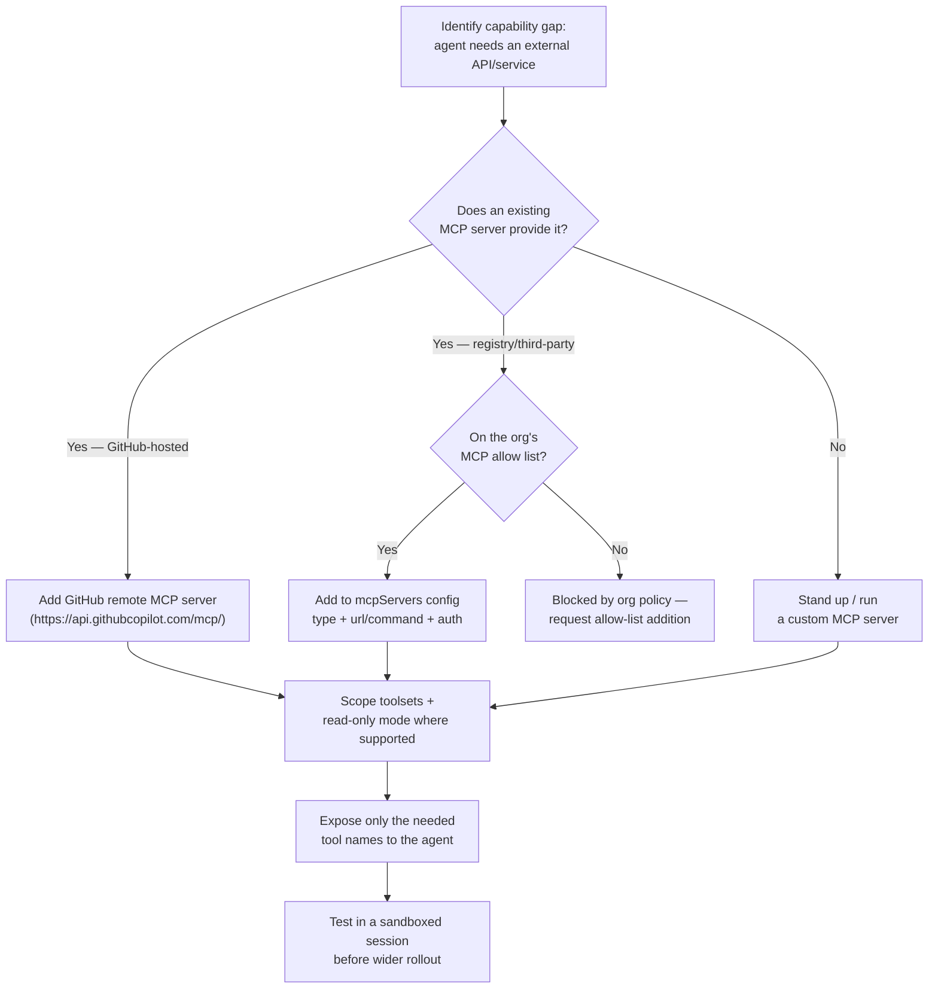
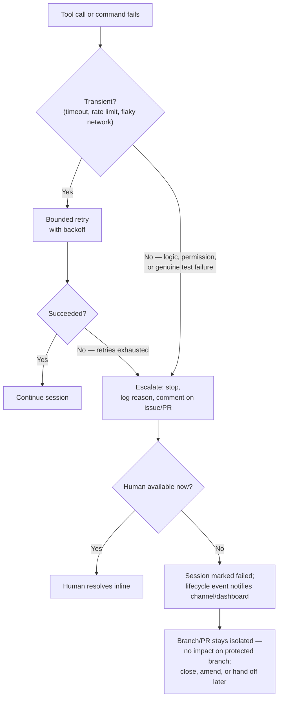

# D2: Implement Tool Use and Environment Interaction

> **Exam weight**: 23% · **Questions**: ~28 of 120

## Overview

This is the largest domain on the exam, and for good reason: it's where an agent stops being a conversational model and starts being able to *do* things — read a repo, call an external API, run a command, open a pull request. Every capability you grant is also a risk surface, so the domain is really about one repeated discipline applied across four layers: deciding exactly which tools an agent needs, wiring those tools in safely (including MCP servers), running the agent inside a scoped development environment, and handling the moment something goes wrong without losing control or the audit trail.

> 💡 **Human Angle**: Giving an agent tool access is like issuing a new hire a keycard — it should open exactly the doors their job requires on day one, not the whole building "just in case they need it later."

## Selecting and Configuring Agent Tools

### Key Concept
**Identify required tools from the task, not from what's available**

Tool selection starts from the task, not from the catalog. For a given agent role — a code-review agent, a triage agent, a release-notes agent — you list the concrete actions it must be able to perform (read files, run tests, comment on a PR, query an issue tracker) and map each one to the smallest tool that satisfies it. This is the same discipline as the plan/act boundary from Domain 1, applied one level lower: a tool an agent doesn't need isn't a convenience held in reserve, it's an unused capability that only adds risk and ambiguity. The more tools an agent can see in a given turn, the more chances there are for it to pick the wrong one on an ambiguous instruction — a triage agent that can also merge PRs will occasionally try to, even though "triage" never implied "merge."

### In Practice

**What breaks without this**: an agent configured with a broad, copy-pasted toolset (because it was easier than auditing the task) occasionally invokes a tool that's technically available but never intended for its role — e.g., a documentation agent that also has `bash` access running an arbitrary shell command because a prompt-injected issue body asked it to, when it should have had no code-execution path at all.

**Decision trigger**: for every tool under consideration, ask "does this agent's task literally require this action to complete, or would the task still fully succeed without it?" If the task succeeds without it, leave it out — you can always add it later with evidence, but you can't un-ring a tool call that already happened.

**When you'd choose differently**: for a general-purpose "assistant" agent meant to handle open-ended, unpredictable requests from developers (not a narrow single-purpose agent), a broader toolset is a legitimate design choice — but it should be paired with tighter permission scoping and human review on anything destructive, since you're trading predictability for flexibility on purpose.

### Key Concept
**Configuring tools: `tools`, `excludedTools`, and MCP tool names**

Once required tools are identified, configuration happens through the agent's `tools` property (an explicit allowlist — start from nothing, add only what's needed) or `excludedTools` (a denylist that subtracts specific tools from an inherited default set). Built-in tools like read/edit/bash/grep/glob/view sit alongside MCP-provided tools, which are namespaced to the server that exposes them (e.g., a GitHub MCP server's `issues` tool is distinct from a Slack MCP server's `post_message` tool even if both are loosely "communication" actions) — so an allowlist entry has to reference the specific server-qualified tool name, not a generic capability label.

### In Practice

**What breaks without this**: teams that reuse one broad `tools` list across every custom agent in the org — because maintaining a separate list per agent feels like overhead — end up with narrow-purpose agents that can silently invoke tools nobody intended for them, and nobody notices until a session log shows an unexpected tool call.

**Decision trigger**: ask "if I inherit the platform's default toolset, will next month's newly-added default tool automatically become available to this agent too?" If yes and that's not acceptable for a sensitive agent, use an explicit `tools` allowlist instead of relying on `excludedTools` against a moving default.

**When you'd choose differently**: `excludedTools` is the more maintainable choice when you're removing a small, known number of capabilities (e.g., "everything except `bash`") from an otherwise-good default set — rebuilding a full allowlist by hand for a broadly-scoped agent adds maintenance risk of its own if the platform's default toolset changes.

### Key Concept
**Tool permission scoping: least privilege as a spectrum, not a switch**

Permission isn't binary "has the tool or doesn't" — most tools (and MCP servers in particular) support finer scoping: read-only vs. read-write modes, per-toolset enablement (e.g., an `issues` toolset without a `pull_requests` toolset), and repository- or org-level constraints on what the underlying credential can reach. A planning-phase or review agent should default to read-only wherever the tool supports it, even if the same tool is also available in write mode elsewhere in the pipeline for the execution phase — matching Domain 1's plan/act split at the tool-configuration layer.

### In Practice

**What breaks without this**: granting a code-review agent a GitHub tool in full read-write mode because "it's the same tool the execution agent uses anyway" means a subtly wrong prompt or an injected instruction in a PR description could cause the review agent to push a commit or close an issue — actions a reviewer was never supposed to be able to take.

**Decision trigger**: before granting a tool, ask "does this agent's job ever require *mutating* state, or does it only need to observe it?" If it only observes, configure the read-only variant even when a write-capable variant is available and would technically also work.

**When you'd choose differently**: a triage agent whose entire job is applying labels and assigning issues genuinely needs write access to a narrow slice of the issue-tracking surface — the point isn't "always read-only," it's scoping write access to exactly the mutation the role requires and nothing wider.

### Exam Trap ⚠️

The exam likes to offer "grant the tool, then instruct the agent not to use it destructively" as a distractor next to a correctly-scoped read-only or allowlisted answer. As with Domain 1's plan/act boundary, an instruction is something the model can be talked out of by ambiguous or adversarial input; a tool that isn't in the `tools` list, or an MCP server running in read-only mode, physically cannot be misused that way. If a question asks how to <em>guarantee</em> a tool won't be misused, the answer is a configuration change to what's available — not a prompt asking nicely.

## Configuring MCP Servers

### Key Concept
**Adding an MCP server as a tool to an agent**

The Model Context Protocol lets an agent call tools exposed by an external server — local (run as a subprocess, e.g., a Docker-packaged server started with a command and args) or remote (an HTTP endpoint the agent connects to directly). Configuration for GitHub Copilot's coding agent happens through an `mcpServers` block: each entry names the server, its `type` (`local` or `http`), how to reach it (`command`/`args` for local, `url` for remote), any required authentication, and — critically — which of the server's tools are actually exposed to the agent. A server that offers thirty tools doesn't mean an agent should receive all thirty; the same least-privilege discipline from tool selection applies again at the MCP layer.

### In Practice

**What breaks without this**: adding an MCP server with its full default toolset exposed — because scoping individual tool names felt like unnecessary setup — hands the agent tools nobody scoped or reviewed, some of which may be destructive (delete, force-push, send-message) and were never part of the task the agent was configured for.

**Decision trigger**: when adding any MCP server, ask "which specific tools does this agent's task require from this server?" and enumerate them explicitly, rather than accepting the server's full default exposure.

**When you'd choose differently**: for an internal, fully-trusted server built in-house specifically to back one narrow agent (nothing else will ever consume it), exposing its complete toolset can be reasonable — the server's entire surface area was already designed around exactly that agent's needs, so there's nothing extra to trim.

### Key Concept
**Configuring the GitHub remote MCP server**

GitHub hosts its own remote MCP server (reachable at `https://api.githubcopilot.com/mcp/`) that exposes GitHub platform capabilities — issues, pull requests, repositories, Actions, code security — as MCP tools, authenticated via a bearer token (OAuth or PAT) sent with the request. Two configuration levers matter most: **toolsets**, which group related tools (e.g., `issues`, `pull_requests`, `actions`) so you can enable only the groups a given agent needs instead of the entire surface; and a **read-only mode**, which restricts the server to non-mutating operations only — the same read/write scoping principle as any other tool, applied to GitHub's own API surface.

### In Practice

**What breaks without this**: enabling every toolset on the GitHub remote MCP server for an agent that only needs to read issue context turns a narrow research task into one with a much larger blast radius — the agent now technically has a code path to modify Actions workflows or push commits, even if the task never called for it.

**Decision trigger**: ask "does this agent's task require any GitHub mutation at all?" If not, enable read-only mode and only the toolsets the task actually touches (e.g., `issues` and `pull_requests`, not `actions` or `code_security`), rather than defaulting to the full authenticated surface.

**When you'd choose differently**: an execution-phase coding agent that needs to push commits and open PRs genuinely needs a write-capable configuration — the goal isn't "always read-only," it's matching the server's mode to the phase the agent is actually operating in.

### Key Concept
**MCP registries: discovery is not the same as trust**

An MCP registry is a catalog — a place to discover servers that expose a given capability — not an approval mechanism. A server appearing in a registry tells you it exists and roughly what it does; it says nothing about whether your organization has vetted its data handling, its authentication model, or the blast radius of the tools it exposes. Treating "it's in the registry" as equivalent to "it's safe to connect" skips the actual review step organizations need before granting any external server access to agent context (which may include repository contents, issue text, or credentials).

### In Practice

**What breaks without this**: a developer discovers a convenient third-party MCP server in a registry and wires it directly into a production agent workflow without review — if that server logs request payloads or has an overly broad tool surface, repository contents or issue text an agent passed through it are now outside the org's control, with no one having evaluated that trade-off.

**Decision trigger**: before connecting any newly-discovered MCP server, ask "has this specific server been vetted by someone with authority to approve it for this org, independent of it being listed in a registry?" Registry presence answers "does it exist," not "should we trust it."

**When you'd choose differently**: for a low-stakes local experiment in a sandbox with no real repository data or credentials in play, a developer trying out a registry-listed server for evaluation purposes doesn't need the same review bar as a production rollout — the distinction is what's actually exposed to the server, not the server's popularity.

### Key Concept
**MCP allow lists: policy enforced at the org, not the individual agent config**

Because any contributor could otherwise wire an arbitrary MCP server into an agent workflow, org owners can configure an **MCP server allow list** policy that restricts which MCP servers are permitted for use with Copilot's coding agent across the organization — only servers on the approved list can be connected, regardless of what an individual repository's configuration requests. This moves the trust decision from "did this repo's maintainer make a good call" to "did the org's security/platform team approve this specific server," which matters because a compromised or malicious MCP server has a direct path to whatever context and credentials the agent session holds.

### In Practice

**What breaks without this**: without an org-level allow list, the practical security posture of every coding-agent session in the org is only as strong as the least-careful repository maintainer's MCP configuration — one repo wiring in an unreviewed server creates an exfiltration path that has nothing to do with that repo's own code quality.

**Decision trigger**: ask "if any contributor in the org could add an MCP server config to any repo today, would that be an acceptable security posture?" If not, the allow list needs to be enabled and enforced centrally rather than relying on repo-by-repo review discipline.

**When you'd choose differently**: a small, security-mature team with tight repository access control and a very short list of contributors might reasonably treat repo-level review as sufficient without a separate org-level allow list — but that's a calculated risk acceptance for a specific context, not a substitute for the mechanism existing at scale.

### Exam Trap ⚠️

Watch for questions that treat "the MCP server is listed in a registry" as sufficient justification to connect it, or that describe an org relying on individual repo maintainers to vet MCP servers instead of a central allow list. Both are the "convenient but ungoverned" answer. Think of an MCP allow list like a vendor-approval list in procurement: the vendor being easy to find in a catalog was never the question — whether someone with authority signed off on trusting them is.

## Integrating Agents into Development Environments

### Key Concept
**Execution context: ephemeral, sandboxed, and configurable before the session starts**

Coding agent sessions run inside an isolated, ephemeral compute environment rather than on a developer's machine or a shared long-lived box — each session starts clean and is discarded afterward. Teams can customize what that environment looks like before the agent's first tool call using a dedicated setup workflow (a `copilot-setup-steps` job) that installs dependencies, sets up language toolchains, or seeds any state the agent's later work will assume is already present — the same way a CI job's setup phase prepares an environment before the actual build/test steps run.

### In Practice

**What breaks without this**: an agent session that has to install dependencies itself, inside its own bounded execution window, spends part of its limited time and tool-call budget on environment setup instead of the actual task — and if setup is nondeterministic (a flaky install step), the session's core work becomes harder to reproduce and debug after the fact.

**Decision trigger**: ask "does every session for this repo need to redo the same setup work before it can start the actual task?" If yes, that setup belongs in a pre-session setup workflow, not repeated inline inside every agent session.

**When you'd choose differently**: a repository with no build step and no dependencies beyond what's already in the base image (e.g., a docs-only repo) doesn't need a custom setup workflow at all — the ephemeral default environment is already sufficient, and adding one would just be unnecessary maintenance.

### Key Concept
**Repository and branch scope**

A coding agent session is scoped to a single repository and operates on its own branch — it cannot push directly to a protected branch, and it cannot span multiple repositories within one session (the same constraint Domain 1 covers for task decomposition, expressed here as an environment-level fact rather than a planning choice). This scoping is what makes the session's diff reviewable as a single coherent unit: everything the session touched is confined to one branch in one repo, so a reviewer never has to reason about partial, cross-repository side effects from a single session.

### In Practice

**What breaks without this**: assuming a single session can coordinate changes across a library repo and its downstream consumers produces a task that silently only completes the portion scoped to whichever repo the session was actually attached to — the requester may not notice the other repos were never touched until something downstream breaks.

**Decision trigger**: before assigning any task, ask "does this change require edits in more than one repository?" If yes, decompose it into one session per repository up front, rather than discovering the scope limit mid-task.

**When you'd choose differently**: there's no legitimate exception here within a single session — cross-repo work always needs decomposition into separate sessions; the only design choice is how those sessions coordinate (e.g., a tracking issue linking the per-repo PRs), not whether the single-repo constraint can be worked around.

### Key Concept
**CI invocation for agent-authored changes**

An agent-opened PR triggers the repository's CI the same way a human-opened PR would, but with one important gate: workflows on agent-authored PRs commonly require the same approval step used for first-time external contributors before Actions workflows run automatically — a maintainer has to approve the workflow run rather than it firing unattended. This exists because a PR whose diff came from an autonomous process is exactly the scenario where you don't want CI (which can have write-capable secrets and deploy permissions) executing unreviewed instructions with no human checkpoint at all.

### In Practice

**What breaks without this**: auto-approving Actions runs on every agent-opened PR (to "keep things fast") removes the one CI-level checkpoint that exists specifically to catch a scenario where the diff itself is untrusted until a human has looked at it — a malicious or injected change could reach a workflow with real secrets before anyone reviewed the code.

**Decision trigger**: ask "would I auto-approve CI runs on a PR from a first-time external contributor without looking at the diff first?" If not, don't configure agent PRs to skip that same gate just because the author is a trusted agent product rather than an unknown human.

**When you'd choose differently**: a narrowly-scoped, low-privilege workflow (e.g., a lint-only check with no secrets and no deploy capability) can reasonably be exempted from the approval gate for agent PRs specifically because a compromised run of *that* workflow has no meaningful blast radius — the exemption should be scoped to the workflow's actual capability, not granted broadly.

### Key Concept
**Autonomous branch and PR creation**

Once execution is unlocked, the agent creates its own working branch off the base branch, commits incrementally, and opens a pull request — by default as a **draft**, signaling it isn't yet ready for merge consideration even though the code changes are complete. This mirrors Domain 1's plan/act/review boundary at the Git level: draft status is itself a checkpoint, distinguishing "the agent finished its work" from "a human has looked at it and agreed it's ready."

### In Practice

**What breaks without this**: treating an agent-opened PR as ready-for-review the instant it appears (skipping the draft-to-ready transition) collapses the signal that was supposed to tell reviewers "this hasn't been triaged yet" — reviewers either waste time on PRs the requester hasn't even glanced at, or a rushed merge happens before anyone confirms the PR matches intent.

**Decision trigger**: ask "has a human confirmed this PR is what was actually asked for, or only that the agent believes it finished?" If only the latter, the PR should stay in draft until someone makes that call explicitly.

**When you'd choose differently**: for a task class with a very tight, mechanically verifiable acceptance criterion (a single dependency version bump with no API changes, validated automatically), a team might configure automatic draft-to-ready transition once CI passes — a deliberate, narrow exception, not a default assumption that CI-green implies ready-for-merge.

### Key Concept
**Environment-specific constraints: network firewall and secrets scoping**

The agent's execution environment sits behind a network firewall that, by default, allows access only to a curated set of domains needed for common development work (source hosting, common package registries) and blocks everything else — this exists specifically to reduce the blast radius of a prompt-injection attack that tries to get the agent to exfiltrate data to an arbitrary external endpoint. Administrators can extend this allowlist with additional domains a given repository's build genuinely needs. Secrets available to the agent are scoped through a dedicated environment (conceptually similar to a GitHub Actions deployment environment) rather than being broadly injected — so a credential the agent's task doesn't need isn't sitting in its environment where a misbehaving tool call could reach it.

### In Practice

**What breaks without this**: an unrestricted network egress path turns any successful prompt injection (a malicious instruction hidden in an issue body or a fetched web page) into a data-exfiltration path — the firewall's default-deny posture is what makes "the agent read something malicious" a contained failure instead of a leaked-secret incident.

**Decision trigger**: before adding a new domain to the allowlist, ask "does this repository's actual build or test process require reaching this domain, or is this a one-off convenience?" Extend the allowlist only for genuine build/test dependencies, not for general internet access "in case it's useful."

**When you'd choose differently**: there's rarely a good reason to disable the firewall outright — the closest legitimate exception is a tightly-scoped, fully-audited internal tooling repository where the team has already accepted the trade-off and documented exactly why the default posture doesn't fit that one case.

### Exam Trap ⚠️

A frequent distractor pairs "the agent's session log shows tests passing" with "therefore the PR is ready to merge." Passing tests confirm the completed diff is internally consistent — not that CI has run and been approved, not that the PR left draft state, and not that a human confirmed it matches intent. Track these as three separate checkpoints (session-level test pass → CI workflow approval and run → human review/ready-for-review), and don't let one satisfied checkpoint stand in for the others.

## Operating Agents with Safe Execution Paths and Robust Error Handling

### Key Concept
**Error handling and bounded retries**

Not every failure means the same thing, so a robust agent doesn't respond to every failure identically. Transient failures — a network timeout, a rate limit, a flaky test — are reasonable to retry a bounded number of times with backoff, because the underlying action is likely to succeed on a later attempt with no change in approach. Failures that reflect a logic error, a missing permission, or a genuinely failing test are not retry candidates — retrying the same failing action without changing anything just burns the session's execution budget and delays the point where a human actually needs to get involved.

### In Practice

**What breaks without this**: an agent configured to retry indiscriminately on any failure — including a genuinely failing test it cannot fix by trying again — burns its bounded execution window retrying the same unproductive action, and the session eventually stops for running out of time rather than for the actual, diagnosable reason, making the resulting log far less useful to whoever investigates it.

**Decision trigger**: for any failure type the agent might hit, ask "would retrying this exact action with no change in approach plausibly succeed?" If the failure is environmental and likely to resolve on its own (timeout, rate limit), retry is appropriate; if the failure is deterministic given the current state (a test the code doesn't satisfy), escalate instead of retrying.

**When you'd choose differently**: for a deterministic failure the agent has tool access to actually fix (a lint error with an auto-fixable rule), the right response isn't "retry the same action" or "escalate immediately" — it's applying a different, corrective action and then re-attempting, which is a distinct pattern from blind retry.

### Key Concept
**Rollbacks: isolation makes "rollback" cheap by construction**

Because execution happens on the agent's own branch rather than directly on a protected branch, a "rollback" from a failed or unwanted session is rarely a destructive undo operation — it's simply not merging. Closing the PR, deleting the branch, or leaving it as an inspectable record of what was attempted costs nothing to the target branch's history, because nothing ever landed there. This is the direct payoff of the repository/branch scoping covered earlier in this domain: the environment-level constraint (agent works on its own branch, can't push to protected branches) is what makes rollback safe-by-default rather than something that has to be engineered separately after the fact.

### In Practice

**What breaks without this**: a workflow that applies agent-generated changes directly to a protected branch (bypassing the branch-and-PR flow to save time) turns every failed or wrong session into an actual revert operation against production history, instead of a PR that was simply never merged — the cost of a mistake goes from "close a tab" to "coordinate an emergency revert."

**Decision trigger**: ask "if this session's output turns out to be wrong, what does undoing it require?" If the answer is more than closing a PR or deleting a branch, the execution path isn't isolated enough yet.

**When you'd choose differently**: there's no good reason to skip branch isolation for agent-authored changes — the closest exception is a fully separate, already-audited automation pipeline (e.g., a config value flip recorded in its own system of record) that isn't really "agent code changes" in the same sense at all.

### Key Concept
**Escalation paths that reach a human without stalling everything else**

When an agent hits a failure it can't resolve through retry or self-correction, the productive move is to stop cleanly and leave a legible trail for a human — a comment on the issue or PR explaining what blocked it (a firewall-blocked domain, a failing test it couldn't diagnose, a permission it doesn't have), plus a session-failed lifecycle event that a monitoring integration can route to a dashboard or chat channel. This is the same asynchronous, checkpoint-based oversight model from Domain 1 applied to the failure case specifically: escalation shouldn't require a human to have been watching the session live, only that the failure is discoverable the next time someone checks in.

### In Practice

**What breaks without this**: an agent that fails silently — stopping without a clear comment explaining why, and without emitting a lifecycle event anyone is subscribed to — leaves a stalled task that looks indistinguishable from "still in progress" until someone manually checks the session, which can take hours or days in a team not actively watching every session.

**Decision trigger**: ask "if this session fails at 2 a.m., how does the right person find out before it matters?" If the answer relies on someone happening to check, wire the lifecycle event to an actual notification channel rather than treating the session log as sufficient on its own.

**When you'd choose differently**: for a low-priority, non-time-sensitive background task (e.g., a periodic documentation-freshness sweep), routing failures to a low-urgency digest rather than an immediate alert is a reasonable calibration — the principle is matching escalation urgency to actual task stakes, not that every failure needs a page.

### Key Concept
**Traceability and accountability**

Every action an agent takes should be reconstructable after the fact: session logs capturing what the agent reasoned and which tools it called, commits attributed to the agent's identity (distinguishing agent-authored work from human-authored work in the repository's history), and organization-level audit log entries recording session starts, tool invocations against sensitive resources, and outcomes. This is what turns "an agent did something" into "we can determine exactly what it did, when, and why" — the difference between an incident being investigable and being a shrug.

### In Practice

**What breaks without this**: without clear commit attribution and session-log retention, a problem discovered weeks later (a subtly wrong config change, an unexpected API call) can't be traced back to which session caused it, what the agent's reasoning was at the time, or which tools it had access to — the investigation has nothing concrete to work from, the same failure mode as bypassing the PR flow entirely in Domain 1.

**Decision trigger**: ask "if this specific change turns out to be wrong six months from now, can someone reconstruct exactly what the agent did and why, using only what the platform already records?" If not, traceability is a gap to close now, not after an incident forces the question.

**When you'd choose differently**: there isn't a legitimate reason to reduce traceability for cost or convenience — the closest real trade-off is retention *duration* for very high-volume, low-risk agent activity, where an org might reasonably keep detailed logs for a shorter window while still keeping the durable Git history (commits, PRs) indefinitely.

### Exam Trap ⚠️

The exam sometimes frames "the agent retried until it succeeded" as evidence of robust error handling. Retrying isn't robust by itself — it's only correct for transient failures, and indiscriminate retry on a deterministic failure just delays escalation while consuming the session's execution budget. If a scenario question shows a genuine logic or permission failure being retried rather than escalated, that's very likely the wrong-answer pattern, not the good one.

## Deep Dive: Making Tool Use and Environment Interaction Click

### 1. The connective narrative

Every sub-topic in this domain is the same question asked at a different layer: *what is this agent actually able to do, and who decided that?* At the tool layer, the question is which built-in and MCP tools are exposed at all. At the MCP-server layer, it's which external servers are trusted enough to connect and which of their tools are actually granted. At the environment layer, it's what the sandbox itself permits — which repository, which branch, which network destinations, which secrets. And at the operations layer, it's what happens when something the agent tried to do doesn't work — does the system fail safely, leave a trace, and reach a human, or does it fail silently or dangerously?

The reason these four areas share a domain (and the largest weight on the exam) is that they compose into a single blast-radius calculation. A tool that's over-granted, connected to an under-vetted MCP server, running with unrestricted network egress, with no escalation path when something goes wrong, is a worst-case stack — each layer's looseness compounds the others. Conversely, a narrowly-scoped tool list, a reviewed and allow-listed MCP server in read-only mode, an isolated branch behind a default-deny firewall, and a clean escalation-and-audit trail is a best-case stack where even a bad outcome at any single layer is caught, contained, and traceable rather than becoming an incident.

The unifying principle underneath all four areas is **least privilege as a default, with explicit, reviewed exceptions** — never the reverse. Tools start from an empty allowlist and get things added because the task needs them, not from a broad default that gets things removed if someone objects. MCP servers require allow-listing before connection, not disconnection after a problem. The firewall defaults to deny, with additions requiring justification. And error handling defaults to "stop and escalate" for anything non-transient, rather than "keep trying and hope."

### 3. Memory aid

**LEAST** — the throughline for every configuration decision in this domain:

- **L**ocate the exact capability the task needs (tool selection starts from the task, not the catalog).
- **E**valuate the source before connecting it (MCP registry presence is discovery, not trust — allow-list it).
- **A**ssign the minimal scope available (read-only toolsets, narrow `tools` allowlists, scoped write access).
- **S**andbox execution (branch isolation, default-deny firewall, environment-scoped secrets).
- **T**race everything (session logs, commit attribution, audit log, escalation on failure — never silent).

If a scenario question describes any step skipping straight to "grant broad access because it's convenient" or "connect because it was easy to find," it has skipped a LEAST letter — and that's almost always the point being tested.

### 4. Exam strategy for this domain

- The exam's favorite distractor pattern here is "grant broadly, restrict later" — a broad tool allowlist, an unreviewed MCP server because it appeared in a registry, disabling the firewall for convenience, retrying a deterministic failure instead of escalating. The correct answer is almost always the narrower, reviewed-first option, even when the broad option sounds faster.
- Distinguish MCP *registries* (discovery) from MCP *allow lists* (policy/trust) — the exam will test whether you know these are two different mechanisms solving two different problems, not synonyms.
- Know the difference between a session-level test pass, a CI workflow run/approval, draft-to-ready PR transition, and human review — they're four separate checkpoints, and a question may satisfy one to make you assume the others are also satisfied.
- The one sentence to remember five minutes before the exam: **every tool, server, and environment permission should be traceable to a specific task requirement — if you can't say why the agent needs it, it shouldn't have it.**

## Cheat Sheet 📋

| Concept | Key Rule |
|---------|----------|
| Tool selection | Start from an empty set; add only tools the task literally requires |
| `tools` vs `excludedTools` | Explicit allowlist for precision/stability; denylist for trimming a known-good default |
| MCP tool names | Namespaced to their server — reference the specific server-qualified tool, not a generic label |
| Tool permission scoping | Default to read-only wherever supported; grant write access only for the specific mutation needed |
| Adding an MCP server | Configure `mcpServers` (type, url/command, auth) and expose only the specific tool names needed |
| GitHub remote MCP server | `https://api.githubcopilot.com/mcp/`; scope by toolset (issues, pull_requests, actions, code_security) + read-only mode |
| MCP registries | Discovery mechanism only — presence in a registry is not equivalent to organizational trust |
| MCP allow lists | Org-level policy restricting which MCP servers can connect at all, enforced centrally, not per-repo |
| Execution context | Ephemeral, sandboxed session; `copilot-setup-steps`-style workflow prepares the environment beforehand |
| Repository/branch scope | One session = one repository, its own branch; never a protected branch directly, never cross-repo |
| CI invocation | Agent-authored PRs commonly require the same workflow-approval gate as first-time external contributors |
| Autonomous PR creation | Opens as **draft** by default — draft-to-ready is itself a human checkpoint |
| Network firewall | Default-deny allowlist; extend only for genuine build/test domain needs, not general convenience |
| Secrets scoping | Delivered via a dedicated environment, limited to what the task needs — never broadly injected |
| Retries | Bounded, with backoff, for transient failures only (timeout, rate limit, flaky network) |
| Non-transient failures | Escalate, don't retry — a deterministic failure won't resolve by trying the same action again |
| Rollback | Branch isolation makes rollback = close/discard, not a destructive undo against a protected branch |
| Escalation paths | Comment explaining the blocker + a `failed` lifecycle event routed to a monitoring channel |
| Traceability | Session logs + commit attribution + audit log = a reconstructable trail, months later, from GitHub alone |

## What to Remember

- This domain's largest exam weight reflects that it covers every layer where an agent's *capability* is decided: which tools, which MCP servers, which environment constraints, and what happens on failure.
- Least privilege is the load-bearing principle across all four sub-areas — start from nothing and add with justification, never start broad and restrict reactively.
- MCP registries and MCP allow lists are two distinct mechanisms: one is a catalog for discovery, the other is enforced organizational policy for trust. Don't conflate them.
- Branch/repository scoping isn't just an organizational convenience — it's the mechanism that makes rollback cheap and makes an agent's diff independently reviewable.
- Robust error handling means matching the response to the failure type: retry only what's transient, escalate everything else, and never let a silent failure stand in for a resolved one.
- Traceability (session logs, commit attribution, audit trail) is what turns "the agent did something wrong" from an unanswerable mystery into an investigable, correctable incident.
