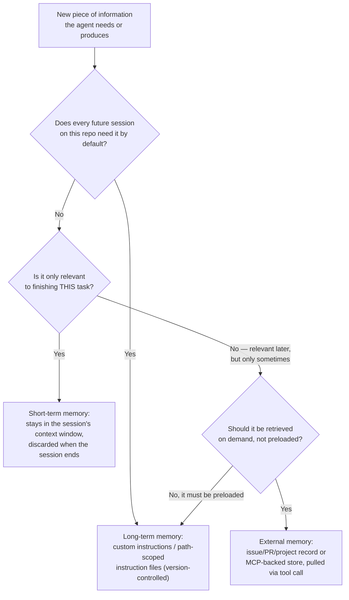
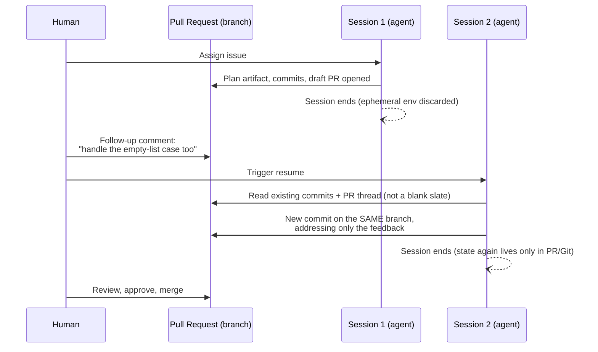

# D3: Manage Memory, State, and Execution

> **Exam weight**: 12% · **Questions**: ~14 of 120

## Overview

A coding agent session runs inside an ephemeral, sandboxed environment (D2) that's discarded the moment the session ends — which means nothing survives from one session to the next unless a team deliberately puts it somewhere durable first. This domain is about that deliberate design: choosing what an agent should remember and for how long, making task progress and decisions land as artifacts a later session (or a later human) can actually pick up, catching the moment a long-running session's actions stop matching the task it started with, and keeping multiple tools and environments from disagreeing about what's currently true.

> 💡 **Human Angle**: Agent memory is like a relay race — what matters isn't how much the last runner remembers, it's whether the baton (a durable artifact) actually made it into the next runner's hand.

## Implementing Agent Memory Strategies

### Key Concept

**Short-term memory dies with the session; only what's promoted to long-term or external memory survives.**

Not all information an agent uses lives the same way. **Short-term memory** is the session's own context window — the running record of what the agent has read, reasoned about, and called tools for during the current session. It's rich and immediately available, but it exists only for that one session; once the session ends and the ephemeral environment is discarded, it's gone unless something in it was externalized first. **Long-term memory** is what a team deliberately writes into the repository so that *every future session* loads it automatically without being told — repository custom instructions (`.github/copilot-instructions.md`) and narrower, path-scoped instruction files are the primary mechanism: they're version-controlled, apply from the first turn of a brand-new session, and don't depend on anyone re-explaining conventions each time. **External memory** is information the agent doesn't carry by default at all — it lives in a system of record (a linked issue, a project board, an MCP-connected knowledge store) and the agent retrieves it on demand through a tool call (D2) only when the current task actually needs it, rather than holding it in context the whole time. **Nothing survives past the session boundary unless it's written down first — like sticky notes on a desk that gets cleared every night.**

*Deciding which memory tier a piece of information belongs in.*

### In Practice

**What breaks without this**: any session where the issue happens to omit a convention silently produces work that violates it — teams that only use short-term memory, repeating the same conventions and constraints inside every issue body because nothing is ever promoted to long-term memory, pay a re-explanation tax on every single task.

**Decision trigger**: for any piece of context, ask "would I want this loaded automatically into the very first turn of every future session on this repo, or only when this specific task calls for it?" The first answer means long-term (custom instructions); the second means external (retrieved via a tool call) or short-term (task-specific, stays in this session only).

**When you'd choose differently**: for a one-off, highly unusual task that will never recur (a rare data-migration script that touches this repo exactly once), promoting anything about it to long-term memory is actively wrong — it would load irrelevant guidance into every normal future session for no benefit.

### Key Concept

**A finite context window means every irrelevant paragraph of loaded instructions competes with the information the agent actually needs.**

A memory tier existing doesn't mean everything should go into it unscoped. Repository custom instructions support path scoping — a narrower instruction file with an `applyTo`-style glob applies only when the agent is working in the matching directory, so a session touching `frontend/` doesn't load backend-specific conventions it has no use for, and vice versa. The same discipline from D2's tool selection ("start from the task, not the catalog") applies to memory: a session's context window is finite, and every irrelevant paragraph of instructions loaded into it competes for the same space and attention as the information the agent actually needs to complete the task correctly. Scoping isn't just tidiness — an agent reasoning over a context window padded with irrelevant repo-wide detail is measurably more likely to apply the wrong convention or miss the one that actually matters. **It's like handing every new hire the entire company handbook when they only need their team's page.**

### In Practice

**What breaks without this**: diluting the signal for the guidance it actually needs — a single unscoped, repo-wide instructions file that tries to cover every subsystem's conventions in one document forces every session, regardless of what it's actually touching, to load and reason over guidance for parts of the codebase it will never modify.

**Decision trigger**: ask "does this instruction apply to the whole repository, or only to a specific subsystem, language, or directory?" If it's the latter, scope it with a path-specific instruction file rather than adding it to the repo-wide default.

**When you'd choose differently**: for genuinely repo-wide conventions (commit message format, the branch-naming scheme, a blanket "never modify files under `vendor/`" rule) unscoped repo-wide instructions are the correct choice — the point isn't "always scope narrowly," it's matching the scope of the instruction to the scope of what it actually governs.

### Key Concept

**Memory that isn't externalized has a default lifespan of zero — that's what makes the other two tiers necessary, not optional.**

A session's short-term context resets completely the moment the session ends — the ephemeral compute environment is discarded (D2), and nothing about what the agent reasoned or tried persists into the next session unless it was captured in a durable artifact along the way. Even within a single long-running session, the context window itself is bounded: as a session runs longer, older turns can be pruned or summarized to make room for new work, which means information from early in a long session that was never captured in a commit, a plan artifact, or a comment can effectively "expire" before the session even ends. Long-term memory has the opposite property by design — custom instructions are reloaded fresh at the start of every new session, so a team editing them today is guaranteed every session from tomorrow onward sees the update, with no stale cached copy from a previous session's understanding carried forward. **An undocumented mid-session decision is a whisper in a room that's about to be demolished.**

### In Practice

**What breaks without this**: that decision has no effect on the session's later behavior once enough turns have passed for it to be pruned from the working context — a team assumes an agent will "remember" a decision made verbally in a long session's early reasoning, without it ever landing in a commit message, a plan artifact, or a PR comment.

**Decision trigger**: for any decision made mid-session that later steps in the *same* session will depend on, ask "is this captured somewhere durable yet, or only in the reasoning that produced it?" If only the latter, write it down (a commit message, a plan-artifact update, a PR comment) before assuming later work — in this session or the next — can rely on it.

**When you'd choose differently**: for a decision that only matters for the very next tool call and is acted on immediately (no gap for pruning or a session boundary to intervene), there's no need to externalize it separately — the action itself is the record; over-capturing every micro-decision as a standalone artifact just adds noise to the durable trail without adding safety.

### Exam Trap ⚠️

The exam likes to frame "the agent recalled it earlier in the session, so it will remember it later" as safe. Within-session memory is not guaranteed to survive the whole session, and it is never guaranteed to survive to the next session — only what's captured in a durable artifact (a commit, a plan update, a custom instruction, a comment) or promoted to long-term memory does. If a question asks how to make sure information a session depends on is actually available when needed, the answer is "externalize or persist it," never "the agent already saw it once."

## Persisting Agent State and Managing Context Drift

### Key Concept

**Because the execution environment is thrown away, "agent state" has to live in Git and GitHub artifacts, not in the compute environment.**

The structured plan artifact (D1) records what the agent intended to do before it did it. Incremental commits, each a viewable diff, record what actually changed and in what order. The PR description and its comment thread record the reasoning and any decisions made along the way — including a human's feedback. The session log records what the agent reasoned and which tools it called. **It's a paper trail a stranger could follow without asking anyone a single question** — a completely different session, or a human with no prior context, can reconstruct exactly where the task stands by reading these artifacts alone.

### In Practice

**What breaks without this**: the work looks like it happened, but why it happened a particular way is unrecoverable — an agent that tracks its own progress only in its working context, with no commit, comment, or plan-artifact update reflecting a decision it made along the way, leaves that decision invisible to anyone, including a future session, who wasn't watching the live reasoning.

**Decision trigger**: ask "if this session ended right now and someone else had to pick up the task, could they tell what's been decided and why from GitHub alone?" If not, the current state isn't actually persisted yet — it's just sitting in a context window that's about to be discarded.

**When you'd choose differently**: for exploratory, throwaway investigation that won't inform any later work regardless of outcome (a quick check to rule out a hypothesis that turns out false), there's no need to durably record every dead end — the artifacts that matter are the ones later work will actually depend on, not a transcript of every path considered.

### Key Concept

**A follow-up PR comment resumes on the same branch — it doesn't re-derive the plan or risk a divergent second solution.**

Because progress is recorded in durable artifacts, an agent can pick up a task exactly where it left off instead of starting over. GitHub Copilot's coding agent supports this directly: a reviewer can leave a follow-up comment on the agent's existing pull request — "this breaks the edge case where the list is empty" — and the agent resumes on the *same branch*, reading the existing commits and the PR thread as its starting context, rather than opening a fresh session with no memory of the work already done. **Resuming on the same branch is picking up the same relay baton, not starting a new race.**

*Resuming reads the same branch instead of starting cold.*

### In Practice

**What breaks without this**: now a reviewer has two partial answers to reconcile instead of one PR to approve — triggering a brand-new, unrelated session to address PR feedback instead of resuming on the existing branch risks the second session re-deriving its own interpretation of the task from the issue alone, producing a second, divergent solution that conflicts with the first.

**Decision trigger**: when more work is needed on a task an agent already started, ask "does this need to continue the existing branch's state, or is it genuinely a new, independent task?" If it's a continuation, resume via a follow-up comment on the existing PR rather than starting a new session from the issue.

**When you'd choose differently**: if the follow-up request has grown into a materially different task from the original issue (not "fix this bug" but "also redesign this unrelated subsystem while you're in there"), starting a fresh, properly scoped session — rather than stretching one branch to cover two unrelated intents — keeps the PR reviewable as a single coherent unit (D2).

### Key Concept

**Context drift is the gap between what the task asked for and what the session is actually doing — detect it against the original artifact, not the session's own reasoning.**

The longer a session runs, the more its own accumulated reasoning becomes the dominant influence on its next action — which creates room for **context drift**: the gap growing gradually enough that no single step looks wrong in isolation. Detecting drift means checking the session's current state against something that didn't drift with it — the original issue, the approved plan artifact (D1), or the stated acceptance criteria — rather than checking the session's own reasoning against itself. Correcting it means re-grounding explicitly: a human (or a gate) pointing the session back at the original scope via a comment, or in more severe cases, ending the session and starting a fresh one from the last known-good durable artifact rather than letting a drifted session keep compounding. **It's a boat drifting off course while every single oar stroke still looks fine.**

### In Practice

**What breaks without this**: nobody notices until a reviewer is staring at a much larger PR than the task justified — a long session fixing a reported bug gradually starts "improving" adjacent code that was never part of the request, and each individual edit looks locally reasonable even as the cumulative diff no longer matches the issue's scope.

**Decision trigger**: for any session running significantly longer than the task's expected shape, ask "does the current diff still match the plan artifact and the issue's stated scope, or has it grown to cover things neither mentioned?" Check against the original artifact, not against whether the session's own narration still sounds coherent.

**When you'd choose differently**: if the plan itself was explicitly revised and re-approved mid-task (D1's plan-revision loop) to cover newly-discovered, genuinely necessary scope, an expanded diff that matches the *updated* plan isn't drift — it's a legitimately re-scoped task; drift specifically means the diff has diverged from the current approved scope, not that scope never changes.

### Exam Trap ⚠️

Watch for a scenario where a session "still sounds confident and coherent" being offered as evidence nothing has gone wrong. Confidence isn't the signal — drift is specifically the failure mode where every individual step looks reasonable while the trajectory as a whole has moved away from the task. The only reliable check is comparing current state against a durable, external reference point (the original issue, the approved plan) that didn't drift along with the session, not asking whether the session's own most recent reasoning still makes sense to itself.

## Ensuring Continuity Across Tools and Environments

### Key Concept

**No two tools share an in-memory conversation by default — any state one produces has to be passed explicitly, not assumed.**

An agent session commonly reaches multiple tools in a single task — built-in tools, one or more MCP servers, possibly a separate CI environment that runs after the PR opens (D2). Each is invoked independently, and any state one of them needs to be consistent with what another produced has to be passed explicitly. This is why durable, inspectable artifacts matter beyond just session-to-session continuity: the commit, the PR description, and the issue thread are also the shared surface that different tools and even different environments (the interactive session vs. the CI run it triggers) can each read the same way, giving them a common, unambiguous reference point instead of each maintaining its own private, potentially inconsistent view. **Each tool is a witness giving its own account — nobody's cross-checked the stories yet.**

### In Practice

**What breaks without this**: the agent can end up acting on whichever answer it received most recently rather than on the one that's actually authoritative — that's the risk when it queries an MCP-connected project-tracking server for task status in one tool call and separately queries GitHub's issue state in another, with no shared reference point reconciling the two.

**Decision trigger**: whenever a task involves more than one tool or environment that could each hold a view of "current state," ask "is there one artifact both of these are supposed to agree with, and does the agent treat that artifact as authoritative?" If not, define one (typically the GitHub issue/PR itself) rather than letting each tool's local view stand unreconciled.

**When you'd choose differently**: for tools that are genuinely independent and never need to agree (a linter's output and a changelog-formatting tool, say), there's nothing to reconcile — shared-state discipline applies specifically where two sources could plausibly describe the same fact differently, not to every pair of tools an agent happens to use.

### Key Concept

**When two trusted sources disagree, GitHub's live state is the ground truth every other source has to be checked against.**

Conflicting context is the specific failure where two sources an agent trusts disagree about the same fact — an MCP server's cached view of an issue's status says "open" while GitHub's actual current state says "closed," or a local environment's dependency versions (seeded once by a `copilot-setup-steps` workflow) no longer match what the repository's lockfile currently specifies. Preventing this starts with recognizing that not all sources are equally authoritative: GitHub's own live state (the issue, the PR, the repository as it currently exists) is the ground truth a coding agent's task is ultimately judged against, and any other source — a cache, a snapshot, a secondary integration — is only useful to the extent it's kept consistent with that ground truth. **GitHub's live state is the courtroom record; everything else is hearsay until checked against it.**

### In Practice

**What breaks without this**: visibly wrong, confusing output undermines trust in the whole workflow — an agent that trusts a stale MCP-server response over GitHub's live state might report an issue as still open, and act accordingly (commenting, re-triaging), after a human already closed it through the UI moments earlier.

**Decision trigger**: when two available sources could describe the same entity, ask "which of these is the system of record, and does my configuration make the agent prefer it when they disagree?" If there's no explicit preference, the agent's behavior on conflict is effectively arbitrary, not designed.

**When you'd choose differently**: a monitoring or analytics tool that's explicitly documented as eventually-consistent (deliberately lagging live state by design, e.g. for batch reporting) doesn't need real-time reconciliation — the point isn't that every source must always be live, it's that the agent's configuration should know *which* sources are authoritative and which are intentionally lagging, rather than treating all of them as equally current.

### Key Concept

**Stale context is a single source that used to be right and nobody told the agent it changed.**

A session's environment is seeded once, at the start, by a setup workflow (D2) — if that session then runs long enough for the underlying repository state to change elsewhere (a dependency gets bumped by a separate PR that merges mid-session, say), the agent's already-running environment has no mechanism to notice and doesn't automatically re-sync. Custom instructions avoid this specific problem by being reloaded fresh at the start of every *new* session (covered above under expiration rules) — but that guarantee only covers session boundaries, not a single long-running session's already-loaded environment or context. **A stale snapshot is a photo nobody told is out of date.**

### In Practice

**What breaks without this**: tests that would fail against the current repository state might still pass inside the session's untouched snapshot, producing a PR that looks validated but wouldn't actually pass CI against the real current `main` — that's what happens when a long-running session seeded its environment before a colleague's unrelated PR merged a breaking dependency change, and it keeps operating against the old, now-stale version for the rest of its run.

**Decision trigger**: for any long-running session, ask "has anything this session's environment assumed as fixed actually changed elsewhere in the repository since the session started?" If the task is sensitive to that possibility (dependency versions, a shared config file, a schema another team owns), don't treat CI passing inside the session as equivalent to CI passing against current `main` — let the real CI run against the actual current state be the final check, not the session's internal one.

**When you'd choose differently**: for a short, tightly-scoped session unlikely to overlap with concurrent unrelated changes (a small, fast-turnaround fix), the risk of the environment going stale mid-session is low enough that this isn't worth engineering around explicitly — the discipline matters most for long-running or extended sessions, not every session by default.

### Exam Trap ⚠️

A frequent distractor treats "the agent's own tests passed inside its session" as proof the change is safe against the current repository state. That only confirms internal consistency with whatever the session's environment snapshot happened to contain — which can be stale relative to what's actually on the target branch by the time the PR is reviewed. The real check, as in D2's error-handling trap, is the CI run that executes against current `main` after the PR opens, not the session's own internal test pass.

## Deep Dive: Making Memory, State, and Execution Click

### 1. The connective narrative

Every idea in this domain follows from one fact established back in D2: the agent's execution environment is ephemeral, and it's thrown away when the session ends. That single design choice is what makes "memory" a design problem instead of something the platform just handles for you. If nothing persisted by default, a team would have to decide, deliberately, what's worth persisting (long-term memory via custom instructions), what's worth fetching on demand rather than carrying around (external memory via a tool call), and what genuinely only matters for the current session and is fine to lose (short-term memory). That's the memory-strategy piece.

State persistence and drift detection are what happens once you accept that memory doesn't survive automatically: the only way a task's progress means anything beyond a single session is if it's written down somewhere durable — a plan artifact, commits, a PR thread — and the only way to know a long session hasn't wandered off-task is to keep checking its current state against that same durable reference point, because the session's own internal reasoning isn't a trustworthy witness to whether it's drifted.

Continuity across tools and environments is the same problem at a wider angle: once more than one tool, more than one MCP server, or more than one environment (an interactive session and the CI run it triggers) are all touching the same task, "memory" isn't just about surviving time, it's about surviving being observed from more than one place at once. The fix is the same principle applied sideways instead of forward: designate one thing as the ground truth (GitHub's live state), and treat every other view — cached, snapshotted, or independently sourced — as something that has to be checked against it, not trusted on its own.

### 3. Memory aid

**RESET** — what to do with any piece of agent state or context, given that the default is loss:

- **R**ecord decisions as durable artifacts (plan, commits, PR description, comments) the moment they're made.
- **E**xternalize anything that must outlive a single session — short-term context is discarded by default.
- **S**cope memory to what the current task actually needs — path-scoped instructions, not everything ever known.
- **E**xpect drift on long sessions — check current state against the original issue/plan, not against the session's own reasoning.
- **T**rust the authoritative source when contexts disagree — GitHub's live state over a cache, a snapshot, or a secondary integration.

If a scenario question describes state that only ever lived in a session's own reasoning, or a long session being judged safe because it "still sounds coherent," it has skipped a RESET letter.

### 4. Exam strategy for this domain

- The exam's favorite distractor pattern here is treating in-session memory as durable: "the agent already knows this from earlier in the conversation" is never a substitute for a written artifact, and it never survives a session boundary.
- Distinguish the three memory tiers precisely — long-term memory (custom instructions) loads automatically every session; external memory (an issue, an MCP-backed store) is retrieved on demand; short-term memory (the session's own context) doesn't survive past session end. A question describing one but naming another is testing whether you conflate them.
- Conflicting context (two sources actively disagreeing) and stale context (one source that used to be right and no longer is) are different failure modes with the same fix — treat GitHub's live state as the source of truth and reconcile everything else against it.
- The one sentence to remember five minutes before the exam: **if it isn't written into a durable artifact, it doesn't exist once the session ends — and a session that "sounds" on-task still needs to be checked against the artifact that didn't drift with it.**

## Cheat Sheet 📋

| Concept | Key Rule |
|---------|----------|
| Short-term memory | The current session's context window — discarded when the ephemeral environment is torn down |
| Long-term memory | Custom instructions (repo-wide + path-scoped) — version-controlled, reloaded fresh every new session |
| External memory | Issues, PRs, project records, MCP-backed stores — retrieved on demand via a tool call, not preloaded |
| Scoping memory | Path-scoped instruction files so a session only loads guidance relevant to what it's actually touching |
| Expiration/reset | Session end = full reset; even mid-session, older context can be pruned if never externalized |
| Durable artifacts | Plan artifact, commits, PR description/thread, session log — the actual record of task state |
| Resuming work | Follow-up PR comments continue on the *same branch*, reading existing commits — not a fresh, blank session |
| Context drift | Gradual divergence from task scope where no single step looks wrong in isolation |
| Detecting drift | Compare current diff/state against the original issue or approved plan — not against the session's own reasoning |
| Correcting drift | Re-ground via a redirecting comment, or restart from the last known-good durable artifact |
| Sharing state across tools | No shared in-memory conversation between tools by default — use durable artifacts as the common reference |
| Conflicting context | Two sources disagree — resolve by treating GitHub's live state as authoritative |
| Stale context | One source used to be accurate and no longer is — environment snapshots don't auto-resync mid-session |
| Session-internal tests vs. real CI | A session's internal pass reflects its own snapshot; the CI run against current `main` is the real check |

## What to Remember

- Ephemeral, session-scoped execution (D2) is the root cause this entire domain responds to — memory strategy only matters because nothing survives by default.
- The three memory tiers solve three different problems: long-term (auto-loaded every session), external (fetched on demand), short-term (this session only, then gone) — don't treat them as interchangeable.
- Progress and decisions only count as "state" once they're durable — a plan artifact, a commit, a PR thread, a comment — not while they're still only inside a session's own reasoning.
- Resuming work well means continuing the same branch from its existing commits and PR thread, not starting a new session that has to re-derive everything from the issue alone.
- Drift is detected by comparing a session's current state against an external, unmoving reference (the issue, the approved plan) — never by checking whether the session's own narration still sounds reasonable to itself.
- Continuity across tools and environments comes down to one rule: designate GitHub's live state as the source of truth, and treat every cache, snapshot, or secondary integration as something to reconcile against it, not trust independently.
