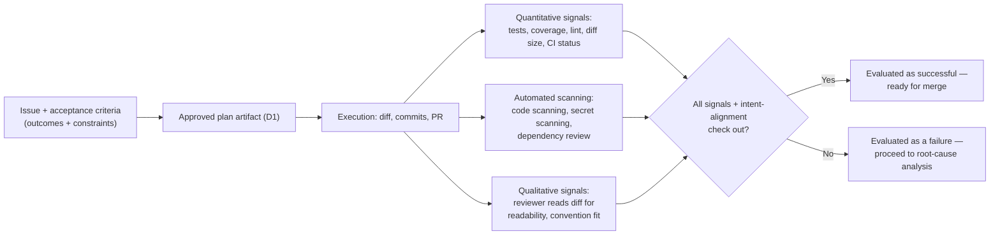
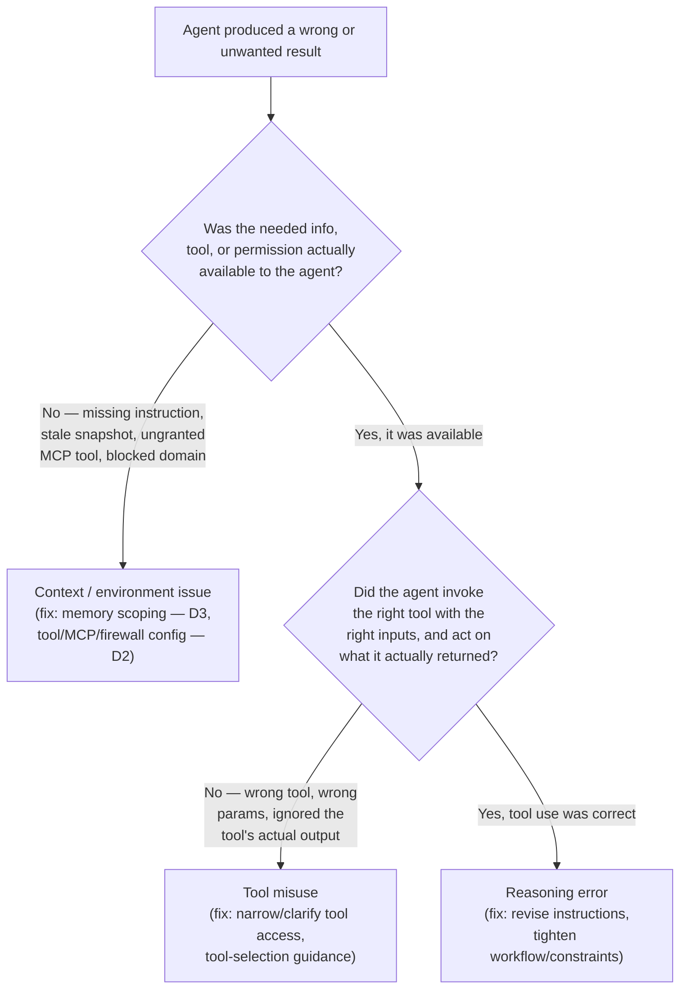

# D4: Perform Evaluation, Error Analysis, and Tuning

> **Exam weight**: 18% · **Questions**: ~22 of 120

## Overview

Delegating work to a coding agent (D1) only pays off if a team can reliably tell whether the result was actually good — not just whether it looks finished. This domain is about that judgment loop: defining what "success" means for a task before the agent starts, reading the evidence a session leaves behind (logs, plans, traces, outputs) to find exactly where and why a failure happened, and then changing the one configuration layer — instructions, memory, or tool access — that the evidence actually points to, rather than guessing.

> 💡 **Human Angle**: Diagnosing an agent failure without checking the evidence trail is like a mechanic replacing parts at random until the noise stops — it might work once, but you never actually learn what was broken, and the same fault comes back on a different car.

## Defining Success Criteria and Evaluation Signals

### Key Concept
**Expected outcomes and constraints as the baseline for what "success" means**

Before evaluating an agent's output, evaluation needs an explicit target — not just "did it work," but "did it produce the outcome the issue asked for, without crossing any boundary the issue also set." **Outcomes** describe what the change should accomplish: the behavior, the bug that should no longer reproduce, the feature that should now exist. **Constraints** describe what must stay untouched regardless of whether the outcome is achieved: scope (D1's stated file/path boundaries), API surface, performance budgets, or an explicit "do not modify X" instruction. A PR can achieve the desired outcome and still fail evaluation if it violates a constraint — fixing the reported bug while also rewriting an unrelated module is a failed evaluation, not a partial success, because the constraint was as much a part of the task definition as the outcome was.

### In Practice

**What breaks without this**: an evaluation that only checks "does the test pass" misses a PR that satisfied the test by weakening an assertion, or by editing files well outside the stated scope — outcome achieved on paper, constraint violated in practice — and a reviewer using pass/fail as the whole bar approves a regression nobody actually checked for.

**Decision trigger**: for any task, ask "what specific outcome is required, and what specific things must *not* change regardless of whether that outcome is achieved?" If you can't answer the second half, the evaluation baseline is incomplete before a single session has even run.

**When you'd choose differently**: for a pure exploratory or research task (D1) that produces a report rather than a diff, there's no file-scope constraint to check — success is closer to "did it accurately represent the codebase" than to an outcome-plus-constraint pair.

### Key Concept
**Qualitative vs. quantitative evaluation signals**

**Quantitative signals** are numeric or binary and machine-checkable: test pass/fail counts, coverage delta, lint or type-error counts, diff size (files/lines changed) against the expected scope, CI status. They scale — a pipeline can check every one of them on every PR at zero marginal cost. **Qualitative signals** are judgment calls that don't reduce to a single number: whether the approach matches team conventions, whether the code reads the way an engineer familiar with the codebase would have written it, whether the PR description actually explains the reasoning rather than just restating the diff. Qualitative signals don't scale the same way — they require a human actually reading the change, which is why they belong at the review checkpoints (D1's PR review) rather than something a pipeline auto-gates on. Good evaluation design uses quantitative signals as a filter (an obviously broken PR with failing tests never reaches a reviewer's attention in the first place) and qualitative signals to catch what no automated check can: an overbuilt or under-scoped solution that technically passes everything.

### In Practice

**What breaks without this**: treating a large diff with 100% green CI as sufficient evidence of quality skips the one thing CI structurally cannot check — whether the approach itself was the right one, or whether it solved a bigger (or smaller) problem than the issue actually asked for.

**Decision trigger**: ask "can this specific concern be reduced to a pass/fail or numeric check that catches it every time, or does judging it require reading the actual change?" Automate the former; keep the latter as a human review checkpoint rather than trying to force it into a metric.

**When you'd choose differently**: a narrow, mechanically verifiable task class (a pinned dependency version bump with no API surface change, D1) may need no qualitative check at all — quantitative signals (build passes, no breaking-change detected) can be sufficient because there's no real judgment call left for a human to make.

### Key Concept
**Aligning evaluation with developer intent**

A change can pass every automated check and still be wrong if it doesn't match what the requester actually meant — the gap between satisfying the letter of the issue and satisfying its intent. This is D3's drift-detection discipline (compare current state against the original issue or plan, not the session's own account of itself) applied specifically to evaluation: the reference for "was this successful" is the original issue text, its stated acceptance criteria, and the approved plan artifact — never the agent's own PR description, and never how confident that description sounds. A reviewer checking alignment reads the diff against the issue directly, the same way D1's plan-review checkpoint checks a plan against scope before execution is even allowed to start.

### In Practice

**What breaks without this**: an agent PR whose own description states "successfully implemented the requested batching logic" gets treated as self-certifying evidence of success, when the actual diff batches in chunks of 50 rows instead of the requested 500 — the narration was confident and wrong, and nobody checked it against the source issue before approving.

**Decision trigger**: ask "am I evaluating this against what the agent says it did, or against what the original issue actually asked for?" If the former, go back and read the issue text directly before trusting the summary.

**When you'd choose differently**: for a task deliberately delegated with open intent ("explore a couple of approaches and recommend one," rather than one specific spec), alignment checking shifts from "matches one exact outcome" to "is this a reasonable, well-reasoned answer to the question that was actually asked" — intent alignment still applies, just against a broader target.

### Key Concept
**Automated scanning tools as evaluation signal sources**

Beyond the task-specific test suite, a coding agent's PR flows through the same repository-wide automated scanning any PR does, and these are evaluation signals in their own right, not redundant background noise: **code scanning** (e.g., CodeQL) flags newly introduced vulnerabilities in the diff, **secret scanning** (with push protection) catches credentials accidentally committed, and **dependency review** flags a newly introduced package with a known vulnerability or license issue when the agent adds or updates a dependency. A clean result from these tools is evidence the change didn't introduce a security or compliance regression — independent of whether the task's own tests pass, because the task's own tests were written to check the reported bug, not to check for an unrelated SQL-injection surface the fix happened to introduce along the way.

### In Practice

**What breaks without this**: an agent PR that satisfies every test the issue cared about — the functional fix genuinely works — can still introduce an unrelated security regression (a newly pinned dependency with a known CVE, a string-concatenated query) that the task-specific suite was never designed to catch; relying on task tests alone as the evaluation signal misses it completely.

**Decision trigger**: ask "does the task-specific test suite actually cover security and dependency-compliance concerns, or only the functional behavior the issue described?" If the latter, repo-wide scanning is a required, separate evaluation signal — not something that becomes optional because the task tests already passed.

**When you'd choose differently**: for a change with no new dependencies and no code-scanning-relevant surface (a documentation or config-comment update), these scanners simply report nothing new — that's an expected clean pass confirming there was nothing to catch, not a reason to have skipped enabling them.

### Exam Trap ⚠️

The exam likes to frame "the tests passed" or "CI is green" as sufficient evidence a PR is ready — the same checkpoint-conflation trap D2 warns about. A real evaluation stacks several *independent* signal types: task-specific tests (did it do the right thing), constraint checks (did it stay in scope), automated scanning (did it introduce an unrelated security or dependency problem), and intent alignment against the original issue (does it match what was actually asked, not just what the agent's own summary claims). A question offering "the tests passed" as the complete answer to "how do you know this succeeded" is testing whether you'll stop at one signal instead of checking the full stack.

## Analyzing Agent Failures and Identifying Root Causes

### Key Concept
**The evidence trail — logs, plans, traces, outputs, artifacts**

Diagnosing why an agent failed (or produced a wrong-but-plausible result) starts from the same durable record D1–D3 establish for everything else: the **session log** (what the agent reasoned and which tools it called, in order), the **plan artifact** (what it intended to do before it acted — D1), the **tool-call trace** (the actual sequence of invocations, their parameters, and their results), the **outputs** (diffs, commits, PR description, comments), and any external **artifacts** referenced along the way (a linked issue, an MCP-retrieved record — D3's external memory). No single one of these tells the whole story: the plan shows intent, the trace shows what was actually attempted, the output shows what landed. Root-cause analysis is reading them together to find the point where they first diverge from each other — not just noting that the final output diverges from what was wanted.

### In Practice

**What breaks without this**: without a session log or trace to compare against, a team investigating a bad PR is left guessing at the cause from the diff alone — which shows *what* changed but nothing about the reasoning path or the tool calls that produced it — so the same class of failure recurs on a later task because nobody could actually pin down what caused it the first time.

**Decision trigger**: ask "at what point does the plan, the trace, or the output first diverge from what was actually needed?" Walk the artifacts in order — plan, then trace, then output — rather than starting from the final diff and guessing backward.

**When you'd choose differently**: for a trivially small, obviously-correct change that fully matches intent, there's no failure to diagnose, and walking the full evidence trail is pure overhead — root-cause analysis is triggered by an actual discrepancy the evaluation stack surfaced, not run as a ritual on every PR regardless of outcome.

### Key Concept
**Classifying failures — reasoning errors vs. tool misuse vs. context/environment issues**

Once the evidence trail is visible, most agent failures sort into one of three categories, and the distinction matters because each calls for a different fix. A **reasoning error** is a failure where the agent had accurate, sufficient information available and still drew the wrong conclusion from it — misreading a constraint, choosing an unwarranted approach, or "fixing" the wrong location entirely despite the right information sitting in front of it the whole time. **Tool misuse** is a failure where the agent had the right tool for the job but invoked it incorrectly — wrong parameters, ignoring what the tool actually returned and proceeding on a stale assumption instead, or retrying a deterministic failure indiscriminately rather than adapting (D2's error-handling trap). A **context/environment issue** is a failure where the information, tool, or permission the agent needed simply wasn't available to it — a missing custom instruction, a stale environment snapshot (D3), a required MCP toolset that was never granted, a firewall-blocked domain (D2). In this category the agent's reasoning could have been entirely sound and it still would have failed, because the thing it needed to succeed wasn't there to find.

The diagnostic question that separates the three stays consistent even in a messy real trace: was the necessary information, tool, or permission actually available to the agent at the time? If not, it's a context/environment issue. If it was available, did the agent invoke the right tool with the right inputs and act on what it actually returned? If not, it's tool misuse. If it was available and used correctly, and the agent still reached the wrong conclusion, it's a reasoning error.

### In Practice

**What breaks without this**: treating every failure the same way — "the agent got it wrong, add a stricter instruction" — misdiagnoses tool-misuse and context/environment failures as reasoning failures, so the fix (a tightened instruction) does nothing for a session that actually failed because a needed MCP tool was never granted, and the same class of failure recurs on the next similar task.

**Decision trigger**: before choosing a fix, walk the two-question test above against the actual evidence trail — don't infer the category from the symptom alone; a bad diff looks the same on the surface whether the cause was reasoning, tool misuse, or missing context.

**When you'd choose differently**: for a failure that's clearly a one-off transient tool timeout a bounded retry already resolved cleanly (D2), there's no root cause left to classify beyond "transient" — classification effort is worth spending on failures that could recur, not on ones a bounded retry already handled.

### Exam Trap ⚠️

A frequent distractor collapses all three failure categories into one generic "the agent made a mistake, tighten the prompt" answer. That's only the correct fix for a genuine reasoning error. If the evidence trail shows the agent never had access to the needed information or tool in the first place, tightening instructions changes nothing — the fix is a context/environment change. If the trail shows correct access but a bungled tool call, the fix is tool-selection guidance or tighter tool scoping, not a broader instruction. Match the fix to the category the evidence actually supports, not to whichever category is easiest to write a sentence about.

## Tuning Agent Behavior

### Key Concept
**Revising instructions, workflows, and constraints**

Once a failure is classified as a reasoning error, the fix operates at the instruction/workflow/constraint layer, not the tool or memory layer. **Revising instructions** means updating the custom instructions file (D3's long-term memory) or a task-specific prompt to close the specific gap the evidence trail revealed — not a vague "be more careful," but a concrete addition that would have changed the outcome (e.g., "when fixing a flaky test, default to a test-side fix — mocking, a fixed clock — unless the issue explicitly asks for a production-code change," added after a session incorrectly "fixed" production logic for a test-only bug). **Revising workflows** means changing where or how a checkpoint runs — tightening D1's plan-review gate to explicitly flag when a proposed plan names files outside the issue's stated scope, catching a scope-creep reasoning error before execution unlocks instead of after a PR already exists. **Revising constraints** means tightening what's allowed at the configuration level — a stricter acceptance-criteria template, or an explicit "do not touch these paths" rule enforced by an automated scope check. All three levers change what the agent is told and checked against, given that it already had what it needed — none of them touch what the agent can access, which is the tool/memory tuning covered next.

### In Practice

**What breaks without this**: repeatedly re-running the same failed task class, hoping a different session "gets it right," without ever updating the instruction, workflow, or constraint that let the failure happen, wastes execution budget on the same category of mistake indefinitely — the fix has to change something future sessions are told or checked against, not just retry with identical configuration.

**Decision trigger**: ask "would a future session, given the current instructions and workflow, make the exact same mistake on the same input?" If yes, the instruction/workflow/constraint hasn't actually changed yet — it needs a concrete addition addressing the specific gap the evidence trail showed, not a general reminder.

**When you'd choose differently**: for a failure traced to tool misuse or a context/environment gap rather than a reasoning error, revising instructions is the wrong lever entirely — a stricter instruction doesn't grant a missing tool or refresh a stale environment snapshot; tune the layer the evidence actually points to.

### Key Concept
**Refining memory usage**

When a failure traces back to missing or stale context (D3), the fix is memory tuning, not an instruction rewrite. If a session repeatedly lacks a convention that should have been obvious, and the evidence shows it was never in the custom instructions at all, the fix is promoting that information from "the requester had to re-explain it every time" — a short-term-memory pattern that never scaled — to **long-term memory**, adding it to the repository's custom instructions so every future session loads it automatically. Conversely, if a failure traces to reasoning diluted by irrelevant loaded context — a repo-wide instructions file so broad the agent applied the wrong subsystem's convention (D3's scoping discipline) — the fix is the opposite: split the instructions into path-scoped files so only relevant guidance loads for a given session. And if a failure traces to context going **stale** mid-session — the agent's environment snapshot no longer matching what changed elsewhere in the repo while it ran (D3) — the tuning target isn't the instructions at all; it's the setup or refresh cadence, such as shorter sessions or an explicit refresh step for long-running ones.

### In Practice

**What breaks without this**: a team that responds to "the agent didn't know about our error-handling convention" by adding a stricter sentence to the task prompt every single time — instead of promoting it once to long-term memory — pays the exact re-explanation cost D3 warns about, on every future task, rather than fixing it durably once.

**Decision trigger**: ask "did this failure happen because the needed information wasn't durable anywhere, or because it was durable but scoped too broadly or too narrowly for this session to load it correctly?" The first calls for promoting to long-term memory; the second calls for re-scoping what already exists.

**When you'd choose differently**: for information genuinely relevant to one task only, and unlikely to recur, promoting it to long-term memory is D3's documented anti-pattern — some context is correctly short-term, and tuning memory scope isn't the fix for a one-off.

### Key Concept
**Refining tool usage and access**

When a failure traces to tool misuse or a context/environment gap involving a tool, the fix operates at D2's configuration layer: the `tools`/`excludedTools` allowlist, MCP server toolset scoping, or permission mode (read-only vs. read-write). A session that repeatedly calls the wrong tool for an ambiguous action may need a narrower, more precisely-scoped tool set — removing an overlapping tool that invites the wrong choice — rather than better instructions about which one to pick, echoing D2's point that a tool that isn't in the allowlist can't be misused, and fewer, more precisely-scoped options reduce the odds of picking the wrong one at all. A session that failed because it lacked write access to a resource it legitimately needed gets that access granted narrowly — the specific mutation, not a broad write-everything grant; a session that failed because it *had* unnecessary write access and used it destructively gets that access removed or downgraded to read-only. Tool tuning is evaluated the same way tool selection was originally designed (D2): from the task's actual needs, using the evidence trail to show exactly which access was missing or excessive — not from a general instinct to add more capability "in case it helps."

### In Practice

**What breaks without this**: responding to a tool-misuse failure with an instruction like "please use the search tool correctly," instead of removing the redundant, easily-confused tool that caused the wrong choice in the first place, leaves the same ambiguous decision point in place for the next session to get wrong again.

**Decision trigger**: ask "did this failure happen because the agent picked the wrong tool from an ambiguous set, because it needed access it didn't have, or because it had access it shouldn't have used destructively?" Each has a distinct configuration fix — narrow the set, grant narrowly, or restrict to read-only — not a shared one.

**When you'd choose differently**: for a reasoning error where the tool call itself was executed correctly and the tool was the right choice — the agent just drew the wrong conclusion from a correct tool result — tool access tuning changes nothing; that failure belongs to the instructions/workflow lever, not this one.

### Exam Trap ⚠️

Watch for a scenario where every fix offered is "add an instruction," regardless of what the evidence trail actually shows. If root-cause analysis points to a missing or misscoped tool, context that never made it into long-term memory, or an environment snapshot that went stale mid-session, an instruction change is the distractor — it doesn't touch the layer that actually failed. The exam is testing whether you route the fix to the same layer the evidence pointed to (instructions/workflow/constraints for reasoning errors, memory scoping for context gaps, tool/MCP/permission config for tool misuse and access gaps), not whether you can write a plausible-sounding instruction for any failure.

## Deep Dive: Making Evaluation, Error Analysis, and Tuning Click

### 1. The connective narrative

Evaluation, root-cause analysis, and tuning form a closed loop, and the loop only works if each stage feeds the next the right kind of evidence. Defining success criteria and evaluation signals up front is what makes it possible to detect a failure at all — without an explicit outcome, constraint, and signal stack to check against, "did this work" has no answer beyond a vague impression, and a subtly wrong PR sails through because nothing was actually checking the thing that mattered. Root-cause analysis is what turns a detected failure into an actionable one: the evidence trail (plan, trace, log, output) lets you locate not just *that* something went wrong, but *which* of three distinct layers it went wrong in — the agent's reasoning, its tool use, or the context/environment it was operating in. Tuning is where the loop closes: each root-cause category maps to a specific configuration lever — instructions/workflow/constraints, memory scoping, or tool/MCP/permission access — and using the right lever is what makes the next evaluation cycle actually different, instead of producing the same failure again wrapped in a different instruction.

The throughline is that evaluation, diagnosis, and tuning aren't independent skills applied once — they're one repeating cycle, and this domain exists because each stage has a specific, common way to get it wrong. Skipping straight to "add an instruction" without first classifying the root cause — the exam's favorite trap here — treats every category of failure as if it were a reasoning failure, so roughly two-thirds of the time it fixes nothing at all.

### 3. Memory aid

**TRACE** — the loop this domain runs, every time:

- **T**arget the original issue and its stated constraints as the ground truth for "success" — not the agent's own summary.
- **R**ead the evidence trail — plan, trace, log, output — in order, before forming a theory about what went wrong.
- **A**ttribute the failure to exactly one of three root causes: reasoning error, tool misuse, or context/environment issue.
- **C**hange the lever that matches — instructions/workflow/constraints, memory scoping, or tool/MCP/permission access — never a lever the evidence doesn't support.
- **E**valuate again against the full signal stack, not just whether the specific failure you fixed no longer reproduces.

If a scenario jumps straight from "the agent got it wrong" to "add an instruction" without walking Read and Attribute first, it has skipped the middle of TRACE — and that's almost always the point being tested.

### 4. Exam strategy for this domain

- The exam's favorite distractor pattern is a single satisfied signal standing in for the whole evaluation — "tests passed," "CI is green" — offered as proof a PR is ready. The correct answer checks outcomes, constraints, automated scanning, and intent alignment together.
- A close second is collapsing all three failure categories into "add a stricter instruction," regardless of what the evidence trail shows. Expect the exam to describe a context/environment or tool-misuse failure and offer an instruction-based fix as the tempting-but-wrong option.
- Know the two-question root-cause test cold: was the needed info/tool/permission available at all (no → context/environment), and if so, was it used correctly (no → tool misuse, yes → reasoning error).
- The one sentence to remember five minutes before the exam: **diagnose before you tune — the fix belongs at the layer the evidence trail actually points to, and "add a stricter instruction" is only the right answer for a genuine reasoning error.**

## Cheat Sheet 📋

| Concept | Key Rule |
|---------|----------|
| Success criteria | Outcomes achieved *and* constraints respected — either one alone isn't sufficient |
| Quantitative signals | Machine-checkable: tests, coverage delta, lint/type-error counts, diff size vs. scope, CI status |
| Qualitative signals | Judgment-based: readability, convention fit, PR description clarity — a review checkpoint, not an auto-gate |
| Intent alignment | Evaluate against the original issue/plan text — never against the agent's own summary of what it did |
| Automated scanning tools | Code scanning (CodeQL), secret scanning, dependency review — catch what task-specific tests were never built to check |
| Evidence trail | Session log + plan artifact + tool trace + outputs/commits — walk plan → trace → output to find the divergence |
| Reasoning error | Info/tools available; agent still drew the wrong conclusion — fix: instructions/workflow/constraints |
| Tool misuse | Right tool available; invoked incorrectly or its output ignored — fix: tool scoping/selection guidance |
| Context/environment issue | Needed info/tool/permission wasn't available at all — fix: memory scoping or tool/MCP/firewall config |
| Root-cause test | Available? No → context/environment. Yes → used correctly? No → tool misuse. Yes → reasoning error |
| Revising instructions/workflows/constraints | Fixes reasoning errors — a concrete addition closing the specific gap, not a vague "be careful" |
| Refining memory | Fixes context gaps — promote to long-term, re-scope by path, or refresh a stale snapshot |
| Refining tool access | Fixes tool misuse/access gaps — narrow an ambiguous set, grant narrowly, or downgrade to read-only |
| Fix-layer matching | Never fix a tool/context problem with an instruction, or a reasoning problem with a permission change |

## What to Remember

- Evaluation needs a signal stack, not one signal: outcomes, constraints, quantitative checks, qualitative review, automated scanning, and intent alignment against the original issue — together, not any single one standing in for the rest.
- CI green and tests passing are necessary but not sufficient — they don't check scope, security regressions, or whether the change matches what was actually asked.
- Root-cause analysis works backward through a durable evidence trail (plan → trace → output), not forward from a guess based on the final diff alone.
- The three failure categories — reasoning error, tool misuse, context/environment issue — are distinguished by one test: was the needed info/tool/permission available, and if so, was it used correctly.
- Tuning only works when the fix matches the category the evidence supports: instructions/workflow/constraints for reasoning errors, memory scoping for context/environment issues, tool/MCP/permission config for tool misuse and access gaps.
- This domain closes the loop D1–D3 opened: architecture (D1), tool/environment configuration (D2), and memory/state (D3) are exactly the three levers this domain tunes once evaluation reveals which one actually failed.
