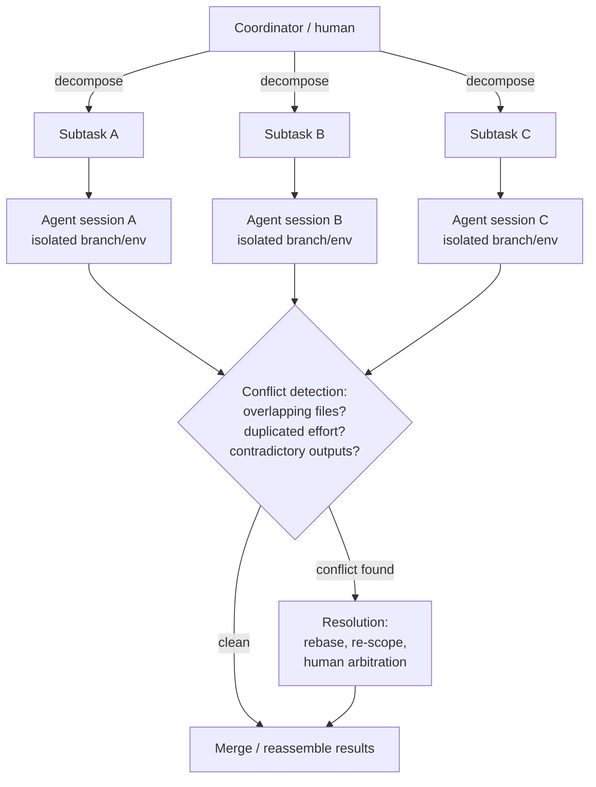
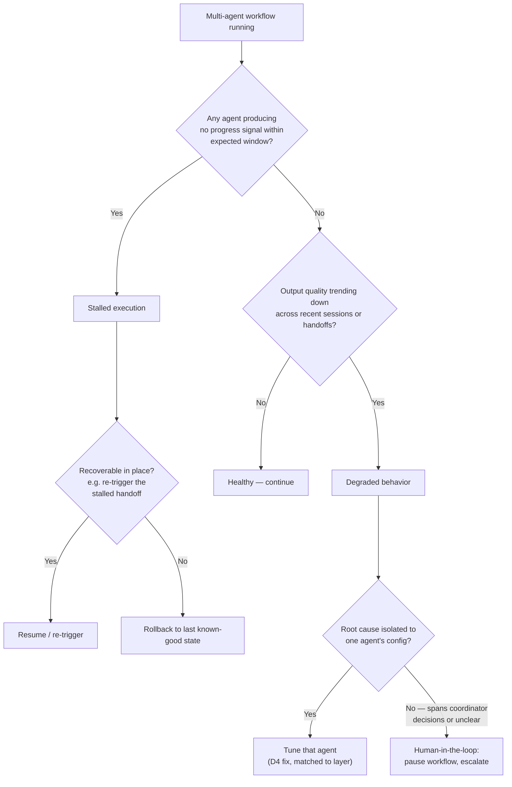

# D5: Orchestrate Multi-Agent Coordination

> **Exam weight**: 17% · **Questions**: ~20 of 120

## Overview

Once more than one agent works on the same codebase at the same time — whether that's several independent Copilot coding agent sessions each picking up a different issue, or a coordinator dispatching subtasks to specialized custom agents — the guarantees D1–D4 established for a single session (a scoped plan, evidence-backed evaluation, a durable memory record) stop being enough on their own. A second agent can read stale state, touch the same file, or quietly duplicate work the first agent already did, and none of that shows up in either agent's own session log. This domain is about the coordination layer that sits above individual sessions: keeping parallel work isolated so it doesn't collide, detecting and resolving conflicts when it does, keeping the resulting system observable enough to reconstruct who decided what, catching failures that only appear at the multi-agent level (a stalled handoff, a whole workflow degrading rather than one session erroring out), and changing which agents are running without losing the audit trail underneath them.

> 💡 **Human Angle**: Multi-agent coordination without isolation is like several editors marking up the same physical manuscript page at once with no separate copies — each edit looks reasonable in isolation, but nobody can tell whose ink is whose, and two "fixes" to the same sentence can directly contradict each other.

## Operating and Managing Multi-Agent Workflows

### Key Concept

**The orchestration pattern in use — sequential, parallel, or coordinator-delegated — determines where the coordination risk actually lives.**

A **sequential** pattern runs agents one after another, each consuming the previous one's output as its own input — a planning agent's approved plan becomes an executor agent's task, an executor's PR becomes a review agent's input. Risk here is a broken handoff: stage two starting from a stale or misread version of stage one's output. A **parallel** pattern runs multiple agents at the same time against independent (or assumed-independent) scopes — several Copilot coding agent sessions, each assigned a different issue, running concurrently. Risk here is scope overlap: two agents that were assumed independent turn out to touch the same file or subsystem. A **coordinator-delegated** pattern (D1's planner/executor split, extended to multiple executors) has one agent — or a human — decompose a larger goal into subtasks and route each to a specialized agent or session, then reassemble the results. Risk here concentrates at the coordinator: a bad decomposition propagates into every downstream agent it dispatches to. **It's the difference between a relay race, sprinters on separate tracks, and a race director assigning each runner their leg** — the failure mode for each is different.

*Coordinator decomposes work, checks for conflicts, then merges.*

### In Practice

**What breaks without this**: a genuinely parallel setup ships with no scope-overlap check at all because nobody classified it as parallel in the first place — that's what happens when "multi-agent" gets treated as a single undifferentiated category, applying parallel-execution controls (isolation, conflict detection) to a sequential pipeline where the actual risk is a broken handoff.

**Decision trigger**: ask "do these agents run one after another consuming each other's output, at the same time against assumed-independent scope, or under a coordinator that decomposed one goal into several?" The answer determines whether the coordination risk to guard against is a bad handoff, a scope collision, or a bad decomposition.

**When you'd choose differently**: for a single agent working a single well-scoped issue end-to-end, none of these patterns apply — orchestration-pattern selection is a decision that only exists once a workflow genuinely involves more than one agent or session.

### Key Concept

**Parallel sessions stay safe because each works against its own isolated slice of state, not because the agents happen not to collide.**

In practice this means each session works on its **own branch**, in its **own ephemeral, sandboxed environment** — its own checkout, its own dependency install, its own execution context — so one session's in-progress edits are never visible to another session mid-run, and a session that fails or produces a bad result can be discarded without any effect on a sibling session's branch or environment. Isolation is what makes "run three coding-agent sessions on three different issues at the same time" a safe default rather than a gamble: each session's world is a copy, not a shared reference, and the only point where their work can actually collide is the shared trunk each branch eventually targets — which is exactly why conflict detection has to run at merge time, not assumed away by isolation alone. **Each session works in its own sealed room** — the collision only happens at the door where they both try to walk out at once.

### In Practice

**What breaks without this**: the resulting failure looks like a random flaky error with no obvious cause, because the actual cause — a second agent editing the same files concurrently — never appears in either session's own log — that's what happens when two agent sessions share a single working directory or branch instead of each getting its own, and file contents change out from under a session mid-tool-call.

**Decision trigger**: ask "if I ran this session and a second one at the exact same moment, would either one ever read or write something the other touched, before either finishes?" If yes, isolation is missing — separate branches and separate ephemeral environments are the fix, not tighter tool permissions on either session individually.

**When you'd choose differently**: for two agents that are already fully sequential — the second only starts once the first has committed and finished — isolation between them is a non-issue by construction; there's no overlap window to isolate against because nothing runs concurrently.

### Key Concept

**A clean merge only catches literal overlapping edits — duplicated effort and contradictory outputs pass every mechanical check clean.**

**Overlapping changes** are the simplest and most mechanically detectable: two sessions edited the same file or the same lines, and a merge or rebase surfaces a literal conflict marker — this is the one that tooling catches automatically, the same way a standard PR merge would. **Duplicated effort** is subtler and not caught by any merge tool: two sessions solved the same underlying problem independently, in different files or different ways, because their scopes were assumed independent but actually overlapped in intent rather than in lines of code — nothing conflicts mechanically, but the codebase ends up with two competing implementations of the same thing. **Contradictory outputs** are subtler still: two sessions each produced a technically valid, individually defensible result, but the two results are mutually inconsistent when combined — one session standardizes an API to return `null` on a missing record, a second session standardizes the same API to throw instead, and both PRs pass their own tests in isolation while directly contradicting each other. Overlapping changes are caught by merge tooling; duplicated effort and contradictory outputs require a reviewer (or a coordinator agent) actually reading the set of parallel outputs together, the same qualitative-judgment step D4 requires for a single PR, applied across a batch instead of one at a time. **Two doctors can each write a technically correct prescription that's lethal when taken together** — neither chart alone shows the problem.

### In Practice

**What breaks without this**: nothing in either PR's own evaluation (D4) catches it, because each PR's tests only checked its own change, never the other PR's — a team that only checks for merge conflicts, the mechanically detectable case, approves two parallel PRs that each individually pass CI but jointly leave the codebase with two different, contradictory conventions for the same behavior.

**Decision trigger**: before merging results from parallel agent work, ask three separate questions rather than one: did any two sessions touch the same lines (merge tool catches this), did any two sessions solve the same problem in different places (duplicated effort — requires reading both diffs), and are any two sessions' outputs mutually inconsistent even though neither touches the other's files (contradictory outputs — requires reading both against each other, not just each against its own issue).

**When you'd choose differently**: for parallel sessions working on genuinely unrelated, non-adjacent parts of a codebase (a docs fix and an unrelated dependency bump), the duplicated-effort and contradictory-output checks add negligible value — conflict-checking effort should scale with how related the parallel scopes actually are, not run as a fixed ritual regardless of overlap risk.

### Exam Trap ⚠️

The exam likes to present "no merge conflicts" as proof that parallel agent work is safe to combine. Think of a clean merge as a spell-checker: it catches a specific, narrow class of error (literal overlapping edits) and says nothing about whether the sentences actually agree with each other. Duplicated effort and contradictory outputs produce a perfectly clean merge every time, because they don't touch the same lines — they're a semantic conflict, not a textual one, and only a reviewer (or coordinator) reading the parallel outputs together catches them.

## Configuring Observability for Multi-Agent Behavior

### Key Concept

**Audit-ready means the record survives being examined after the fact by someone who wasn't watching it run — not just "logged somewhere."**

An audit-ready artifact for a multi-agent workflow captures, per agent session: what it was assigned (the subtask or issue), what it decided and why (the plan, D1), what it actually did (the tool trace, D4), what it produced (diff, commit, PR), and — specific to the multi-agent case — which other agent or coordinator it received input from and which one it handed output to. This last piece is what turns a set of individually-logged sessions into a reconstructable workflow. **Five isolated diaries don't make a shared timeline** — you need to know whose entry answered whose.

### In Practice

**What breaks without this**: that reconstruction is unreliable exactly when it matters most, during an incident — a multi-agent incident review that has each session's individual log but no record of which session's output fed which other session's input is left reconstructing the workflow topology from timestamps and guesswork, and if two sessions ran close enough in time, the guesswork gets worse.

**Decision trigger**: ask "if I only had this artifact and nothing else, could I reconstruct not just what one agent did, but which other agent it depended on and which one depended on it?" If the dependency edges aren't captured, the artifact documents sessions, not a workflow.

**When you'd choose differently**: for a single-agent, single-session task with no handoff to any other agent, this requirement collapses to D4's ordinary evidence trail — there's no dependency edge to record because there's no second agent in the picture.

### Key Concept

**A multi-agent failure often traces back to the routing decision or the handoff itself, not to any single agent's execution.**

Beyond raw logs, a multi-agent workflow needs an explicit record of two specific moments: a **decision point** (why the coordinator routed a subtask to this agent rather than another, or why a given approach was chosen over an alternative the agent considered) and a **handoff** (the exact state — files, plan, context — that moved from one agent to the next, and confirmation the receiving agent actually picked it up correctly rather than silently reinterpreting it). Decision documentation matters because a multi-agent failure often traces back not to any single agent's execution but to the routing choice itself. Handoff documentation matters because this is the exact seam where D4's context/environment failure category shows up at the multi-agent level: an executor agent starting from a plan the planning agent produced, but reading a stale or partial copy of it, fails for a reason invisible in the executor's own log — the executor did everything correctly with what it was actually given, and the given input was already wrong. **A relay runner who ran a perfect leg still loses the race if the baton handed to them was already dropped.**

### In Practice

**What breaks without this**: the two require completely different fixes (D4), and there's no way to tell which one actually happened — without a record of the handoff itself, not just each agent's individual output, a downstream failure caused by an executor picking up an outdated version of a plan looks, from the evidence available, identical to an executor that reasoned incorrectly from a correct plan.

**Decision trigger**: at every point where one agent's output becomes another agent's input, ask "is there a record of exactly what was handed off, and that the receiving agent's starting state actually matches it?" If the answer is "probably, based on timing," that's not documentation — it's an assumption.

**When you'd choose differently**: for a coordinator pattern with only one downstream agent and no branching decision (there was only ever one agent capable of the subtask), the "why this agent over another" half of decision documentation is moot — there's a handoff to document, but no routing choice that needed justifying.

### Key Concept

**If any of three questions can only be answered by guessing, the observability layer wasn't audit-ready in the first place.**

Post-hoc analysis is the practice this whole observability layer exists to support: reconstructing, after a multi-agent workflow has already run to completion, exactly what happened and why — using only the artifacts above, without needing to re-run anything or rely on any agent's memory of its own session. This is D4's root-cause analysis (evidence trail → failure classification → matched fix) extended across a workflow instead of a single session: the question shifts from "where in this one session's plan/trace/output did things diverge" to "which agent, or which handoff between agents, is where the workflow-level failure actually originated." A clean post-hoc analysis of a multi-agent incident should be able to answer, from artifacts alone: which agent produced the first output that was actually wrong, whether a downstream agent trusted that wrong output without independently verifying it, and whether the coordinator's original decomposition or routing decision was itself sound. **It's the difference between a black box that survived the crash and one that melted with the wreckage.**

### In Practice

**What breaks without this**: a production incident traced to "one of the four parallel agents produced a bad result, but we can't tell which one from what's logged" turns every future multi-agent incident into the same unresolved question, because the gap isn't in any single session's log — it's in the missing decision and handoff records connecting the sessions to each other.

**Decision trigger**: before relying on a multi-agent workflow in production, ask "if this fails next month, could someone who wasn't watching it run reconstruct exactly which agent and which decision caused it, using only stored artifacts?" If the honest answer involves re-running the workflow to find out, observability isn't sufficient yet.

**When you'd choose differently**: for a low-stakes, easily-reversible experimental workflow where a bad result costs nothing to simply discard and retry, investing in full post-hoc reconstructability may not be worth the overhead — the depth of observability should scale with the cost of getting the diagnosis wrong.

### Exam Trap ⚠️

A common distractor treats "each agent has its own session log" as sufficient observability for a multi-agent workflow. Individual session logs are necessary but not sufficient — think of them as each witness's separate statement with no record of who talked to whom beforehand. What's missing is the connective tissue: the decision of why a subtask was routed where it was, and the handoff record confirming what actually moved between agents. A question that offers "every agent logs its own actions" as the complete answer to "is this workflow observable" is testing whether you notice the missing dependency edges.

## Detecting and Responding to Multi-Agent Failures

### Key Concept

**A stall is detected by absence of progress, not presence of an error — and degraded behavior is only visible as a trend across a workflow.**

A **stalled execution** is an agent (or a whole coordinator-delegated workflow) that stops making forward progress without erroring out cleanly — a session waiting on a handoff that never arrives, a coordinator that dispatched a subtask to an agent that silently hung, or a dependency chain where agent B is blocked on agent A's output and A never completes. Because nothing "crashed," a stall doesn't trigger the same alerting a hard failure would — it has to be detected by absence (no progress signal within an expected window) rather than by presence of an error. **Degraded behavior** is different and arguably harder to catch: the workflow keeps producing outputs, but the outputs get progressively worse — a coordinator that keeps routing subtasks to an agent whose recent outputs have been failing evaluation more often, propagating a quality problem forward instead of catching it, or a chain of agents each building on the previous one's slightly-off output so errors compound across handoffs rather than staying contained to one session. **A frozen conversation and a slowly rambling one both look fine from any single sentence** — you only notice the problem by reading the whole transcript.

*Detecting workflow stalls and quality drift before they compound.*

### In Practice

**What breaks without this**: a workflow can run for days silently getting worse or silently stuck without a single alert firing — a monitoring setup built entirely around "did this agent throw an error" misses both failure modes here completely, because a stall produces no error to catch and degraded behavior produces valid-looking outputs at every step.

**Decision trigger**: ask "would I actually notice if this workflow stopped making progress, or if its output quality quietly declined over several runs, given only the alerts I have configured today?" If the honest answer is no, detection is built for hard failures only and is blind to the two multi-agent-specific patterns that matter most here.

**When you'd choose differently**: for a single short-lived session with a bounded timeout (D2/D4's transient-failure handling), a dedicated stall-detection mechanism is redundant — the timeout itself already catches "no progress," and building a separate detector adds no value for a workflow that's over in minutes.

### Key Concept

**Match the recovery to how well the root cause is understood — rollback for an isolated bad output, human-in-the-loop for anything a retry would just repeat.**

**Rollback** reverts the workflow (or the affected branch/agent's output) to the last known-good state — appropriate when the failure is clearly isolated to identifiable output that can be safely discarded without losing unrelated, still-valid work from sibling agents; isolation (covered above) is what makes a clean rollback of one agent's branch possible without disturbing others. **Human-in-the-loop** pauses the workflow and routes the decision to a person, appropriate when the root cause spans multiple agents or a coordinator-level decomposition choice, when the fix isn't mechanically obvious from the evidence, or when the failure is severe enough that an automated retry risks repeating it. **It's the difference between replacing a blown fuse and rewiring a house that keeps blowing fuses** — one is safe to automate, the other needs an electrician.

### In Practice

**What breaks without this**: automated recovery only works when the failure is actually the kind automation can fix, and a coordinator-level failure isn't — a workflow that automatically retries every failure, including ones where the root cause is a bad coordinator decomposition rather than a bad individual agent output, just re-runs the same flawed decomposition and produces the same degraded result again.

**Decision trigger**: ask "is this failure isolated to one agent's output that can be safely discarded, or does it implicate a decision (routing, decomposition) that a retry would simply repeat unchanged?" The first calls for rollback and retry; the second calls for pausing and escalating to a human, because retrying an unexamined bad decision just reproduces it.

**When you'd choose differently**: for a workflow operating in a domain with a low cost of error and cheap retries (a non-production exploratory run), human-in-the-loop escalation for every ambiguous failure may be excessive — rollback-and-retry with a bounded retry count can be an acceptable default even for causes that aren't fully understood, as long as the blast radius of a repeated failure is genuinely small.

### Exam Trap ⚠️

Watch for a scenario that treats rollback as the universal answer to any multi-agent failure. Rollback undoes bad output; it does nothing about a bad decision that produced that output, and a workflow that rolls back and immediately retries with the same coordinator logic, the same routing, and the same decomposition will very often just reproduce the identical failure. If the evidence points at a coordinator-level or cross-agent root cause rather than one agent's isolated output, the correct response pauses for human review before resuming — not rollback alone.

## Managing Agent Lifecycle Within Workflows

### Key Concept

**An in-flight session should keep running against the configuration it started with — a config change applies to new sessions, not ones already mid-plan.**

The core discipline is the same isolation principle used for parallel execution, applied to configuration changes instead of concurrent branches: an in-flight session should keep running against the agent configuration it started with, and a configuration change should apply to *new* sessions going forward rather than mutating a session that's already partway through a plan built against the old configuration. Updating an agent's instructions mid-session — the same failure mode D3 warns about for context going stale mid-execution — means the plan the session already committed to (D1) no longer matches the rules it's now operating under, and the resulting output can't be evaluated against either the old rules or the new ones cleanly. The safe pattern versions agent configuration the same way code is versioned: an in-flight session pins to the version it started with, and a change takes effect for sessions that start after it lands. **It's changing the rules of a game that's already in progress** — the players who started under the old rules should finish under them.

### In Practice

**What breaks without this**: root-cause analysis (D4) becomes unreliable — the evidence trail shows reasoning consistent with instructions that, by the time anyone reviews the trail, no longer exist anywhere to compare against — that's what happens when a shared agent's instructions get updated while three sessions are already mid-execution against the old ones, and their outputs get evaluated against criteria they were never actually operating under.

**Decision trigger**: before pushing a change to an agent's instructions, tools, or scope, ask "are there sessions currently running against this agent's current configuration, and if so, will my change apply to them mid-run or only to sessions that start afterward?" If it's the former, the update isn't safe yet.

**When you'd choose differently**: for a genuinely urgent fix — an agent actively taking a harmful action that must stop immediately — waiting for in-flight sessions to finish cleanly is the wrong call; an emergency stop that accepts disrupting active work is the correct tradeoff when the cost of letting it continue exceeds the cost of a clean handoff.

### Key Concept

**Retiring an agent stops it from taking new work — it doesn't erase the history of the work it already did.**

Removing an agent from a workflow — because it's been superseded, consolidated into a broader agent, or simply no longer needed — has to preserve the audit trail for every workflow that agent already participated in, even after it stops running new sessions. Retiring an agent means it no longer accepts new work, not that its history disappears: the decision and handoff records (above) that reference it, the sessions it completed, and the artifacts those sessions produced all need to remain queryable, because a post-hoc analysis of a workflow from six months ago that included a since-retired agent still has to be reconstructable. This is the multi-agent-lifecycle version of D3's memory-retention discipline — retiring the agent is a change to what's active going forward, not a deletion of what already happened. **Retiring an employee doesn't shred their old performance reviews.**

### In Practice

**What breaks without this**: the retirement decision quietly also destroys the evidence trail needed to ever audit that workflow again — that's what happens when a retired agent's configuration and historical session records get deleted together, rather than just removing it from future routing, making any post-hoc analysis of a workflow it participated in permanently impossible.

**Decision trigger**: when retiring an agent, ask separately "should this agent accept new work going forward?" (usually no, that's the point of retiring it) and "should records of the work it already completed remain queryable?" (usually yes) — these are two different decisions, and treating retirement as answering both at once is how auditability gets lost by accident.

**When you'd choose differently**: for a genuinely temporary, low-stakes experimental agent whose sessions were explicitly scoped as disposable and never fed into any decision or artifact anyone downstream relied on, full historical retention may be unnecessary overhead — the retention bar should scale with whether anything else in the system actually depends on being able to reconstruct that agent's history later.

### Exam Trap ⚠️

The exam sometimes frames retiring an agent as a purely operational cleanup step — remove it, done. The trap is treating "stop routing new work to it" and "erase its history" as the same action. An agent can be fully retired from active duty while every workflow it ever participated in remains fully auditable; conflating retirement with deletion is what actually breaks post-hoc analysis on past incidents.

## Deep Dive: Making Multi-Agent Coordination Click

### 1. The connective narrative

Everything in this domain traces back to one structural fact: once more than one agent is acting on shared state, no single agent's own session log can tell the whole story anymore. A single agent's plan, trace, and output (D1, D4) fully explain that agent's behavior — but they say nothing about what a second agent was doing at the same time, what it was told to expect from the first agent, or whether the two outputs are actually compatible once combined. Isolation exists to keep that gap from becoming corruption while agents are still running — separate branches and separate environments mean concurrent work can't silently interfere mid-flight. Conflict detection exists to close that gap once work is finished — checking not just for literal overlapping edits (which tooling catches for free) but for duplicated effort and contradictory outputs (which require someone to actually read the combined result, because nothing about either individual output looks wrong in isolation).

Observability and lifecycle management are the two disciplines that keep this whole system explainable over time. Audit-ready artifacts, decision records, and handoff documentation exist because a multi-agent failure's root cause is often *between* agents — a bad routing decision, a stale handoff — not inside any one agent's own reasoning, and D4's evidence-trail approach only finds that if the connective tissue between sessions was actually recorded. Failure detection extends the same idea forward in time: a stall or a slow quality decline is often only visible in the trend across a workflow, not in any single session viewed alone. And lifecycle management is what keeps all of the above intact while the roster of agents itself keeps changing — a new agent added, an old one retired — without either disrupting work that's already mid-flight or quietly deleting the history needed to explain it later.

The throughline: every mechanism in this domain — isolation, conflict detection, observability, failure recovery, lifecycle discipline — is solving the same underlying problem from a different angle. A single agent's correctness is a property of that agent. A multi-agent system's correctness is a property of the *relationships between* agents, and none of those relationships are visible unless something is specifically built to record and check them.

### 3. Memory aid

**ICOR** — the four layers this domain builds, in the order a multi-agent workflow actually needs them:

- **I**solate parallel work — separate branches, separate ephemeral environments, so concurrent sessions can't corrupt each other mid-run.
- **C**onflict-check the results — merge tooling catches overlapping edits; a reviewer reading combined outputs catches duplicated effort and contradictory outputs, which pass every mechanical check clean.
- **O**bserve the whole workflow, not just each session — decision records and handoff documentation are what make a between-agent root cause (not just a within-agent one) findable during post-hoc analysis.
- **R**ecover and evolve safely — match rollback vs. human-in-the-loop to whether the cause is isolated or systemic, and change the agent roster (add, update, retire) without disrupting in-flight sessions or deleting the history needed to explain them later.

If a scenario's fix only addresses one ICOR layer — rolling back an output without ever touching the coordinator decision that caused it, for instance — the fix is incomplete, and that gap is almost always the point being tested.

### 4. Exam strategy for this domain

- The exam's signature trap here is a clean merge standing in for "no conflict." Expect a scenario where two agents' outputs merge without a single overlapping line and are still wrong together — the correct answer requires someone actually reading the combined result, not trusting the merge tool's silence.
- A close second: rollback offered as the universal fix for any multi-agent failure, including ones where the actual cause is a coordinator-level decision that a retry would simply reproduce unchanged. Match the recovery pattern to whether the cause is isolated (rollback) or systemic/unclear (human-in-the-loop).
- Watch for "retiring an agent" framed as equivalent to deleting its history — the two are separate decisions, and only the first is what retirement actually requires.
- The one sentence to remember five minutes before the exam: **isolation stops concurrent agents from corrupting each other while they run; it does nothing to guarantee their finished outputs actually agree, and that check has to happen separately.**

## Cheat Sheet 📋

| Concept | Key Rule |
|---------|----------|
| Sequential pattern | Risk: a broken handoff — stage two consumes a stale or misread version of stage one's output |
| Parallel pattern | Risk: scope overlap between agents assumed to be independent |
| Coordinator-delegated pattern | Risk concentrates at the coordinator — a bad decomposition propagates into every dispatched agent |
| Isolation | Own branch + own ephemeral environment per session — prevents mid-run interference, not post-merge incompatibility |
| Overlapping changes | Same lines edited by two sessions — caught automatically by merge tooling |
| Duplicated effort | Same problem solved twice, in different places — clean merge, requires a reviewer to catch |
| Contradictory outputs | Two individually-valid results that are mutually inconsistent combined — clean merge, requires a reviewer to catch |
| Audit-ready artifact | Records what an agent did *and* which agent it received input from / handed output to |
| Decision documentation | Why a subtask was routed to this agent / why an approach was chosen over alternatives |
| Handoff documentation | Exact state passed between agents, plus confirmation the receiving agent picked it up correctly |
| Post-hoc analysis | Reconstruct a workflow's root cause from stored artifacts alone, without re-running anything |
| Stalled execution | No forward progress within an expected window — detected by absence, not by an error |
| Degraded behavior | Output quality trending down across sessions/handoffs — visible only as a trend, not in any one session |
| Rollback | Fix for a failure isolated to one agent's discardable output |
| Human-in-the-loop | Fix for a failure implicating a coordinator decision or cross-agent cause a retry would just reproduce |
| Adding/updating agents | In-flight sessions keep the configuration they started with; changes apply to new sessions going forward |
| Retiring agents | Stop routing new work to it — a separate decision from deleting its historical records |

## What to Remember

- Multi-agent coordination risk is a property of the *relationships between* agents, not any single agent's own correctness — every mechanism in this domain exists to make those relationships visible and safe.
- Isolation (separate branches, separate ephemeral environments) prevents concurrent sessions from corrupting each other mid-run; it says nothing about whether their finished outputs are actually compatible.
- A clean merge only rules out one of three conflict types — overlapping changes. Duplicated effort and contradictory outputs pass every mechanical check clean and require a reviewer reading combined outputs to catch.
- Observability for a multi-agent workflow needs decision and handoff records connecting sessions to each other, not just each session's own log — the root cause of a multi-agent failure is often in the connective tissue, not inside any one session.
- Stalls are detected by absence of progress; degradation is detected as a trend across sessions — neither shows up as a hard error in any single session's log.
- Match recovery to cause: rollback for an isolated bad output, human-in-the-loop for anything implicating a coordinator decision or cross-agent root cause that a retry would simply reproduce.
- Retiring an agent means it stops accepting new work — not that its historical records disappear; conflating the two breaks post-hoc analysis on every workflow it ever participated in.
- This domain builds directly on D1's planning/delegation, D2's tool/environment isolation, D3's memory/state discipline, and D4's evidence-trail root-cause method — applied across agents and workflows instead of within one session.
