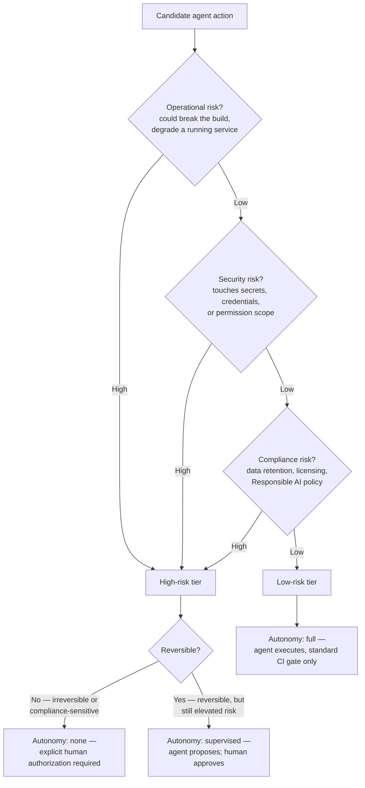

# D6: Implement Guardrails and Accountability

> **Exam weight**: 12% · **Questions**: ~14 of 120

## Overview

Every earlier domain assumed an agent is allowed to do what it's doing — D1 scoped a plan, D2 scoped a tool, D5 scoped a branch and an environment. This domain is about the decision that has to happen *before* any of that: given a specific action an agent is about to take, how risky is it, how much human involvement does that risk actually require, and where does the line sit between a guardrail that prevents real harm and an approval gate that just adds friction without reducing risk. Getting this wrong in either direction is expensive — too much autonomy turns a single bad decision into an unrecoverable incident; too little autonomy turns every agent task into a queue behind a human reviewer, which quietly kills the reason for delegating the work in the first place.

> 💡 **Human Angle**: A well-designed guardrail system works like a building's fire code, not a security guard checking ID at every door. A locked server room or a sealed emergency exit removes a category of harm permanently, regardless of who's asking — that's a guardrail. A supervisor's signature required to open a stairwell that was never actually at risk doesn't make the building safer; it just makes people prop the door open. The goal isn't more checkpoints — it's checkpoints exactly where a decision genuinely can't be made in advance.

## Defining Autonomy Levels

### Key Concept

**Classify each action along three separate risk dimensions — a blended "risk score" hides which one is actually driving the concern.**

**Operational risk** is the chance an action breaks something that's currently working — a bad dependency bump fails a build, a misconfigured deploy takes a service down. It's usually the easiest to detect (tests fail, a health check trips) and often the cheapest to reverse (revert the commit, roll back the deploy). **Security risk** is the chance an action expands what someone or something can do or see beyond what it should — touching a secret, widening a permission, modifying an IAM policy or a credential. Security risk doesn't always announce itself the way operational risk does; a leaked credential can sit unnoticed for weeks before it's exploited. **Compliance risk** is the chance an action violates an obligation the organization is bound by regardless of whether the code technically works — a data-retention policy, a license restriction, a Responsible AI commitment about what an autonomous system is allowed to decide unsupervised. A single action can carry more than one of these at once (rotating a production secret is both operational and security risk). **A thermometer that only reads "sick" or "not sick" is useless to a doctor who needs to know if it's a fever, an infection, or a broken bone.**

*Risk tier and reversibility together set an action's autonomy.*

### In Practice

**What breaks without this**: the guardrail response ends up either too heavy for the reversible operational risk, slowing routine work, or too light for the irreversible compliance risk, letting it through on the same terms as a dependency bump — that's what happens when a single blended "risk level" collapses "this could take the site down but is trivially reversible" and "this permanently deletes a customer's export history" into the same tier.

**Decision trigger**: for any action an agent is about to take, ask the three questions separately — could this break something currently working, could this expand access to something sensitive, could this violate an obligation the organization has regardless of whether the code runs correctly — rather than asking "how risky is this" as one combined judgment.

**When you'd choose differently**: for a tightly scoped agent operating in a sandboxed, disposable environment with no path to production, no real credentials, and no customer data in scope, the security and compliance dimensions may genuinely be near-zero for every action it can take — classification still happens, it just resolves the same way every time, which is itself useful evidence that the environment is scoped correctly.

> **Note**: classify the *action*, not the agent — treating every action from a "trusted" agent as automatically low-risk skips this step entirely, so the one action in a routine task that happens to touch a compliance-sensitive data path gets the same rubber-stamp treatment as the ninety-nine that don't. The one exception: an agent restricted by tool scoping (D2) to a capability set where every possible action already falls in the same risk tier by construction (e.g., a read-only triage agent) has effectively had this classification done once, at configuration time.

### Key Concept

**More autonomy buys delivery speed; less autonomy buys assurance a human made the call before something unrecoverable happened.**

At the low end, **full autonomy** lets the agent execute and land the change with no extra gate beyond whatever standard checks (CI, linting) already apply to any change — appropriate for low operational, security, and compliance risk, where a mistake is cheap to detect and cheap to undo. In the middle, **supervised autonomy** lets the agent execute and produce a result, but a human has to review and approve before it takes effect — appropriate when risk is elevated but the action is still reversible, so the review is a check on a proposal rather than a gate on an action that already happened. At the high end, **no autonomy** means the agent cannot take the action at all without an explicit human decision made *before* execution, not just a review after — reserved for irreversible or compliance-sensitive actions where "review after the fact" isn't actually a safety net, because there's nothing left to revert. Getting the assignment right means resisting both failure directions — defaulting everything to supervised "to be safe" burns the entire point of delegating work to an agent, and defaulting everything to full autonomy "for speed" removes the check exactly where classification said it mattered. **It's the difference between letting a new driver take the highway solo and having them practice in an empty parking lot first** — the same driver, a different amount of runway before the stakes get real.

### In Practice

**What breaks without this**: the autonomy level was set by who's asking, not by what's being done — an organization that assigns autonomy by team convention ("this team's agents run autonomously, that team's don't") instead of by the classified risk of the specific action ends up with a fast-moving team autonomously executing something genuinely irreversible, and a cautious team routing trivial, reversible changes through a human reviewer for no measurable safety gain.

**Decision trigger**: for a given action, ask "if this executes and turns out to be wrong, what does undoing it cost, and did a human make the call before or only after it happened?" Full autonomy is defensible only when the answer to the first half is "close to nothing."

**When you'd choose differently**: for a new, unproven agent role — even one whose classified actions are objectively low-risk — an organization may reasonably start it at supervised autonomy for a trial period and relax to full autonomy once its track record is established; risk classification sets the ceiling on autonomy, not a floor that has to be granted immediately.

### Exam Trap ⚠️

The exam likes to present autonomy as a single dial — "high autonomy" or "low autonomy" — applied to an agent as a whole. Autonomy is assigned per classified action, not per agent: the same agent can hold full autonomy for a dependency bump and zero autonomy for a change to a data-retention path, in the same session. A question that asks "what autonomy level should this agent have" without reference to a specific action's risk classification is testing whether you notice the missing unit of analysis — the answer is "it depends on the action," not a single number.

## Implementing Guardrails and Human-in-the-Loop Workflows

### Key Concept

**Reserve human-in-the-loop for judgment a machine genuinely can't make — not as a generic safety net for anything that feels uncertain.**

An action needs human judgment specifically when the "correct" answer depends on context a policy engine can't evaluate: whether a contractual obligation actually applies to this specific customer, whether an ambiguous instruction was actually intended to authorize this exact scope, whether a tradeoff between two defensible approaches should favor one over the other for reasons outside the code. This is different from an action that's simply high-risk but mechanically resolvable — a request to push directly to a protected branch doesn't need a human to *judge* anything, it needs a rule that blocks it outright (below). **Asking a judge to rule on a case that a speed camera already settled wastes the one resource — judgment — that a camera doesn't have.**

### In Practice

**What breaks without this**: by the time an action that does need real judgment arrives, it gets the same reflexive approval as everything else — routing every ambiguous-but-mechanically-resolvable action to a human ("branch protection would block this anyway, but let's also get sign-off") produces approval fatigue, because reviewers start rubber-stamping requests once most of what reaches them didn't actually need their judgment.

**Decision trigger**: before routing an action to a human, ask "is there a rule that could resolve this correctly without context a person would have to supply?" If yes, that's a policy to encode (below), not a judgment call to escalate.

**When you'd choose differently**: for a brand-new class of action with no established policy yet, routing to a human even when a rule might eventually be codifiable is the right call — the first few instances are exactly how the rule gets written; the goal is to stop routing it to a human once the pattern is established, not to never start.

### Key Concept

**Some actions shouldn't reach a human for a decision at all — they should be structurally impossible for the agent to take.**

Blocking outright is the right response when the action violates a policy with no legitimate exception in the agent's context: an agent's execution credential should never be able to read the production secret store directly, regardless of how well-intentioned the request looks, because no version of "the agent needed the secret" is a scenario the design should accommodate. This mirrors D2's tool-scoping principle (a capability that isn't granted can't be misused) and D1's guardrail-granularity principle (bypass a specific rule, not an actor wholesale) — applied here to the accountability question of *who* gets to make an exception. A blocked action has no override path inside the agent's own execution flow; if an exception is ever legitimate, it requires a human acting outside the agent entirely, through a separate, audited channel. **It's removing the liquor from the cabinet, not just telling a teenager not to drink it.**

### In Practice

**What breaks without this**: the only thing preventing misuse is the agent's own judgment about when to use it — an agent whose execution context technically has read access to a secret store "just in case it's needed later" is one prompt injected through a PR description, an issue body, or a tool's output away from having that judgment talked out of it.

**Decision trigger**: for a hard policy violation, ask "does the agent's execution context even have the capability to attempt this, or does it only refrain because it was instructed not to?" If the capability exists and only an instruction is stopping it, that's not a block — it's a request the model can be talked out of.

**When you'd choose differently**: for a policy that genuinely has legitimate exceptions depending on context (e.g., "don't modify files outside the target module" during a cross-cutting refactor that was explicitly scoped to touch multiple modules), a hard block is the wrong tool — that's a case for explicit authorization or a scoped exception, not an absolute rule with no path through it at all.

### Key Concept

**An agent that structurally cannot reach a resource doesn't need to be trusted not to reach it — it's simply unable to.**

Least-privilege scoping means an agent's execution context — its credential, its network reachability, its filesystem access, its tool set — starts from nothing and grants exactly what a specific role requires, never a broad default trimmed down reactively after something goes wrong. This is the same discipline D2 applies to individual tools (read-only vs. read-write, per-toolset enablement) and D5 applies to parallel execution (an isolated branch and environment per session), extended here to the accountability question directly: an agent that structurally cannot reach the production secret store, cannot push to a protected branch, and cannot call an unapproved external endpoint doesn't need to be trusted not to do those things. **A guard who's never been given the vault key can't be bribed into opening the vault.**

### In Practice

**What breaks without this**: the blast radius of any single mistake is the entire scope of the credential, not the scope of the task the agent was assigned — that's what happens when an agent's execution credential is provisioned with broad org-level access "because it's simpler than scoping each role individually," and every future action that credential can technically perform is one prompt-injection or reasoning error away from actually happening.

**Decision trigger**: when provisioning an agent's execution context, ask "what is the smallest set of repos, environments, and network endpoints this specific role needs to do its job," and grant exactly that — then re-ask the same question every time the role's actual task changes, rather than granting once broadly and never revisiting it.

**When you'd choose differently**: for a genuinely general-purpose coordinator agent (D5) whose job is legitimately cross-cutting — dispatching to multiple repos, reading across several systems to decompose a task — a narrowly scoped credential defeats the role's actual purpose; the fix there is scoping to *read* broadly while keeping *write* access narrow and per-delegated-task, not denying the coordinator the breadth its job requires.

### Key Concept

**A PR approval is calibrated for "is this change correct," not "should this specific consequence be allowed to happen at all."**

Some actions are technically reversible in principle but not in any practical sense — deleting a database table, removing a data-export pathway two enterprise customers depend on under contract, rotating a credential that other systems have already cached. Explicit authorization means a human makes an affirmative, specific decision *before* the action executes, tied to the actual consequence rather than to the code change that produces it — approving "delete this table" as a deliberate act, not approving a PR that happens to contain a `DROP TABLE` statement among forty other reasonable changes. This is a stricter bar than supervised autonomy's after-the-fact review: supervised autonomy reviews a proposal before it takes effect but assumes an incorrect approval is still recoverable; explicit authorization exists precisely for the cases where that assumption doesn't hold. **It's the difference between a form-approval and a surgeon's signed consent for a specific operation** — one covers the paperwork, the other names the exact procedure.

### In Practice

**What breaks without this**: the approval that technically authorized the irreversible action was never actually pointed at it — bundling an irreversible action inside a larger, otherwise-routine PR means the reviewer approving the PR is evaluating the diff as a whole, not specifically affirming the one line that deletes something permanently.

**Decision trigger**: before an agent takes an action, ask "if this turns out to be wrong, is there a path back to the state before it ran?" If the honest answer is no — or "only by rebuilding it from scratch" — the action needs a standalone, explicit authorization step, separate from routine code review, that names the specific consequence being approved.

**When you'd choose differently**: for an irreversible action in a fully disposable, non-production environment (deleting a table in an ephemeral test database that gets rebuilt from a fixture every run), the practical cost of "irreversible" is close to zero — explicit authorization should scale with the real-world cost of being wrong, not with whether an action is irreversible in the abstract.

### Key Concept

**Every approval gate that doesn't correspond to a classified risk is a cost with no offsetting benefit — and it trains reviewers to stop paying attention.**

A guardrail system earns trust (and gets followed) only if every gate in it corresponds to a real, classified risk; gates added out of general caution, or left in place after the risk they were built for stopped applying, don't make the system safer — they make the genuinely important gates harder to notice among the routine ones. An action that's low operational, security, and compliance risk, and fully reversible, gains nothing from an additional approval step beyond standard CI — the gate doesn't change the outcome, it only delays it. **A toll booth on an empty road doesn't make the road safer** — it just slows down every car equally, including the ones that were never the problem.

### In Practice

**What breaks without this**: the approval habit that forms — skim, approve, move on — is exactly the habit that lets a genuinely risky change slip through disguised as routine, because nothing in the process distinguished it — that's what happens in a review culture where every change, regardless of classified risk, routes through the same human-approval queue.

**Decision trigger**: for an existing approval gate, ask "if this gate were removed, what specific risk would go undetected that isn't already caught by CI, tests, or a structural block?" If the honest answer is "none, really" — the gate should come out, and the reviewer time it was consuming should go toward the actions that actually need judgment.

**When you'd choose differently**: for a newly introduced agent role or a newly automated action type with no track record yet, keeping a lightweight approval gate in place even for classified-low-risk actions can be a reasonable transitional measure — the case for removing it strengthens once there's evidence the classification holds in practice, not on day one.

### Exam Trap ⚠️

Watch for a scenario that treats "add another approval step" as a universally safe answer to any guardrail question — it reads as the cautious choice, which is exactly why it's a common distractor. Think of it like a smoke detector on every single wall of a house that has one working fire alarm system: it feels thorough, but it doesn't catch anything the existing detector wasn't already catching, and the constant false alarms train people to ignore the beeping. The correct answer usually maps the guardrail to the specific risk classification (block, explicit authorization, supervised review, or no added gate) — not to "more approval, generally."

## Deep Dive: Making Guardrails and Accountability Click

### 1. The connective narrative

Every mechanism in this domain answers a version of the same question: given a specific action, exactly how much human involvement does it actually need — no more, and no less. Classification comes first because the answer depends entirely on what the action actually touches: operational risk, security risk, and compliance risk don't move together, and an action that's high on one dimension and near-zero on the other two needs a response shaped to that specific profile, not a blanket "this feels risky" reaction. Autonomy assignment translates that classification into a concrete operating rule — full autonomy, supervised review, or no autonomy at all — and it's a genuine two-sided tradeoff: every unit of autonomy removed buys assurance at the cost of speed, and every unit added buys speed at the cost of assurance, so the assignment has to trace back to the classification, not to convenience or habit.

The guardrail mechanisms are what make that assignment enforceable rather than aspirational. Blocking makes a hard-violation action structurally impossible, so it never depends on the agent (or a prompt) making the right call in the moment. Least-privilege scoping is the same idea applied preemptively — an agent that never had the capability doesn't need to be trusted not to use it. Explicit authorization exists for the narrow but consequential band of actions that are technically possible, not hard policy violations, but carry a cost too high for an after-the-fact review to meaningfully catch if it's wrong. And trimming unnecessary approvals is the discipline that keeps the whole system credible: a guardrail set that gates everything equally, regardless of classified risk, trains the humans inside it to stop paying attention, which quietly defeats the purpose of every gate that remains.

The through-line is that accountability isn't a synonym for caution. A system with too little autonomy isn't more accountable — it's slower, and the humans nominally providing oversight are approving so much low-value traffic that their attention is diluted exactly where it matters least. Real accountability means every point of human involvement in the system is there because the classification said it had to be, and every point that isn't gets removed — which is the same standard this domain applies to guardrails themselves.

### 3. Memory aid

**CRISP** — a guardrail set that's exactly as thick as the risk requires, never padded:

- **C**lassify every action by operational, security, and compliance risk before deciding anything else about it.
- **R**ight-size autonomy to that risk and to reversibility — more autonomy where a mistake is cheap and reversible, less where it isn't.
- **I**solate: scope permissions and execution context to least privilege, so risky actions are structurally unavailable rather than merely discouraged.
- **S**top policy-violating actions outright, with no override inside the agent's own execution path.
- **P**rompt for explicit human authorization before anything irreversible or compliance-sensitive — a decision made before the action, not a review made after it.

A guardrail set is CRISP when every gate in it traces back to one of these five reasons — and every gate that doesn't trace back to one of them is the padding that should come out, because it's what teaches reviewers to stop reading before it matters.

### 4. Exam strategy for this domain

- The exam's default trap is offering "add another approval step" as the safe answer regardless of the scenario's actual classified risk. The correct answer is almost always a specific match — block, explicit authorization, supervised review, or no added gate at all — not a generic increase in friction.
- A close second: autonomy framed as a single setting on an agent, rather than something assigned per classified action. The same agent legitimately holds different autonomy levels for different actions in the same session.
- Watch for an irreversible or compliance-sensitive action bundled inside a routine PR and "approved" as part of that PR's normal review — a diff approval calibrated for correctness is not the same as an explicit authorization pointed at a specific irreversible consequence.
- The one sentence to remember five minutes before the exam: **a guardrail's strength should come from what the agent is structurally unable to do, not from what it's been asked not to do — and every approval gate that doesn't correspond to a classified risk is a cost with no offsetting benefit.**

## Cheat Sheet 📋

| Concept | Key Rule |
|---------|----------|
| Operational risk | Chance an action breaks something currently working — usually detectable and cheaply reversible |
| Security risk | Chance an action expands access to something sensitive (secrets, credentials, permissions) |
| Compliance risk | Chance an action violates an obligation regardless of whether the code works — retention, licensing, Responsible AI policy |
| Full autonomy | Low risk across all three dimensions, fully reversible — agent executes, only standard CI gates apply |
| Supervised autonomy | Elevated but reversible risk — agent proposes, human reviews and approves before it takes effect |
| No autonomy | Irreversible or compliance-sensitive — human must decide *before* execution, not just review after |
| Human judgment needed | Reserve for context a policy engine can't evaluate — not for anything merely high-risk but mechanically resolvable |
| Blocking outright | Hard policy violations — the capability shouldn't exist in the agent's execution context, no override in its own path |
| Least-privilege scoping | Grant the smallest execution context (credential, network, tools) a role needs — start from nothing, add with justification |
| Explicit authorization | A standalone, affirmative decision tied to the specific irreversible/compliance-sensitive consequence — not a bundled PR approval |
| Trimming approvals | Remove any gate that doesn't correspond to a classified risk — it costs latency and attention with no risk reduction |

## What to Remember

- Classify risk along three separate dimensions — operational, security, compliance — because they don't move together, and the guardrail response should match the specific dimension that's actually elevated.
- Autonomy is assigned per classified action, not per agent as a whole; the same agent can hold different autonomy levels for different actions in one session.
- Blocking and least-privilege scoping make a hard-violation action structurally impossible — the strongest guardrail is a capability that was never granted, not an instruction the agent is expected to follow.
- Explicit authorization is a stricter bar than supervised review: it's a standalone decision made *before* an irreversible or compliance-sensitive action, pointed specifically at that consequence — not a routine PR approval that happens to contain it.
- Trimming approval gates that don't correspond to a classified risk isn't cutting corners — it's what keeps the gates that remain meaningful, because reviewer attention degrades under volume of low-value approvals.
- This domain closes the loop the earlier domains open: D1's plan/act split and guardrail granularity, D2's least-privilege tool scoping, and D5's human-in-the-loop recovery all feed into the same accountability question this domain makes explicit — exactly how much human involvement does this specific action need, no more and no less.
